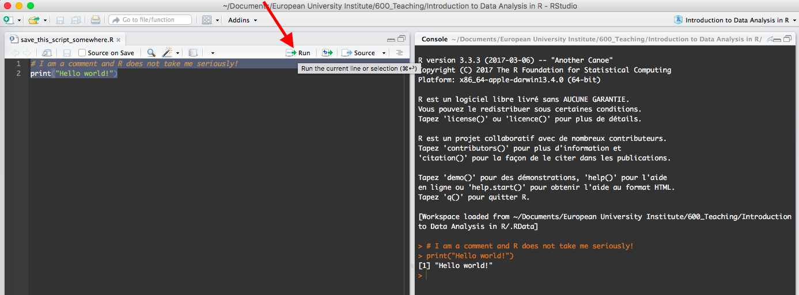

<style>
.unnumbered {
color: #02485C;
background: #FFAE5C;
padding: 0.1px 20px 10px 20px;
}
.unnumbered ol {
padding: 0 20px 0 20px;
}
.unnumbered ul {
padding: 0 20px 0 20px;
}
</style>

<!-- TODO: 
- Include http://r4ds.had.co.nz and tidyverse package 
- tibble vs. dataframe? => dataframe!
- dplyr (https://idc9.github.io/stor390/notes/dplyr/dplyr.html)
- https://rafalab.github.io/dsbook/index.html (Harvard)
-->

```{r setup, include=FALSE}

knitr::opts_chunk$set(eval=FALSE)

# Set the working directory here globally for the whole file
try(setwd("/Users/patricewangen/Documents/European University Institute/600_Teaching/Introduction to Data Analysis in R"))

```

***

# Introduction
The purpose of this course is to provide a practical introduction to the programming language R for researchers in the social sciences and humanities. R is a powerful tool that can ultimately make your life easier by enabling efficient solutions to your data analytical problems. Also, R is completely free. Who doesn't like that?

This course aims to facilitate the participant's first steps in R and equip them with the tools and understanding to expand their technical know-how according to the needs of their specific research. It is neither a computer science nor a methodological course, but aimed at the practical needs of empirically working researchers.

You might think of R as an overly complicated status symbol for quantitative researchers with special needs. This is not really true anymore as R has become much more userfriendly over the last years. Think of R as your friend and helper if you are interested in doing insightful graphs, regression analysis, QCA, quantitative text analysis, web-scraping, data visualization, systematic hand-coding of documents, formal modelling, etc.

While this course is most likely to attract people with solid statistical training who usually use Stata or SPSS, it can easily be attended by a broader audience. All you really need to know is (1) the structure of a typical dataset in the social sciences (rows are observations, columns are variables), and (2) the logic of dependent and independent variables.

You will learn how to use R to handle your data, describe it, analyse it (regressions), and transform it into beautiful graphs. At the end, you will have an idea of what R can do, and the resources to teach yourself more where needed.

Disclaimer: R has a very steep learning curve and you might experience bursts of frustration. You will probably have violent urges to go back to Stata/SPSS. Don't. R does everything that commercial softwares do. You just need to find out how. The longer you keep switching to Stata/SPSS, the longer R will feel like an annoyance. The longer you keep trying to do things in R, the more you will feel like a free (and efficient) bird.

## Organizational Remarks
__Dates:__ 23 & 24 November, 2017 <br>
__Times:__ 10:00-12:00 & 14:00-18:00 <br>
__Location:__ Teatro, Badia Fiesolana <br>
__Instructor:__ Patrice Wangen <br>
__Contact:__ [patrice.wangen@eui.eu](mailto:patrice.wangen@eui.eu) <br>

All you need is ...

* ... this script
* ... some data to experiment with: [Download Me Now!](https://web.tresorit.com/l#_zmAPmXtASoL87-CiR9QCg)
* ... the programming language R: [Download and Install Me Now!](https://cran.r-project.org)
* ... the user interface RStudio: [Download and Install Me Now!](https://www.rstudio.com)

__Graphs in R:__ By Daniel Paierl on Friday (23/11), 14:00-18:00. Follow this [link](http://bit.ly/2zRpf1A) to download the (separate) course material for this part.

<!-- 
For 10 credits you need to ...

* Hand in all exercises that you find in this script (marked by "exercise")
* In your own R-script use full title and name of exercise
* We expect an r-script that runs in one chunk without problems (includes packages etc.)
* Comment extensively what you did
* Deadline: 18.3.2016 (2 weeks)
* Exercises are corrected by Adrián and Matthias
* There are no exceptions to this deadline ["Exceptions": medical certificate, case of hardship]
-->
***

<div align = left>
_Acknowledgement: This course builds upon a script designed by Paul C. Bauer, who himself was inspired by Rudolf Farys. Likewise, you can freely use the Markdown file to adopt this script to your teaching needs. (script-v.0.6-2017-11-23) _ 

</div>

***

# Why Should I Learn R?

## What Is R?

R is an open source programming language that is very popular among statisticians and data analysts. It is not strictly speaking a 'statistics program' like Stata/SPSS since everything you do in R, you need to spell out in the form of code. However, since the release of RStudio in 2011, it is possible to use R in the same manner as you would with do-files in Stata. The only difference is that do-files are called R scripts.

It is developed by a [Core group](http://www.r-project.org/contributors.html) of programmers and thousands of volunteers from public and private research institutions. In addition to R's core functionalities, the community has developed over [10.000 packages](https://cran.r-project.org/web/packages/available_packages_by_date.html) that enable you to tackle specific problems. If you can't find pre-defined solutions here, you can develop them yourself and submit your package to the CRAN repository. <br>

History of R:

* [A brief history by Ross Ihaka](http://cran.r-project.org/doc/html/interface98-paper/paper_2.html)
* [What is R?](http://www.inside-r.org/what-is-r)
* [Wikipedia - R (programming language)](http://en.wikipedia.org/wiki/R_%28programming_language%29)
* [Data Analysts Captivated by Rs Power](http://www.nytimes.com/2009/01/07/technology/business-computing/07program.html?pagewanted=all)

Some helpful ressources:

* [R for Data Science](http://r4ds.had.co.nz) for a comprehensive introduction by Garrett Grolemund and Hadley Wickham in book form
* [Introduction to Data Science](https://rafalab.github.io/dsbook/) for a similar book-form introduction by Rafael A. Irizarry
* [Advanced R](http://adv-r.had.co.nz) by Hadley Wickham if you're really serious about this
* [TryR Code School](https://www.codeschool.com/courses/try-r) and maybe [Swirlstats](http://swirlstats.com/) for practicing the basic syntax
* [UCLA](https://stats.idre.ucla.edu/r/) for how to implement specific statistical techniques in R
* [Quick R](http://www.statmethods.net/) as a quick 'cheat sheet' and a good overview of the basic/most needed features of R. In parts a bit outdated.
* [RStudio Cheat Sheets](http://www.rstudio.com/resources/cheatsheets/) for several handy packages.
* Forums: [www.stackoverflow.com](http://www.stackoverflow.com); [www.stats.stackexchange.com](http://www.stats.stackexchange.com); [www.talkstats.com](http://www.talkstats.com)
* [rOpenSci](http://ropensci.org/): Creating packages that allow access to data repositories through R (see also [rOpenGov](http://ropengov.github.io/about/))
* [R-bloggers](https://www.r-bloggers.com): A search index and wrapper for many R related blogs. There are always great posts to stay at the bleeding edge of R usage
* [Rtips](http://pj.freefaculty.org/R/Rtips.html)
* [EUI R Website](http://www.eui.eu/ServicesAndAdmin/ComputingService/Software/TutorR.aspx) 
* Google Search... (seriously!)

## Why Should I Care?

It's practical!

* Open source and free (you, your institution, your students)
* Powerful and flexible
* Vibrant and supportive community
* Very good online-documentation
* Supports all operating systems (Mac/Windows/Linux)

<br> 
It's cool and useful!

* Popularity on job market ([1](http://r4stats.com/articles/popularity/) and [2](https://www.r-bloggers.com/data-science-job-report-2017-r-passes-sas-but-python-leaves-them-both-behind/))
* Pionieering role in advancing (quantitative) methodology
* Advanced visualization capabilities ([1](http://rgraphgallery.blogspot.ch/), [2](http://shiny.rstudio.com/gallery/) and [3](http://paulcbauer.eu/visualization))
* Gateway drug for other programming languages (especially python)
* Enforces deeper methodological understanding of the techniques you use
* Also attractive for qualitative researchers: Create your own NVivo-like coding interface with the [shiny](https://shiny.rstudio.com) package! Do [QCA](http://cran.r-project.org/web/packages/QCA/index.html) without any technical restrictions!
* Some other examples of interesting projects:
+ [Lavaan package](http://lavaan.ugent.be/) for latent variable modelling
+ [StreamR package](http://pablobarbera.com/blog/archives/1.html) for twitter analysis
+ [Statnet project](https://statnet.csde.washington.edu/trac) and [sna package](jstatsoft.org/v24/i06/paper) for network analysis
+ [Quanteda](https://github.com/kbenoit/quanteda) for quantitative text analysis
+ [R Shiny](http://shiny.rstudio.com/) is the new shooting star. It combines R with a webserver to easily build webapplications that are fully powered by R. See some [bad ass examples here](http://shiny.rstudio.com/gallery/)!


<br>
And ... it's difficult to learn. However, once you pass a certain threshold, we promise that R will save time in your research process rather than waste it.

***
# The Basics

## RStudio

While R is the programming language that does all the work, RStudio is a user interface that makes programming in R much more intuitive and accessible. It's almost like Stata/SPSS. You just can't use a drop-down menu to get stuff done. Use code instead!

* Use [__Projects__](https://support.rstudio.com/hc/en-us/articles/200526207-Using-Projects) to organise different research projects. Create a new one in a specific directory where you save your data files, R scripts, and graphs.
* __R Scripts:__ These are like Stata's do-files. Use them to organize your code and make sure that you can trace back whatever you did to your data (and repeat/reverse it if necessary). Everything following a ```#``` sign will not be evaluated by R. Use this to comment your code as precisely as possible!
* __Console:__ This is where you 'run' the code. You can either type individual code directly and run it by pressing enter (not recommended). Or, you can mark the lines in your script that you want to run and press the 'Run' button in the bar right above the script (shortcut: CTRL+Enter or CMD+Enter).
* __Custom Looks:__ Go to 'RStudio > Preferences' and select 'Appearance' to change the color, font, and appearance of your program -- I like idle fingers! Select 'Pane Layout' to choose in which corner to display your scripts (Source) and in which your output (Console). 


<br> 

### Exercise 1 {-}

* Create a new R Project 'R-Workshop-2017' in a directory of your choice.
* Create a new R Script 'yourlastname_workshop-2017' and save it in the project directory. In this script you save all the code that you use to solve the exercises from now on.
* Save all data that you need for this workshop in this directory.
* Display your scripts in the upper left corner and your console on the upper right.

## Help Function

Everything is documented and explained in R. If you don't know how to use a certain function, use the help function to look up the documentation. Try to make this a habit before asking others how to do things. You will notice that you can find most solutions on your own.

* Open the general help window with ```help.start()``` or in the menu
* Search the help file with ```help.search("search term")``` or in the menu
* Use ```help(function)``` or ```?function``` to quickly jump to the explanation of a specific function
* For example: ```help(lm)``` or ```?lm```

## Calculator and Logical Comparisons

R can calculate and compare things.

* Arithmetic operators: ```+ - * / ^```
* Logical operators: ```& | == != > < >= <=```
* Set functions: ```union() intersect() setdiff() setequal() is.element() %in%```
* Mathematical functions: ```exp(x) = e^x log(x) log10(x) sin(x) cos(x) tan(x) abs(x)```
```sqrt(x) ceiling(x) floor(x) trunc(x) round(x, digits=n)```

<br>

```{r, eval=TRUE}
# Calculations
(23 + 24) * 11 / (18 + 15) * 5

# Exponentiation
2^{2}

# Functions
log(3)

# Equals
3 == 0

# Is smaller than
3 < 0

# Is bigger than or equal to
3 >= 0

# Not equal
3 != 0

# Not equal 
!(3 == 0)

# Bigger than -1 and smaller than 1
3 > -1 & 3 < 1

# Bigger than 1 and smaller than -1
3 > 1 & 3 < -1

# Bigger than 1 or smaller than -1
3 > 1 | 3 < -1
```

### Exercise 2 {-}

* You went to a restaurant with some friends. For the three of you, the bill amounts to ```32.85 Euro```. As usual, these Italian waiters don't provide separate bills. Use R to calculate how much each of you has to pay!
* Since none of you has change, use the ```ceiling()``` function to get to the next hightest round number.
* Use the ```help()``` to find out more about the ceiling function!

### Homework {-}

1. Calculate the following terms using R.
    + $((3 + 4 - 5) - 9)^{2}$
    + $\frac{-99}{33} + 42$
    + $log(1)$
    + $(\sqrt{2})^{2}$
2. Check the following terms:
    + $5 = 7$
    + $5 \times 5 \geq 6 \times 4$
    + $\sqrt{3} \neq cos(17)$
3. In the ```mean()``` function it is possible to use and additional argument called ```trim```. Find out what this argument does by checking the help file of the ```mean()``` function and write it into your script.

## Working Directory

The working directory is path where R tries to look for files or saves them. By default, it is set to the folder where your R Project is located. But you can change it if necessary. For example, you might have stored some data that you want to load in a different directory. Or, you might want to save some graphs or tables or datasets in a different directory.

* ```getwd()```: Display current working directory
* ```setwd("new_working_directory")```: Set working directory
* ```dir()```: Display files in current working directory
* R does not understand ```\```
* Use ```\\``` instead or ```/``` in directory paths

### Exercise 3 {-}
* Use the ```dir()``` function to check whether you stored the course_material folder in the right place.
* Use ```?dir()``` if you're lost.

## Environment and Object-Oriented Programming

Stata/SPSS:

* One data set at a time
* Data sets follow a "row-by-column" structure
+ Rows = observations/units
+ Columns = variables
* Variables have certain attributes attached to them (e.g. labels)

R (similar to python):

* "Everything" is an object
* There are different classes of objects (see 3.6)
* Data, functions, estimation results etc. are all stored as objects
* Functions process the content of these objects, the outcome of which can be stored in another object
* Objects are stored in your R "environment" (also sometimes referred to as "workspace")
* Working on multiple data sets at a time is easy
* Use ```ls()``` to see what is stored in your environment
* Use ```rm(list = ls())``` to delete everything
* RStudio automatically loads the last saved environment of your Project.

```{r, eval=TRUE}
# Create a new object with "<-" or "="
# Always use meaningful names; no_blanks!
x <- 3

# Show the 'content' of the object by typing its name into the console
x

# Overwrite existing object
x <- 42
x

# Save single object outside of RStudio
save(x, file = "data/myObject.RData")

# Save all objects of your environment outside of RStudio
save.image(file = "data/myEnvironment.RData")

# Load .RData files into your current environment
load("data/myObject.RData")

# Delete object from environment
rm(x)
```

## Object Classes

Everything is an object, but not all objects are the same. Use the ```class()``` to find out what kind of object you are dealing with. Here are the most common classes you will encounter while working with R:

* Single objects can take different forms:
    + **integer**: ```42```
    + **numeric**: ```42.42```
    + **logical**: ```TRUE```
    + **character**: ```"Meaning of Life"```
* Some object classes can store homogenous content (see [Wickham](http://adv-r.had.co.nz/Data-structures.html)):
    + **vector**: One-dimensional collection of single objects
    + **factor**: One-dimensional collection of character objects with pre-defined levels (i.e., 'names' or 'meta-data')
    + **matrix**: Two dimensional matrices
    + **array**: Collection of matrices
* Some object classes can store heterogeneous/varying content: 
    + **list**: List of independent objects that can be of any class
    + **data.frame**: "List" of vectors/factors of equal length
    + **function**: Stores a set of code that processes input (see 8)
* Convert objects with functions like ```as.numeric()```, ```as.character()```, ```as.data.frame()```, etc.
* Check out [this more sophisticated treatment of R's data structures](http://adv-r.had.co.nz/Data-structures.html) by Hadley Wickham!

```{r, eval=TRUE}
# For example, a numeric vector might have been converted to a character vector in the process of importing data from badly formated files.
x <- c("21", "21")
class(x)

# Use the as.numeric() function to convert the object into a numeric vector that can be used in calculations.
x <- as.numeric(x)
class(x)
sum(x)
```

<br> __Here are some more examples of different object classes:__
```{r, eval=TRUE}
# This is an integer vector
x_int <- c(1, 2, 3, 4, 5, 6)
x_int

# This is a numeric vector
x_num <- c(1.1, 1.2, 1.3, 1.4, 1.5, 1.6)
x_num

# This is a logical vector
x_log <- c(TRUE, FALSE, TRUE, T, F, T)
x_log 

# This is a character vector
x_char <- c("One", "Two", "Three", "ROFL", "Three", "ROFL")
x_char

# Let's convert the character vector into a factor and see what this does
x_fact <- as.factor(x_char)
x_fact

# Let's combine the vectors into a data.frame. Note how I use the data.frame function to assign proper names to each variable. We will see later how these names can be used to handle your datasets in an efficient manner.
x <- data.frame("Integer" = x_int, "Numeric" = x_num, "Character" = x_char,
                "Factor" = x_fact, "Logical" = x_log)
x

# Let's try to make a list instead
x <- list("Integer" = x_int, "Numeric" = x_num, "Character" = x_char,
          "Factor" = x_fact, "Logical" = x_log, "DF" = x)
x

# This is an array of two 5x5 matrices
x_array <- array(c(1:50), c(5, 5, 2)) # Numbers 1 to 50 in array with 2 5*5 matrices 
x_array

```
### Exercise 4 {-}

* Create a 3x3 ```matrix()``` filled with the numbers from 1 to 9. 
* __Tipp:__ Remember the ```help()``` function and try out ```c(1:9)```!
* Convert this matrix into a data.frame and save the object as a ```.RData``` file in your project directory.
* Now delete the data.frame from your R environment.
* Now load the data.frame again from your project directory into your R environment.

## Packages

So far, we have dealt with functionalities that are internal to the R programming language and are readily available. While we can handle a lot of tasks this way, one of the most powerful aspects of R is the abundance of additional packages that you can install for free. These packages are typically developed by volunteers in and outside of academia and then stored on the so-called CRAN repository.

If you have specialised techniques (e.g., multi-level modelling or QCA) that you would like to implement in R, chances are that somebody already did the job for you. So, if you have a problem for which there doesn't seem to be an integrated solution in R, use Google to find out whether there is a package that can help you with this.

Once you found it, you first need to install the package in your own 'library.' Use ```install.packages("name_of_package")``` to do so. This has to be done only once, unless you completely delete all R-related things on your computer.

Use the ```update.packages("name_of_package")``` function to get the latest version of a package that you already installed on your computer a while ago.

After installing (and updating) the package, you still need to load the package into your current session to be able to use the functions it provides. Use the ```library("name_of_package")``` function to do so. This you need to repeat everytime you start R. So, keep these entries in your R script if necessary.

If you feel so inclined, you can use ```remove.packages("name_of_packages")``` to uninstall it from your system.

Sometimes, you might find ```ls("package:packagename")``` useful to display all objects within a package.

### Exercise 5 {-}

* Install the package ```ggplot2``` in your library because it will be your BFF.
* Load the package into your current session.
* Find out which functions the package contains (either via code or the RStudio panes)
* Use the help function to find out more about the package's function ```ggplot()```.

## Code Writing: Best Practice

Question: What is your experience trying to reuse do-files that you creates two years ago?

1. Comment your code
    + Data sources, data manipulations, describe steps of analysis
    + commenting increases readability
    + commenting increases reproducability
    + you can't comment too much
    + Comments in R are marked by ```#```
    + Use meaningful names!
    + Don't be too clever!
2. Structure you code properly
    + Headlines
    + Indentation
3. Code must be usable on machines with different paths to the project      
    + Path is set once and afterwards, relative paths are used
    + There is a folder structure separating data and figures (and code)

More ...

* See tips by [Jonathan Nagler](http://blog.oup.com/2015/02/jonathan-nagler-writing-good-code/)
* Follow the [Google Style Guide for R](https://google-styleguide.googlecode.com/svn/trunk/Rguide.xml)
* Try the [formatR](http://yihui.name/formatR/) package: [Online example](https://yihui.shinyapps.io/formatR/)
* Check out pages like [GitHub](http://www.github.com) to keep track of versions, branches, etc. of larger projects.

# Vector/Factor Operations

While you will most likely deal predominently with data.frames, it is useful to understand what you can do with vectors/factors because data.frames are basically just a collection of the same. A lot of what you learn in this section can be readily applied to individual columns/variables of data.frames.

Here are some functions operations that you will encounter time and again:

* ```c()```: "Concatenate" individual objects and/or vectors
* ```length()```: Get vector length
* ```:```: indicates from:to for number sequences
* ```rep("Peter", 2)```: Repeat "Peter" two times
* ```seq(5, 8, 0.5)```: Sequence from 5 to 8 by steps of 0.5
* ```vector[position_of_elements]```: Access elements by inserting a number that indicates their position within the vector
* ```vector[logical_statement_for_subset]```: Access elements according to a logical condition
* ```which(logical_statement)```: Find index of elements that meet logical condition
* ```rbind(vector_1, vector_2)```: Combine vectors line-by-line (creates matrix)
* ```cbind(vector_1, vector_2)```: Combine vectors column-by-column (creates matrix)

Here are some special values that you might encounter sometimes:

* ```Inf``` and ```-Inf```: Positive and negative infinity (e.g., calculate ```1/0```)
* ```NaN```: "*Not a number*" (e.g., calculate ```0/0```)
* ```NA```:  Missing value

```{r, eval=TRUE}
# Generate some vectors:
a <- c(10, 11, 9, 12, 11)
b <- c(TRUE, FALSE, TRUE, FALSE, TRUE)
d <- seq(0, 8, 2)
e <- c("a", "b", "c", "a", "b")

# Access vector elements:
a[1] # 1st element of a
b[c(1,4)] # Element 1 and 4 of b
d[1:2] # First 2 elements of c
e[-(2:4)] # All elements of d but not positions 2 to 4

# Access logical subset of vector:
a[a > 12] # Subset of a, where a is bigger than 12
e[e %in% c("b", "c")] # Subset of e, where the element is in the vector c("b", "c")

# We can add names to the elements of a vector with the names function
names(b) <- c("Chiara", "Diego", "Pietro", "Ilaria", "Simone")
b

# Or already while we create the vector (with or without quotation mark)
b <- c("Chiara" = TRUE, Diego = FALSE, "Pietro" = TRUE, Ilaria = FALSE, "Simone" = TRUE)

# This allows us to access individual elements of the vector via its new name
b[c("Chiara", "Simone")]

# Combine vectors rowwise and columnwise
rbind(a,b)
cbind(d,e)

# We can convert vectors into factors, which is useful for categorical data, and potentially important for some advanced functions of R (e.g., graphs in ggplot2).
e <- factor(e) # unordered factor
e

a <- ordered(a) # ordered factor
a

# We can check which 'categories' are represented in the vector via its 'levels'
levels(a)

```

### Exercise 6 {-}
* Create a vector called ```repetitive```of length 50 that contains the numbers from 1 to 5 repeated for 10 times.
* Create a vector ```can_count``` that counts the numbers from 0 to 20 in steps of 2.
* Create a vector ```subset``` that contains the three last values of the ```can_count``` vector.
* Create a character vector ```must_eat``` that contains your favourite Italian dishes.

### Homework {-}

1. Question: What did R do to the vectors after using ```rbind()``` and ```cbind()```? What class do they have? Repeat the creation of the vectors a, b, d, and e, and double-check with the ```class()``` function.
1. Create a vector ```x``` of length 101, that starts with the number 33 and ends with the number 133.
1. Extract the elements on the positions 26 to 50 and save them in a new object ```y```.
1. Extract the elements on position 1 to 25 and save them in a new vector ```z```. 
1. Join the two vectors both column by column and subsequently line by line and save the results in two new objects ```col_yz``` and ```line_yz```. 
1. What class do the last two objects that you created posses? 
1. From ```x```, extract the elements that are smaller than 57 or greater/equal than 83 and save them in a new object ```subgroup```.


# Your Workhorse: data.frame

The object class that will look most familiar to Stata/SPSS users is data.frame. It is basically like an Excel sheet with rows and columns. In the social sciences, rows typically represent observations whereas columns represent variables. Thus, most of the data you use will be stored in a data.frame sooner or later.

This section is a practical introduction to all the things that you can do with this object class. It will take a while until you really get used to the logic of these procedures, but once this feels like a second nature to you, data management is much more intuitive and quicker in R than in Stata/SPSS. Practice! Once you understand the logic of how R handles objects and specific classes, it will be super easy to translate this understanding to other programming languages like python.

In R, there are always multiple ways to do the tasks described below. Over the years, the core development team have added certain features to the programm's syntax, and community packages were developed to address specific needs. 

What we cover here is but the surface of R's possibilities. If you are missing a specific feature, try to find a solution via google. Most commonly needed tasks have been done previously by somebody else, and chances are that there is an off-the-shelf solution in form of a package or R base functions. 

__Major Difference to Stata:__ 

First, there is no equivalent to Stata's Data Editor. You cannot edit your data manually like in Excel. This could certainly be implemented by R developers. They don't do this, however, because it is bad practice for data analysts (also when using Stata!). Everything you change in your data should be replicable and documented in your R scripts! Even if you only want to change one value, you do it via code. If somebody suggests to use the ```fix()``` function, politely tell them that you have better things to do with your life.

Second, RStudio has a ```View()``` function that is somewhat like Stata's Data Browser, but few seem to use it. To a certain extent because it is slow in handling large and complex data. But mostly because R has a range of handy functions that provide you with all the information you need.

__Some Fundamental Rules:__ 

* Keep your data save: Backup regularly in multiple places. Save different versions when manipulating data.
* Maintain a codebook with explanations for variable names, measurement procedure, measurement scale, and source information (incl. data of access).
* Reproducibility is required by many publishers these days.
* Start your project with the knowledge that you will share both code and data at the point of publication. (e.g. on [Harvard Dataverse Network](http://thedata.harvard.edu/dvn/))
* Think about smart ways to keep data confidential if necessary (encryption, anonymous identifiers, etc.). Check EUI Ethics Committee webpage.

## Opening/Saving
__Useful Packages:__

* ```haven```: [New kid on the block](https://haven.tidyverse.org/) -- part of the [tidyverse package collection](https://www.tidyverse.org/)
* ```foreign```: Old-school

__Typical Data Formats:__

* ```.RData```: R format. Will pop of more often in the future. Use R's ```load()``` function and stick to this format if available. No importing errors because same eco-system.
* ```.csv```: Short for 'comma separated file'. Danger: Values not always separated by commas. Alternatives include delimiation by ```;``` or ```tab```. Use R's ```read.csv()``` function and specify the ```sep``` argument (use the help function!). If you encounter problems, it might be worth checking out the ```read_delim()``` function from the ```readr``` package. 
* ```.xls```: Excel format. Avoid hassle by using Excel to save file in CSV format!
* ```.dta```: Stata format. Be careful about different Stata versions. Use ```read_dta()``` function from ```haven``` package for best handling of labelled data.
* ```.sav```: SPSS format. Use ```read_sav()``` function from ```haven``` package for best handling of labelled data.
* ```.sas```: SAS format. Use ```read_sas()``` function from ```haven``` package for best handling of labelled data.

Life with R gets a lot easier once you have safely imported the data you need. Given the affinity to Stata in both sociology and political science, you are likely to encounter a lot of .dta files. Before the package ```haven``` was developed, this was a problem because a lot of these files contained variables that have labels attached to them. For example:

```{r, eval = TRUE}
# You need to load packages before you can use their functions.
library("foreign") 
library("haven")

# The old way of doing things: foreign and its read.dta() function.
df_foreign <- read.dta("course_material/uspresidentialelections.dta", convert.factors = FALSE)

# Show the variable 'party' from this object. 
df_foreign$party

# haven saved the day with its read_dta() function:
df_haven <- read_dta("course_material/uspresidentialelections.dta")
df_haven$party

# You can use the labels rather than numbers by using the as_factor() function.
as_factor(df_haven$party)
```

You can see that the variable ```party``` from this Stata file contains the value ```-1``` that stands for ```Republican``` and ```1``` that stands for ```Democrat```. With the ```foreign``` package, you have to choose from the beginning whether you want the labels or numbers (via the ```convert.factor``` argument). With ```haven``` you can inspect both in R and decide later which ones to use in your calculations. This makes working with survey data considerably easier.

I include the ```foreign``` package here because you will still find it in a lot in tutorials on the internet. The only caveat for ```haven``` is that it imports the data as a ```tibble```, which is not part of the R base classes. Don't be confused by this. All the basic functionalities of the more typical ```data.frame``` class are maintained within. For all practical matters, you can treat it as such, and we will do so in the following sections of this script. If you ever encounter a problem, use the ```as.data.frame()``` function to convert the ```tibble``` into a more basic R object. However, pay attention to what happens to labelled variables.

To give you a bit of context, ```haven``` is part of the [tidyverse](https://www.tidyverse.org/), which is a collection of packages that are all developed by a central team and meant to improve R's base functionalities, make them more powerful, and the syntax more coherent and efficient. To get an introduction to R that builds around this approach, check out the [R for Data Science](http://r4ds.had.co.nz/) textbook.

While tidyverse makes a lot of things easier and quicker in R, at this stage of development, it is still crucial to know the core R functions before you get lost in the ideosyncracies of tidyverse. Keep an eye on it, though! This will most likely get cooler and cooler over the next years. And feel free to jump to the aforementioned textbook after you finished this workshop.

__Save Your R Objects:__

* ```save()```: Export object in ```.RData``` format. Since R users are still a minority, always provie other formats as well in your replication data.
* ```write.csv()```: Export in CSV format. Also options for tab- and semicolon-delimited formats. Use the help function! Caveat: Not always good at handling encoding of special characters in text data.
* ```write_dta()```: Export in Stata format. ```haven``` package.
* ```write_sav()```: Export in SPSS format. ```haven``` package.
* ```write_sas()```: Export in SAS format. ```haven``` package.

### Exercise 7 {-}
* Use the package ```haven``` to import the Fearon-Laitin data from the course_material folder.
* Remember to use the ```install.packages()``` and ```library()``` functions.
* Remember to use the ```getwd()``` and ```dir()``` functions.
* Name the new object in a meaningful way (short & informative).
* Use the ```class()``` function to check which class your new object has.

### Homework {-}
* Import the Stata file ```uspresidentialelections.dta``` and save the object under a meaningful name.
* Save the dataset as a CSV file with the ```write.csv``` function.
* Use the the help function to find out more about the ```sep```, ```quote```, and ```row.names``` options of this function. Play around with it until you can open the CSV file in Excel without a column indicating the numbers from 1 to 15.
* Import the CSV file into R again and pay some attention to the ```header``` option of the ```read.csv``` function.

## Exploring Structure

_N.B.: If somebody tells you that they save a lot of time in their R scripts by using the ```attach()``` function, ignore the advice. It makes things messy and will cause more headaches than anything else. Forget that you ever heard of this function's existence._

Once you have your data loaded in your R environment, this section explains how to get a basic overview of how your data looks like. Which variables (i.e., columns) are in there? What class do they take (numeric, character, factor, etc.)? How many observations (rows) and variables (columns) are in there? How many values (cells) are missing?

__Overview of Data Structure:__

* ```str()```: Lists the names of columns in data.frame including their class and levels if appropriate, as well as some example values for each. Use this to double check whether import worked correctly. More complex information for labelled data.
* ```names()```: Provides variable names contained in data.frame. Use to check precise spelling of variable names for subsetting. You can also change variable names via this function.
* ```head()```: Provides first 6 rows, or more if specified. With tibble format, this is automatically implemented when exploring the object. Use mostly for data.frame objects.
* ```tail()```: Provides last 6 rows, or more if specified.
* ```summary()```: Provides basic information on variable distribution and amount of missing values (```NA```).
* ```nrow()```: Provides number of observations (rows). 
* ```ncol()```: Provides number of variables (columns).

With the exception of the last two functions, all of these are generic and can be applied to all sorts of objects (vectors, matrices, lists, regression output, etc.). These should become part of your standard R vocabulary that you don't need to double check on the internet.

```{r, eval = TRUE}
# Remember to load the haven package before using its read_dta() function. You 
# only need to do that once per R session.
fela <- read_dta("course_material/fearon+laitin-2003.dta")

# Let's convert tibble to regular data.frame object
fela <- as.data.frame(fela)

# Let's get a first impression of our data via head() rather than View()
head(fela)

# Let's get a list of the variable names
names(fela)

# Let's change the name of the country variable. 
# Remember the vector subsetting approach you learned earlier. The following 
# takes the second ([2]) element of the vector with variable names and replaced
# it with another string/character object.
names(fela)[2] <- "country_name"
names(fela)
```

### Exercise 8 {-}
* Convert the Fearon and Laitin data from the tibble class to a regular data.frame object.
* Use the ```summary()``` function to find out which variables have missing values (```NA```).

## Subsetting

This is one of R's strengths. While keeping the original data, you can subset R objects in countless and mostly intuitive ways. The first approach you will encounter a lot is using the anchor ```$``` to select variables of data.frame objects (or elements of list object). 

This can come in handy, but the more generic approach is to use ```[]``` to specify which rows and columns you would like to select. The key to understanding this kind of subsetting in R is understanding the following syntax rules:

* __Subset specific rows:__ df[<font color="red">select_specified_rows</font><font color="green" size = 5>,</font> ]
* __Subset specific columns:__ df[<font color="green" size = 5>,</font> <font color="blue">select_specified_columns</font>]
* __Subset by rows and columns:__ df[<font color="red">select_specified_rows</font><font color="green" size = 5>,</font> <font color="blue">select_specified_columns</font>]

__Don't forget the comma!__

In that sense, subsetting data.frames works very much like subsetting vectors, but you will have to deal with two dimensions (columns and rows) rather than one. Let's check out some typical examples with the Fearon and Laitin data.

```{r, eval = TRUE}
# Show first 50 values of year variable
head(fela$year, 50)

# Show first 50 values of year variable via [] rather than head()
fela[1:50, "year"]

# Show last 50 values of year variable
tail(fela[, c("year")], 50)


# Use logical statements to get at the observations for Afghanistan and save 
# them in a new object. Use class() to check out what kind of object you just
# created.
fela_afgh <- fela[fela$country_name == "AFGHANISTAN", ]

# Show the years where Afghanistan was experiencing war. 
# Read: Show fela_afgh data.frame where it is true that the fela_afgh$war vector
# is equal to one, and the column name is equal to "year"
fela_afgh[fela_afgh$war == 1, c("year")]

# Show the first 10 variables for the 90s
fela_afgh[fela_afgh$year > 1989, c(1:10)]

# You can get the same result by de-selecting variables with the - sign
fela_afgh[fela_afgh$year > 1989, -c(11:ncol(fela_afgh))]

# You can use multiple conditions with c() or ().
# Read: Show fela data.frame where it is true that the fela$war vector is equal
# to 1 AND the fela$Oil vector is equal to 1, and the column name is either 
# "country_name" or "polity2"
table(fela[c(fela$war == 1 & fela$Oil == 1), c("country_name", "polity2")])
```

In addition to this baseline approach, there are some R-internal functions that are useful for the common data management problems we encounter in the social sciences. 

* ```subset()```: Simplifies subsetting in the sense that you don't have to repeat the data.frame name all the time for your logical conditions. Useful for more complex subsetting. However, you first have to wrap your head around how the function works. Use the help function and google, but understand the basic approach first!
* ```unique()```: Returns all unique values in vector or rows in data.frame.
* ```duplicated()```: Returns a logical vector indicating whether a certain value is a duplicate of a prior value in the specified vector. The 'original' or first element will be assigned FALSE, the 'duplicate' or following element will be assigned TRUE.
* ```order()```: Returns a vector with index values that are sorted according to the alphabet in case of character, and from low to high in case of numerical vectors.
* ```rev(order())```: Reverses the output of the previous function. A to Z and high to low.
* ```is.na()```: Returns logical response indicating whether object or its elements are ```NA``` (missing) or not.
* ```!is.na()```: Reverses the logical statement of the previous function ('is not ```NA```').

```{r, eval = TRUE}
# A third way to subset your data is to use the subset() function. Here you don't need to specify the data.frame name every time.
table(subset(fela, war == 1 & Oil == 1, "country_name"))

# Exlore which wars are included in the dataset
unique(fela$casename)

# Check whether any country-year observations appear twice
table(duplicated(fela[, c('country_name', 'year')]))

# Reorder the dataset so the war-torn country-year observations appear first
head(fela[rev(order(fela$war)), c(1:10)])

# Check how many observations are missing for the population variable
table(is.na(fela$pop))

```

__Useful Package:__

```dplyr``` provides computationally more efficiant and syntactially more streamlined functions that are particularly useful for large and complex data. However, it is useful to know R's basic syntax for subsetting before you get lost in the ideosyncracies of ```dplyr```. You can do most daily tasks with the things provided by R, but check out the 'tidyverse' approach to subsetting if you use big data and/or need to do frequent and complex subsetting. In that case, check out Chapter 5 in the [R for Data Science](http://r4ds.had.co.nz/transform.html) book to get a good introduction.

### Exercise 9 {-}
* Find out which countries are represented in Fearon and Laitin's data.
* Use the ```table()``` function to find out how many countries experienced war while they were considered democracies (polity > 7).
* Can you find out which countries these are? Any interesting cases?
* Find out which countries have missing values on the polity variable while experiencing war.
* Did they show up in the previous task?

### Homework {-}
* Get a first impression how the polity scores of Albania and Algeria compare between 1989 to 1999.
* Find out how many and which countries in the dataset are big oil exporters according to Fearon and Latin's definition.
* Tipp: R can count for you with the ```length()``` function.

## Manipulating/Recoding

This section is about creating new variables, overwriting old ones, overwriting certain values, turn them into logical variables (TRUE/FALSE), turn them into binary variables (0/1), etc. Everything you might need to prepare your data for analysis and/or presentation.

__The Assignemnet operation ```<-```__
```{r, eval = TRUE}
# You create new or overwrite existing objects with the '<-' expression. 
# N.B.: This also works with subsets of objects!
# The following creates a 'new_variable' in the fela data.frame that is full of 
# missing values (NAs)
fela$new_variable <- NA
names(fela)
head(fela$new_variable)

# The following overwrites the missing values and replaces them with 0
fela$new_variable <- 0
head(fela$new_variable)

# The following overwrites the 0s and replaces them with the values found in
# the year variable.
fela$new_variable <- fela$year
head(fela$new_variable)

# The following overwrites the first two values of the variable
fela[1:2, 'new_variable'] <- c(1944, 1945)
head(fela$new_variable)

# If you want to delete a variable from a data.frame, you might think of using
# the rm() function. However, this only works with entire objects in your R
# environment. Within data.frames, you need to overwrite variables with NULL
# to get rid of them.
fela$new_variable <- NULL
names(fela)

# You can also take existing variables and change them before assigning them to 
# the new variable
fela$year_lead <- fela$year + 1
head(fela$year_lead)

# Use ifelse() function to create logical variables. Remember the help function 
# if you're lost!
# Read: If the year variable in the fela data.frame is smaller than 1990, 
# assign the value TRUE, otherwise assign the value FALSE
fela$cold_war <- ifelse(fela$year < 1990, TRUE, FALSE)

# Use the table() function to check what this did to the year variable.
table(fela$year)
table(fela$year_lead)
table(fela$cold_war, fela$year)

# Convert polity scores to threefold category: Autocracy, Anocracy, Democracy
# Use help() function to find out more about cut().
fela$polity_cat <- cut(fela$polity2,
                       breaks = c(-10, -5, 5, 10),
                       labels = c("Autocracy", "Anocracy", "Democracy"))
table(fela$polity2, fela$polity_cat)

```

From here on it is pure logic: Subset the data to get to the values/variables/obvervations (cells/columns/rows) you want to change, and assign new values with the assignment operation. All you need to do is think about what you want to achieve, and double check whether your code did what you wanted it to do. It's best to keep the original version of the variable so you can easily revert your data manipulations in case something goes wrong.

Use ```table()```, ```unique()```, ```summary()```, ```class()```, ```str()```, and ```is.na()``` to double check your new creations. Pay particular attention to unwanted missing values. R will rarely tell you that something went wrong, because usually it is not obvious what is 'right'. At least not to a generic programming language.

Use ```as.numeric()```, ```as.factor()```, ```as.character()```, ```as.integer()``` to convert variables if they are not saved in the right class. For example, numbers might have been converted to character at some stage of the processing. If that is the case, R will show error messages when you try to use the variable in calculations. But if the characters are still reckognizably numerical, you will be able to convert it back.

```{r, eval = TRUE}
# Here is an example of how things can go wrong with R classes, and how you fix
# it. Let's create a broken numerical vector:
broken <- c("1", "2", "3", "4", "5")
broken

# The quotation marks clearly that broken is of class character.
class(broken)

# Let's fix this
fixed <- as.numeric(broken)
fixed
class(fixed)

# Factors are annoying as hell and a weakness of R. But for now we have to live
# with it. 
annoying_factor <- fela$polity_cat
table(annoying_factor)

# Let's add a different category
annoying_factor <- c(annoying_factor, "Trumpocracy")
table(annoying_factor)

# ARRGHHH! Let's use character class instead
nice_character <- as.character(fela$polity_cat)
table(nice_character)

nice_character <- c(nice_character, "Trumpocracy")
table(nice_character)

```

__Useful Packages:__

* ```dplyr```: Provides functions ```recode()```, ```mutate()```, ```transform()```, ```transmute()```, etc. Not clear whether it is worth spending the time to understand these. Same as previous comments on dplyr and tidyverse. Potentially useful and the future, but for now it's often overkill.
* ```plyr```: Old-school, but used in a lot of tutorials.

### Exercise 10 {-}
* Fearon and Laitin have a variable on population (```pop```) and a logged version of this variable (```lpop```). Create a new variable replicating the latter via the former.
* Use the ```cut()``` function to create a new categorization of the polity scale that includes four categories: "Autocracy", "Anocracy", "Democracy", and "Trumpocracy". You can choose yourself where to place the latter.
* Since missing values for polity scores typically refer to 'transition periods', replace ```NA``` with -20 to confirm our bias that autocracies bring war and instability.
* Tipp: Keep the original variables and try out ```ifelse()``` for the last task.

### Homework {-}
* Create a new dummy variable (0/1) that indicates whether a country was either a British (colbrit) OR a French colony (colfra). Think of it as a general colonial legacy variable.
* Check out the ```scale()``` function and think 'normalize' a variable of your choice.

## Merging/Appending/Reshaping

__Merging__ two data sets means that both have variables on the same unit (e.g., Afghanistan 1990), and have a few identifier variables that can be used to link the variables in data.frame x to those in data.frame y.

R provides the ```merge()``` function as an integrated solution for this task. As usual, ```dplyr``` provides some faster alternatives, but R's function is sufficient for most tasks. Check out ```?dplyr::join``` if you're working with big data. The logic is very similar.

```{r, eval = TRUE}
# Load battle-related deaths data from UCDP
ucdp <- read.csv("course_material/ucdp-brd-conf-171.csv", 
                 header = TRUE,
                 stringsAsFactors = FALSE)

# For merging, we use year and country. However, the ucdp data is not formated
# to easily be merged with the Fearon and Laitin data. (1) Both variables nead 
# to have the same name. (2) Fearon and Laitin use a different format for 
# country names than UCDP.
head(ucdp[, c(3, 4)])
head(fela[, c(2, 5)])

# Let's just simply create new variables that are up to the task. We use the
# countrycode package to convert country.names to standardized ISO3c codes.
library("countrycode")
ucdp$iso <- countrycode(ucdp$LocationInc,
                        origin = "country.name",
                        destination = "iso3c",
                        warn = FALSE)
ucdp$year <- ucdp$Year

fela$iso <- countrycode(fela$country,
                        origin = "country.name",
                        destination = "iso3c",
                        warn = FALSE)

# Furthermore, the UCDP data only covers the period from 1989 to 2016. Let's
# subset the Fearon and Laitin data first.
fela_1989 <- fela[fela$year > 1988, ]

# Merge fela and ucdp by country-year observations. Since the UCDP data only
# covers those observations where there were more than 0 casualties, we tell
# the function that it should take all the rows from x (fela), even when there
# is no match in y (ucdp). In this case, it introduces NAs, which should be 
# replaced by 0s because there were 0 casualties for that observation.
ucdp_fela <- merge(fela_1989, ucdp, by = c('iso', 'year'), all.x = TRUE)

# The BdBest variable refers to the best estimate about number of battle-related casualties.
# Read: If the variable BdBest is missing, overwrite the NA with 0, else use
# the existing value.
ucdp_fela$BdBest <- ifelse(is.na(ucdp_fela$BdBest), 0, ucdp_fela$BdBest)

# Let's check out how many people died because of war between 1989 and 1999 in 
# Afghanistan and how this is reflected in its polity2 scores.
ucdp_fela[ucdp_fela$iso %in% c("AFG"), c("iso", "year", "BdBest", "polity2")]

```
__Appending__ data means to add observations (rows) to an existing data.frame. this is quite easy to achieve with the ```rbind()``` function. The only issue is that both data.frames need to have exactly the same variables, both in terms of number and names.

If this is not the case by default, harmonize both by adding empty variables (```NA```) or deleting superfluous ones before appending.

```{r, eval = TRUE}
# The easy case of compatible data
df_1 <- data.frame(a = 3, b = 7, c = 42)
df_1

df_2 <- data.frame(a = 21, b = 42, c = 1)
df_2

df_3 <- rbind(df_1, df_2)
df_3

# The next one does not fit automatically
df_4 <- data.frame(a = 42, b = 9)
df_4

# Add an empty variable to allow for easy appending
df_4$c <- NA

df_5 <- rbind(df_3, df_4)
df_5
```

__Reshaping__ a dataset is something that you might need if you work with time-series cross-section data. But it will also be necessary if you work with ```ggplot2``` to make nice graphs (not covered in this part of the course). For example, the UCDP data is organized in a way that each row represents a country-year observation.

Let's say we want to plot different estimates of battle-related casualties in one timeline. To do so with ```ggplot2```, it is easiest to restructure the data in a way that each observation represents a country-year-estimate observation. We can use to ```melt()``` function from the ```reshape2``` package to achieve this goal.

```{r, eval = TRUE}
# Subset the Afghanistan data from UCDP and select low, best, and high estimates
# of battle-related casualties
afgh_bd <- ucdp_fela[ucdp_fela$iso %in% c("AFG"), 
                     c("iso", "year", "BdLow", "BdBest", "BdHigh")]
afgh_bd

# Use the melt() function from the reshape2 package to turn into 'long' format.
library("reshape2")
afgh_bd <- melt(afgh_bd, id = c("iso", "year"))
afgh_bd

# Plot different timelines in ggplot2.
library("ggplot2")
graph <- ggplot(afgh_bd, aes(x = year, y = value, 
                             group = variable, colour = variable)) + 
  geom_line(aes(linetype = variable), size = 1.2)
graph

# Let's make the graph a bit nicer
graph <- graph +
  theme(panel.background = element_blank(),
        panel.border = element_rect(colour = 'grey90', fill = NA),
        panel.grid.major = element_line( size=.1, color="grey50" ),
        panel.grid.minor = element_blank(),
        axis.text.x = element_text(angle = 45, vjust = 1, hjust = 1),
        legend.title=element_blank()) +
  scale_x_continuous(breaks = 1989:1999) +
  labs(x = "Year", y = "Estimates of Battle-Related Casualties")
graph

```

### Homework {-}
* Since these three tasks take quite ideosyncratic forms depending on your data, just try it at home with your own.
* Make use of the fact that you can store multiple datasets in your R environment.
* Manipulate/recode your variables to prepare them for clean merging/appending/reshaping.
* Make sure your code is reproducible, so you can quickly change things later on if you notice that you did a mistake.

## Missing Values

If you have come this far, you will probably know already that R uses ```NA``` as the default to signify missing values. You should also be familiar with the ```is.na()``` function, which returns a logical statement (TRUE/FALSE) whether a given value is missing.

You should know that you can use ```table()``` in combination with this function to get an overview of how many missing values are in a given variable. And you should know how to use ```summary()``` to get the same for individual variables or the entire data.frame.

The only thing I would like to add is that you should check out the [Amelia II package](https://gking.harvard.edu/amelia) and related methodological articles. Most R functions (including regression models) will drop every observation that has a missing value for any of the used variables. This is uncool! Use multiple imputation to avoid the potential biases introduced by 'listwise deletion'.

### Homework {-}
* In your current work (if applicable), find out whether your regression models drop important observations via listwise deletion.
* Install the ```Amelia``` package, and explore its functionalities (```ls("package:Amelia"))```).
* Multiply impute the missing values, and be left wondering what to do with the output. ```zelig``` package?
* Use google to find out the latest solutions. Can you come up with a solution yourself? Averaging regression output tables?
* Or is all of this not worth the hassle?
* How does R's handling of ```Amelia``` output compare to Stata?

# Exploring Data
## Basic Statistics

If you have come this far, you will probably be familiar with the ```table()``` and ```summary()``` functions. However, these are only the most basic tools that are at your disposal for understandinging of your data. The following are the most common. Use the help function to find out more about different specifications/methods.

__Functions for Univariate Statistics:__

* ```mean()```: Mean
* ```median()```: Median
* ```sd()```: Standard deviation
* ```var()```: Variance
* ```min()```: Minimum
* ```max()```: Maximum
* ```density()```: Density distribution. Use in combination with ```plot()```

__Functions for Bivariate statistics:__

* ```cov()```: Covariance
* ```cor()```: Correlation

```{r, eval = TRUE}
# Get the mean. You need to specify that the function should omit missing variables
mean(fela$polity2, na.rm = TRUE)

# Get the correlation between polity2 and war. The use option plays the same role
# as the na.rm option above. Use the help function!
cor(fela$polity2, fela$war, use = "complete.obs")

# Get a correlation table for several variables
cor_tab <- cor(fela[, c("polity2", "war", "ethfrac", "relfrac", "Oil")], use = "complete.obs")
cor_tab

# Use round() to improve readability of numbers
round(cor_tab, digits = 2)
```

__Useful Packages and Links:__

* ```gmodels```: Provides ```CrossTable()``` function, which works similar to ```table()```, but has the option of producing SPSS like formats with frequencies.
* [Quick-R: Basic Statistics](https://www.statmethods.net/stats/index.html) for more.

## Basic Graphs

* ```plot()```: Scatterplot and lineplots (see ```type``` option)
* ```plot(density())```: Densityplot
* ```barplot()```: Barplot
* ```hist()```: Histogram

```{r, eval = TRUE}
# Scatterplot
plot(fela$ethfrac, fela$relfrac)

# Lineplot
plot(afgh_bd[afgh_bd$variable == "BdBest", "year"], 
     afgh_bd[afgh_bd$variable == "BdBest", "value"], 
     type = 'l')

# Densityplot (distributions!)
plot(density(fela$ethfrac))

plot(density(ucdp_fela$BdBest))
```

Check out the [Compendium of Clean Graphs in R](http://shinyapps.org/apps/RGraphCompendium/index.php) for more information on R's internal graph functionalities. For publication purposes, this might be a bit outdated, but for some basic descriptives, this might be the quicker way to go about it.

Check out [this course](https://campus.datacamp.com/courses/data-visualization-in-r/a-quick-introduction-to-base-r-graphics?ex=7#next) on R graphics and/or find out more on Friday afternoon!

__Useful Packages:__

* [ggplot2](http://ggplot2.tidyverse.org/reference/) for publication ready graps. Syntax is not completely R-typical, but once you get the logic, it becomes extremely powerful and intuitive. (part of the tidyverse)
* ```lattice``` package: A bit old-school. Powerful inspiration for gpplot2, but with far inferior documentation.
* [Plotly](https://plot.ly/) for interactive graphs (e.g. on webpage)
* [Shiny](https://shiny.rstudio.com/) for interactive apps/graphs (complicated but more versatile replacement for NViVo/MaxQDA)

<!--
## Exercise: Simple statistics and contingency tables [&#8593;](#top)
1. Find at least two ways to calculate the product of all numbers 1 to 8 with the help of R (Tipp cumprod()).
2. Store the values for the two variables ```Assault``` and ```UrbanPop``` (dataframe ```USArrests```) in two vectors ```x``` and ```y```. Calculate for both vectors ```x``` and ```y``` the mean, the maximum, the minimum and the variance and save all the results in two objects ```statistics.x``` and ```statistics.y```. Name the elements of these two objects "Mean", "Max" etc. Save ```statistics.x``` and ```statistics.y``` as list elements in one list. Finally, check wether the two vectors  ```x``` and ```y``` strongly correlate with each other.

-->

# Statistical Modelling

This part is more condensed because depending on your field and research, you will require very different statistical models. While they all share the basic mathematical (and epistemological) idea that a specific constallation of explanatory variables (X) are used to try to explain a certain outcome (y). In that sense, any statistical model consists simply of one or several mathematical equations. The simplest of which is the basic linear model:

$$y = \beta_{0} +  \beta_{1}x_{1} +  \beta_{2} x_{2} + \epsilon $$
We observe values for $y$, $x_{1}$ and $x_{2}$ -- our dependent and explanatory variables. We don't know for sure, but we can _estimate_ the values for $\beta_{0}$, the constant, and $\beta_{1}$ and $\beta_{2}$ the coeficients. 

There are various approaches for estimating parameters: OLS, Maximum Likelihood and Bayesian are the most common estimation strategies in the social sciences  (see [Rstan](http://mc-stan.org/interfaces/rstan) for the latter).

All of them try to find estimates that bring the predicted values for $y$ -- i.e., $\hat{y}$ -- as close as possible to the observed values for y. This underlying logic is foundational for (almost?) all regression models. 

Both generalized models and multilevel models are just derivates from the equation above with adjustments that correct for potential biases or problems given the structure of your data.

_Disclaimer: Remember, this is not a statistics course. Don't judge me for my nonchalant approach to mathematical notation and statistical concepts! ;-)_

If we want to formulate this equation in R syntax, we follow the same mathematical structure, but leave out the unknown parameters, which are indicated by using the tilde instead of the equal sign: ```y ~ x1 + x2```

```{r, eval = TRUE}
# The following statistical models immediately convert such information,
# but if you would want to store a formula in an object, you can do so
# with the formula class.
equation <- as.formula(y ~ x1 + x2)
equation

```

## Linear Models

Use R's internal ```lm()``` for simple OLS regressions. Save the regression results as an object in your R environment. Keep an eye on the following options:

* ```formula```: See above. Either specify directly here, or call an object of class formula from your environment. Use ```x1:x2``` to specify interactions and remember to include the [constitutive terms!](https://www.cambridge.org/core/journals/political-analysis/article/understanding-interaction-models-improving-empirical-analyses/9BA57B3720A303C61EBEC6DDFA40744B)
* ```data```: Specify data.frame object in environment. That way you don't need to repeat it in the formula specification. Just use the variable names directly (no quotation marks!).
* ```na.action```: Default is ```na.omit```, which equates to listwise deletion.

__Useful Functions:__

* ```summary()```: Summarises regression results (object of class "lm") in readable format. 
* ```coef()```: Returns coefficients as a named vector.
* ```residuals()```: Returns vector of residuals for each $\hat{y}$. Use ```plot()``` to check for homoskedasticity/heteroskedasticity. 
* ```predict()```: Returns $\hat{y}$ for given values of explanatory variables. Use taylor-made marginal effects! 

```{r, eval = TRUE}
# Try to explain battle-related casualties with ethnic fractionalization and
# control for polity scores. 
# N.B.: Ignore the skewed distribution of the casualties for now. This is not a
# methodology course ;-)
linear_model <- lm(BdBest ~ ethfrac + polity2, 
                   data = ucdp_fela)

# Check out the regression results
summary(linear_model)

# Check the residuals. Not entirely homoskedastik, ey?
plot(residuals(linear_model))

# Add y_hat to the original dataframe, and see how far it is off in the case of
# Afghanistan. Add 95% confidence interval to predictions to convey uncertainty.
pre <- predict(linear_model, data = ucdp_fela, se = TRUE)

ucdp_fela[!is.na(ucdp_fela$polity2), 'BdBest_hat'] <- pre$fit
ucdp_fela[!is.na(ucdp_fela$polity2), 'BdBest_95low'] <- pre$fit - 1.959964*pre$se.fit
ucdp_fela[!is.na(ucdp_fela$polity2), 'BdBest_95high'] <- pre$fit + 1.959964*pre$se.fit

afgh_fit <- ucdp_fela[ucdp_fela$iso %in% "AFG", ]

ggplot(afgh_fit, aes(x = year)) + 
  theme(panel.background = element_blank(),
        panel.border = element_rect(colour = 'grey90', fill = NA),
        panel.grid.major = element_line( size=.1, color="grey50" ),
        panel.grid.minor = element_blank(),
        axis.text.x = element_text(angle = 45, vjust = 1, hjust = 1),
        legend.title=element_blank()) +
  scale_x_continuous(breaks = 1989:1999) +
  geom_line(aes(y = BdBest)) +
  geom_line(aes(y = BdBest_hat), color = 'red', linetype = 2) + 
  geom_ribbon(aes(ymin = BdBest_95low, ymax = BdBest_95high), alpha = 0.2,
              fill = 'red')

```

Conclusion: Linear models are not really useful for non-linear data. Negative binomial? Poisson? Or maybe our explanatory variables are just not really good? Probably both.

Tipp: Use ```class()```, ```names()``` and ```str()``` to find explore further possibilities of the linear_model object we just created with the ```lm()``` function.

__Useful Links:__

* [Quick R: Regression Diagnostics](https://www.statmethods.net/stats/rdiagnostics.html)
* [r-statistics tutorial](http://r-statistics.co/Linear-Regression.html)
* [another tutorial](https://rstudio-pubs-static.s3.amazonaws.com/63893_9f6bc9cd73ad47aab3aa85d0193244d9.html)
* [UCLA: Data Analysis Examples](https://stats.idre.ucla.edu/other/dae/)

## Generalized Linear Models

Use R's internal ```glm()``` function in (almost) the same way as the ```lm()```. Save the regression results as an object in your R environment. Keep an eye on the following options:

* ```formula```: See above. Either specify directly here, or call an object of class formula from your environment. Use ```x1:x2``` to specify interactions and remember to include the [constitutive terms!](https://www.cambridge.org/core/journals/political-analysis/article/understanding-interaction-models-improving-empirical-analyses/9BA57B3720A303C61EBEC6DDFA40744B)
* ```data```: Specify data.frame object in environment. That way you don't need to repeat it in the formula specification. Just use the variable names directly (no quotation marks!).
* ```na.action```: Default is ```na.omit```, which equates to listwise deletion.
* ```family```: Specifies the error distribution and link function that is used in your model. Use google to find out tutorials for your specific generalized model. (e.g.: binomial(link='logit') for logit or poisson() for poisson).

__Useful Functions:__

* ```summary()```: Summarises regression results (object of class "lm") in readable format. 
* ```coef()```: Returns coefficients as a named vector.
* ```residuals()```: Returns vector of residuals for each $\hat{y}$. Use ```plot()``` to check for homoskedasticity/heteroskedasticity. 
* ```predict()```: Returns $\hat{y}$ for given values of explanatory variables. Specify option  ```type``` with ```"response"``` to get the (re-)converted $\hat{y}$ Use taylor-made marginal effects! 

```{r, eval = TRUE}
# Try to explain battle-related casualties with ethnic fractionalization and
# control for polity scores. Use poisson instead of linear regression. 
poisson_model <- glm(BdBest ~ ethfrac + polity2, 
                   data = ucdp_fela, family = poisson())

# Check out the regression results
summary(poisson_model)

# Check the residuals. Not entirely homoskedastik either...
plot(residuals(poisson_model))

# Add y_hat to the original dataframe, and see how far it is off in the case of
# Afghanistan. Add 95% confidence interval to predictions to convey uncertainty.
pre_poisson <- predict(poisson_model, data = ucdp_fela, se = TRUE, type = "response")

ucdp_fela[!is.na(ucdp_fela$polity2), 'BdBest_hat'] <- pre_poisson$fit
ucdp_fela[!is.na(ucdp_fela$polity2), 'BdBest_95low'] <- pre_poisson$fit - 1.959964*pre_poisson$se.fit
ucdp_fela[!is.na(ucdp_fela$polity2), 'BdBest_95high'] <- pre_poisson$fit + 1.959964*pre_poisson$se.fit

afgh_fit_poisson <- ucdp_fela[ucdp_fela$iso %in% "AFG", ]

ggplot(afgh_fit_poisson, aes(x = year)) + 
  theme(panel.background = element_blank(),
        panel.border = element_rect(colour = 'grey90', fill = NA),
        panel.grid.major = element_line( size=.1, color="grey50" ),
        panel.grid.minor = element_blank(),
        axis.text.x = element_text(angle = 45, vjust = 1, hjust = 1),
        legend.title=element_blank()) +
  scale_x_continuous(breaks = 1989:1999) +
  geom_line(aes(y = BdBest)) +
  geom_line(aes(y = BdBest_hat), color = 'red', linetype = 2) + 
  geom_ribbon(aes(ymin = BdBest_95low, ymax = BdBest_95high), alpha = 0.2,
              fill = 'red')

```

The poisson model brought the $\hat{y}$ minimally close to the observed $y$, and drecreased the confidence interval around these predictions. This is indeed what we would expect since poisson models take into account the non-linear distribution of the dependent variable. At the same time, it remains a rather underwhelming model that serves more to illustrate bad model fit.

__Useful Links:__

* [UCLA: Data Analysis Examples](https://stats.idre.ucla.edu/other/dae/)
* [Tutorial for Logistic](https://datascienceplus.com/perform-logistic-regression-in-r/), including missing data treatment with Amelia.

### Homework {-}
* Try to replicate the main model(s) of Fearon and Laitin's famous 2003 article! 
* Use what you learned in the Exploring Data section to understand the distributions of you dependent and explanatory variables.
* Check out [UCLA's summary of pseudo R-squared](https://stats.idre.ucla.edu/other/mult-pkg/faq/general/faq-what-are-pseudo-r-squareds/) for logistic regression.
* Check out the ```PseudoR2()``` function from the ```BaylorEdPsych``` package and compare different assessments of model fit for Fearon and Laitin's main model.
* As an alternative, check out [separation plots](http://onlinelibrary.wiley.com/doi/10.1111/j.1540-5907.2011.00525.x/abstract) with the ```separationplot``` package.
* Can you use ```predict()``` and ```ggplot()``` to make a nicer graph?
* What does all of this tell you about the explanatory power of Fearon and Laitin's model? Does this affect their conclusion?

## Multilevel Models

R does not have integrated functions to tackle multilevel modelling yet. Considering that the methodology is still in development, you will find various ways to approach this topic in R. Generally, there seems to be a convergence towards the ```lme4``` package, but the ```arm``` package is also quite good.

__Useful Links:__

* Gelman/Hill 2007, Chapter 11-13: [Data Analysis Using Regression and
Multilevel/Hierarchical Models](http://www.cambridge.org/us/academic/subjects/statistics-probability/statistical-theory-and-methods/data-analysis-using-regression-and-multilevelhierarchical-models)
* [Another Tutorial](https://www.jaredknowles.com/journal/2013/11/25/getting-started-with-mixed-effect-models-in-r)
* [UCLA ME for Logistic](https://stats.idre.ucla.edu/r/dae/mixed-effects-logistic-regression/)

### Homework {-}
* Considering that Fearon and Laitin work with time-series cross-section data, should we use a multilevel model? Which one? 
* Check whether their findings hold if you add random intercepts per country and per year.

## Margins Package

I know Stata users like the margins command. As you can see above, we were able to do very similar things with the ```predict()``` function in R. I prefer this because it forces you to think about the logic of what you are doing, enabling you to better understand what you are actually doing in regression analysis. 

Also, it gives you a lot of freedom to go beyond 'keeping everything at the mean/median'. You can predict $\hat{y}$ for any situation that makes sense in your research and to your readers. In my thesis, I use this to illustrate (a) how well my data is able to predict foreign policy reactions to the civil war in Afghanistan over time, and (b) what are the implications of changing one explanatory variable while keeping everything else at the observed levels for the case of Afghanistan. It's much more fun than margins.

But if you can't do without it, check out this [Introduction to the 'margins' package for R](https://cran.r-project.org/web/packages/margins/vignettes/Introduction.html).

### Homework {-}
* In our own field, think about 'ceteris paribus' scenarios that more fun and insideful for your audience (especially qualitative scholars!).
* Create a new data.frame according to this specification, and use the ```predict()``` function to calculate 'marginal effects.'
* Try to visualize them with ggplot2.

# Loops and Functions

Let's go back shortly to 'Fun with R' rather than finding out things about the social world. Once you feel more comfortable with the logic of programming and thinking in R, you should explore loops and functions as your magic tools enhancing your work-efficacy with the power of logic.

__Functions.__ You have been using them all along. But, you can also create them yourself. They are stored as an object in your environment like everything else. They take objects as input and return another and/or show a message in your console.

```{r, eval = TRUE}
# Let's define a function 'converter' that takes as input an object money_in_euro
# and converts it into money_in_pounds. It also shows an informative text in
# your console
converter <- function(money_in_euro) {
  money_in_pound <- round(money_in_euro / 0.88, 2)
  show_text <- paste0(money_in_euro, " Euro are ", money_in_pound, " Pounds")
    
  cat(show_text)
  
  return(money_in_pound)
}

# Convert 1 Euro into Pounds
output_of_function <- converter(1)

# Inspect the object we just created.
output_of_function

# Objects that are not in 'return()' stay within the function and are deleted
# after it has run its course. They won't appear in your R environment.

```

__Loops__ are helpful every time you need to repeat something several times. E.g., apply a function to several variables?

If Argument

* ```if (argument1) {argument2} else {argument3}```
* If ```argument1``` is TRUE then execute ```argument2```, if not execute ```argument3```

For loops

* ```for(i in Sequence){argument1}```
* Command in one line or several lines but enclosed by curly brackets
* ```i``` is the placeholder across which the loop runs
* ```Sequence``` is a vector of values
* For the values in ```Sequence``` the ```argument1``` is executed

While loops

* ```while(argument1){argument2}```
* ```argument2``` is executed as long as ```argument1``` is TRUE

Repeat loops

* ```repeat{argument1; argument2; if(argument3) break}```
* ```argument1``` and ```argument2``` are repeated until ```argument3``` is TRUE

__Useful Links:__

* ['History of Looping' and Alternatives (apply?)](https://www.r-bloggers.com/a-tutorial-on-loops-in-r-usage-and-alternatives/)
* [Loops Tutorial](https://www.datacamp.com/community/tutorials/tutorial-on-loops-in-r)
* [Loops and Functions Tutorial](https://www2.warwick.ac.uk/fac/sci/moac/degrees/moac/ch923/r_introduction/r_programming/)

<!--
apply, lapply, etc. -- dplyr?
```{r}
# Functions: e.g. cos(); mean()
quadraticfunction <- function(){x^2}
class(quadraticfunction)
quadraticfunction

class(mean)
mean
```
-->
<!--
# Webscraping and Quantitative Text Analysis

* HTML/xpath logic
* quanteda and tm packages
* APIs in general
* python vs. R
* regex
* encoding
* Natural Language Processing (tokenizing, stemming, etc.)
* Machine Learning and Implications

### Importing of/over other formats: HTML, APIs [&#8593;](#top)

#### APIs [&#8593;](#top)
* More and more websites provide an API (Application programming interface) that can be used to access their data
* See [this page](http://www.programmableweb.com/apis/directory) for an overview of APIs
* Example: World development indicators (Worldbank)

```{r}
# install.packages("WDI") # install package to use WDI API
library(WDI) # load the package
# WDIsearch(string="gdp", field="name", cache=NULL)
DF <- WDI(country="all", indicator="NY.GDP.MKTP.PP.KD", start=2005, end=2005) 
DF[1:3, 1:4]
```

#### HTML [&#8593;](#top)
* Lots of data lies around on Html pages in the internet

```{r}
install.packages("XML")
library(XML)

# BADACH
url <- "http://www.badac.ch/db/db.php?abs=canton_x&code=Csi11.51&annee=2009&arg=&lang=De"
unemployment <- data.frame(readHTMLTable(url)$table_data)
names(unemployment) <- c("nr", "abbr", "name", "unemp")
```

-->


# Workflow: R, LaTeX, Word

> __THIS PART NEEDS UPDATING!__

## Office Software and R

R users are mainly Latex users, so Latex integration is superior to Word integration. However there are tricks to improve your workflow when working with R and Word:

* **Crosstables: export with write.csv()**
```{r}
write.csv(mytable, file = "/path/crosstab.csv")
```

You could open this file with Excel to add design and include this as a dynamic table within Word.

* **Regression tables: mtable() from library(memisc)**
```{r}
write.mtable(mtable(fit1, fit2), file = "/path/modelle.csv")
```

* Even better: **htmlreg() from library(texreg)**
```{r}
htmlreg(list(fit1, fit2), booktabs = FALSE, dcolumn= FALSE,file = "/path/file.doc") # fake doc file
htmlreg(list(fit1, fit2), booktabs = FALSE, dcolumn= FALSE,file = "/path/file.html") # html
```

The latter option exploits Words very good compatibility with HTML. You can open the html File with your browser and copy paste it to Word. 

* **Summary statistics: stargazer**

```{r}
stargazer(data, type="html")
```

Again we exploit that Word can nicely read in HTML files (copy paste from your browser).
Check <http://www.princeton.edu/~otorres/NiceOutputR.pdf> for an overview of this excellent package!


## LaTeX and R

* **Crosstables: library(xtable)**

```{r}
library(foreign)
titanic<- read.dta("http://www.stata-press.com/data/kkd/titanic2.dta")
attach(titanic)
mytable<- table(survived, sex)
library(xtable)
xtable(mytable)
```

* **Alternative: toLatex()**

```{r}
mytable<- table(survived, sex)
toLatex(mytable)
```

Requires latex packages booktabs and dcolumn!

* **Summary statistics: library(stargazer)**

```{r}
library(stargazer)
stargazer(titanic)
```

**Regression tables**

* **apsrtable**

```{r}
library(apsrtable)
y <- rnorm(100)
x1 <- rnorm(100)
x2 <- rnorm(100)
fit1 <- lm(y ~ x1)
fit2 <- lm(y ~ x1 + x2)
apsrtable(fit1, fit2)
```

+ Nice out-of-the-box tool
+ robust standard errors are supported

* **mtable from memisc**

```{r}
library(memisc)
write.mtable(mtable(fit1, fit2), forLaTeX = TRUE)
```

+ Very flexible. Many options for R2, Adj R2, AIC etc.
+ Uses booktabs and dcolumn!
+ mind the strange lower/ipper letter notation of "forLaTeX"


* **stargazer**

```{r}
stargazer(fit1, fit2)
```

+ Best out-of-the-box-tool
+ robust standard errors are supported

* **texreg**

```{r}
library(texreg)
texreg(list(fit1, fit2), booktabs = FALSE, dcolumn= FALSE)
```

+ good out-of-the-box-tool
+ uses dcolumn and booktabs as default
+ robust SE supported but nasty to do in practice


<!-- 
The following includes the EUI logo as URI in the header of the script.
URI created with http://dataurl.net/#dataurlmaker 
-->

<script>
$(document).ready(function() {
$head = $('#header');
$head.prepend('<img src=\"data:image/png;base64,iVBORw0KGgoAAAANSUhEUgAAASwAAACRCAYAAAB5XoVqAAAACXBIWXMAAC4jAAAuIwF4pT92AAAYP2lDQ1BQaG90b3Nob3AgSUNDIHByb2ZpbGUAAHjarXlXVBRrE211mBkYhiHnnHPOIDnnHEVggCEnhwwGEESCiiCiCIigoqBiJKiYUQyIoIIJkWAAQUUFFEG5D6Dn/Gfdl7vW/R66a+3eVbWrqlf36v4AhLhpSUlxKDtAfEIKw8PWQtzPP0CcNArMQAJ2kAAhWlhykrmbmxMAwJ/zvxYCMD8ICADAYxVaUlIc/L8tjnB6chgA4gYAoeHJYfEAyHkAnD8siZECQOgBAKn0lKQUAMIMAHAz/PwDAIg4AHBHrtj8AMAdumIrAwA3w8vDEoBoBsBEodEYkQBUJwAQTwuLTAGgxgEQORPCoxMAuHMAiCZhUbRwAMFrAKAcH58YDiA4DQDyof+KE/k/MUP/xqTRIv/aK7UAAACTVXRyUhwtE/5/r/i41D85JAGAEsWw8wAAbgDkWGyiowcAUACQzoRQF1cA4ARA7kSHA6zaL6JS7bxX+dNhyZYBAMALgEI4zcoRAIQBUN7UWG/zVVuTxgBY4aMu0Sn2Xqt2KCPRYzU+mpYQ5+K0Gqcwim7/xz5AT7b2/MOJiLaxBwB2APR8VpSX74pOtCst2scFAKgAaF9yrKfjqu9wVpSlyx8OI9XDGwCkAdDZCIaNxwoH449P/lMXphpGs/YEAH4AzCwlystuxRfzoyf7Of3REE63sl7RgIXTE7xXtWEpSSkWHqu+BUlxbqt87AA9ztZjpc/Y6eQ0zz++j1IYXqs9x8ZiaA5uq7nmk1LcvFa04Sg4gSVYgTikgjiEQiLEQHTvdPs0iK9esQEaMCAS6KCyivzx8AUaMCABaOAJWfAREoAOyX/9LIAGDKBDGiTAr7/oylEFIoAGDEgDOiRDLLwDBsTjgrgJboQ74Sa4GW6Ca+L6uMEfP3G2P1mJ1kQroh3RhqjwV0cYJEIcJAIDov8vmCPEAR1SgQF0SPhTwz/xCO8I/YQxwgBhhPAcfOANMCD6Dys4egvjP8rFwRlGIHW1K3QI/Xd1uCyuievgFrgxboIbgDjOiwuCCq6N6+PmuCluhOvgBv+jMPWvtn96+d98dEj4n3pWcaoiVWdVRejfyVj+Zf03iuW/ehQOieD4XyZWiJ3DurHr2F2sE2sHcewq1oH1YJex9n/dCW+AAZF/s3kAHRIgFuIg+g9H/bj6pPrSf3LTVvMzgA7JKfSMFAAAy8SkTEZ0ZFSKuHlSUhxd3D4hTFVZXFNdQw/Azz9AfOXR8c0DEABAeB/+g9EnANawAzD3/YPF7AZovgXAV/wPJrsWQEAZ4MyjsFRG2gqGAwAQgAxswA0CIApSIA8qoAm6YARmYA0O4Ape4A9BEAZREA8MSIcNkAsFUAK7YA/shzo4BMfgJJyFduiE63Ab7kMfDMBLGIG3MAUzMA+LCIKQEFaECxFAxBAZRAnRRPQRE8QacUI8EH8kBIlEEpBUZAOSh5Qg5ch+pB5pQs4gF5DryF2kH3mOjCKTyFfkJ4qhFJQbFUFlUTVUHzVHHVEvdB0aia5Hs9B8dCe6D21AT6Bt6HX0PjqAjqBT6BwGGAvGi0lgKpg+Zom5YgFYBMbANmHFWCXWgLVgF7Fu7DE2gk1jCzgR58LFcRXcCLfDvfEwfD2+Cd+O78eP4W14F/4YH8Vn8N8EVoIwQYlgSLAn+BEiCemEAkIloZHQSrhFGCC8JcwTiUReohxRj2hH9CfGELOJ24m1xFPEa8R+4jhxjkQiCZCUSMYkVxKNlEIqIFWRTpCukh6R3pJ+MLEwiTFpMtkwBTAlMG1hqmRqZrrC9IjpPdMiMzuzDLMhsytzOHMmcynzYeaLzA+Z3zIvkjnIcmRjshc5hpxL3kduId8iD5G/sbCwSLIYsLizRLPksOxjOc1yh2WUZYHCSVGkWFICKamUnZSjlGuU55RvrKyssqxmrAGsKaw7WZtYb7IOs/6gclFVqfbUcOpmajW1jfqI+omNmU2GzZwtiC2LrZLtHNtDtml2ZnZZdkt2Gvsm9mr2C+xP2ec4uDg0OFw54jm2czRz3OWY4CRxynJac4Zz5nMe4rzJOc6FcUlxWXKFceVxHea6xfWWm8gtx23PHcNdwn2Su5d7hoeTR5vHhyeDp5rnMs8IL8Yry2vPG8dbynuWd5D3J58Inzkfna+Ir4XvEd93fiF+M346fzH/Kf4B/p8C4gLWArECZQLtAq8EcUFFQXfBdMEDgrcEp4W4hYyEwoSKhc4KvRBGhRWFPYSzhQ8J9wjPiYiK2IokiVSJ3BSZFuUVNRONEa0QvSI6KcYlZiIWLVYhdlXsgziPuLl4nPg+8S7xGQlhCTuJVIl6iV6JRUk5SW/JLZKnJF9JkaX0pSKkKqRuSM1Ii0k7S2+QPi79QoZZRl8mSmavTLfMd1k5WV/ZbbLtshNy/HL2cllyx+WG5FnlTeXXyzfIP1EgKugrxCrUKvQpooo6ilGK1YoPlVAlXaVopVqlfmWCsoFygnKD8lMVioq5SprKcZVRVV5VJ9Utqu2qn9Sk1QLUytS61X6r66jHqR9Wf6nBqeGgsUXjosZXTUXNMM1qzSdarFo2Wpu1OrS+aCtp07UPaD/T4dJx1tmmc0Pnl66eLkO3RXdST1ovRK9G76k+t76b/nb9OwYEAwuDzQadBguGuoYphmcNPxupGMUaNRtNrJFbQ19zeM24saQxzbjeeMRE3CTE5KDJiKmEKc20wXTMTMos3KzR7L25gnmM+QnzTxbqFgyLVovvloaWGy2vWWFWtlbFVr3WnNbe1vuth20kbSJtjtvM2OrYZttesyPYOdqV2T21F7EPs2+yn3HQc9jo0OVIcfR03O845qToxHC66Iw6Ozjvdh5ykXFJcGl3BVd7192ur9zk3Na7XXInuru5V7u/89Dw2ODR7cnlGezZ7DnvZeFV6vXSW9471fuGD5tPoE+Tz3dfK99y3xE/Nb+Nfvf9Bf2j/TsCSAE+AY0Bc2ut1+5Z+zZQJ7AgcHCd3LqMdXeDBIPigi4HswXTgs+FEEJ8Q5pDlmiutAbaXKh9aE3oTJhl2N6wqXCz8IrwSboxvZz+PsI4ojxiItI4cnfkZJRpVGXUdLRl9P7oLzF2MXUx32NdY4/GLsf5xp2KZ4oPib+QwJkQm9CVKJqYkdifpJRUkDSy3nD9nvUzDEdGYzKSvC65I4U7JSmlJ1U+dWvqaJpJWnXaj3Sf9HMZHBkJGT2ZiplFme+zbLKOZOPZYdk3NkhsyN0wutF8Y/0mZFPophubpTbnb36bY5tzLJecG5v7YIv6lvIts3m+eRfzRfJz8se32m49XkAtYBQ83Wa0ra4QL4wu7C3SKqoq+l0cXnyvRL2ksmRpe9j2ezs0duzbsbwzYmdvqW7pgV3EXQm7BstMy46Vc5RnlY/vdt7dViFeUVwxuyd4z91K7cq6veS9qXtH9jnt66iSrtpVtbQ/av9AtUX1qRrhmqKa77XhtY8OmB1oqROpK6n7eTD64LN62/q2BtmGykPEQ2mH3h32Odx9RP9IU6NgY0njr6MJR0eOeRzratJramoWbi49jh5PPT55IvBE30mrkx0tKi31p3hPlZyG06mnP5wJOTN41vHsjXP651rOy5yvaeVqLW5D2jLbZtqj2kc6/Dv6LzhcuHHR6GLrJdVLRzslOqsv81wuvUK+kn9l+WrW1blrSdemr0deH78RfOPlTb+bT7rcu3pvOd66c9vm9s1u8+6rd4zvdN41vHvhnv699vu699t6dHpaH+g8aO3V7W17qPewo8+g72L/mv4rj0wfXX9s9fj2E/sn9wdcBvoHvQefPQ18OvIs/NnE87jnX16kvVh8mTNEGCp+xf6qclh4uOG1wutTI7ojl0etRnvGPMdejoeNT71JfrP0Nv8d67vK92LvmyY0JzonbSb7Pqz98HYqaWpxuuAjx8eaT/Kfzn82+9wz4zfz9gvjy/LX7d8Evh2d1Z69Mec2NzwfP7/4vfiHwI9jC/oL3T99f75fTF8iLe37pfDr4m/H30PL8cvLSTQGDQAAMABAIyIAvh4FYPUH4OoDIFNXvr1WF4YAoADgg1ij5pg+zk8gE5lI6kz+zHnkqxQiK43azk7miOO8x63DU8MH/LECvUK6wrtEpsTMxEsl+qXI0gYy/rKxcvHygQoWiiKKX5RuK1epxKoaq7GqvVY/pZGj6a4lofVR+4LOVl13PWG9t/otBhmG5kZko8draozDTZRNvpq2m20wt7CgWLy2vGLVbF1rU2a7yY5mb+rA7/DFscepxbnWpd61023cg+Ap4CXoze6D+Sz5LvpDAPNaaiDrOnzdXNBYcF/INdq50MawqvBiemZEZKRXlEW0doxirEScQDxbApYwmziW1Lf+EuNw8s6UzakFaa0ZeCY969oG2Ci7yXCzfc7a3NQtO/P25Gdv1d46XlC6za1QpoilGErQ7Rw75HealLrs8i0LKA/Y7Vfhs8er0n2vyz7HKtv9FtUmNQa1WgdU6hQPqtc7NuQdGjli33ji6FQTR7PMcY0TRietWpxP+Z4OPhN1Nulc+vlNrVvatrYXdpRcKL2451JNZ+Pl81duXX16beT64I1TNyO6+Lvu3Kq8nd4dcWfdXd977vcde2wf2PV6PVzfd7D/+WOWJ2oDloP2T62f6T+XeUF9sfByYujZq+vDh17njUSOeo+5jDu/cX3r+s7hvcEE38TIZPEH7Q8jU8emsz7afWL61PTZ9vP4zKEvGV+DvrnOOs/FzN/4se1n+y+r5eXV+WtgODaJjxDGiTNMGLMuOYqlhjJCVWRLZ7/NKcCVyf2EV5NvC/8rQR2hAuE+UUExP/EyiU7JIak56XmZD7IP5A7JMxRMFJkUnyjVKceo6Kj8Vr2ttlPdV0NM471mi1aatrEOonNLt1jPVZ9Lf9CgynCtkYjR0Joa40ATAZOnpnvN1prLmi9aDFiesdpuTbdZY8th+86u036PQ5oj3SnUOcol0TXeLdTd1cPIU9FLyJvqg/rM+773G/S/GdCytjqweF1WUHSwX4gVTS2UPwwJ+xA+QO+KaI1sjKqMzo9JjPWPM4uXS2BNmE0cTRpeP5sskRKcWpV2Pf1ZxnjmdNbCBpaNopvkN4vnEHNe57ZuKc1j5Adt9S7w2xZdmFdUW3yypHV7247zO8+UntzVVHak/ODu6oo9e0ori/Zu2ZdZlbg/sjq6Jqf2ap3CwWMNcofKDz8+snCUekywSapZ8bjGCb2TJi1Wp5xP+5+JO1tw7tD5K639bcPtEx3fLmKX+DqVLhtdMbuqd03iOnp97Eb3zdauo7eqb+/q3non6y7jXsr9op7OXt6HG/tePRJ8bPrEayBiMOfpkWcPn8++5BxSeeU0nPR678il0Udjw+Njb6beEd4bTORO9k9xTKt/1Pkk+5nt84+Zd1+efr337cJs/dzmeZ/vct/nf3QuZP00WqQsWf2aXJ2/KjKF1mJBuAKBRPhCnCR9YBpj/sJCpsiwmlMD2HLZT3D0cy5zy/BY88bwbeWvEzgveEvojvBtkUui9WIZ4hbiPyUOSzpKTkkVSstJ35AJklmQrZBTl7snH6lAUjiqaKf4XqlAWV75lkqYKqjWqq1Re6aeqsGpcUrTSXNCK09bVLtDx0NnWnernpheu76b/oTBZkNew+NG5kaP1oSt+WScbUIyqTbVNh00yzIXNe+wcLV4bhlluWzVYO1mw2xz03aDnbbdB/sGh0BHfsdBpz3Oni5sLndd89yM3GbdT3nEesp5vvGq917nI+DzxLfUz85v2b81IG6t9NpXgZXrXNbNB1UEywSfDzEPeUHLCJUMfRZWFR5Ft43QizSIso+mxcTH0uJM49njhxKOJMYn6SQtrb/JKE52S+FJeZlalxaeLpv+LuNApnXmUFZcNnf24w2XNl7Z1LX5Zs6F3KYtlXl5+Ylb1xZYb1MsJBQ+KaoqDiiRLlncPrLjwc4LpQd3bSpbW264W3D3QsXgnrOVe/fu2FdeVb//XPXtmme1Hw4sHmStF2/QOmR3OPBIYuOmo0XHtjflNNOO652gnvh68mPLwmnKGdGzmufczme3nm/70WFwIeli1aXTnR2XL125e3Xuuu2NC12et+a6K+9q3XvSs6M3pM/+kfkTi8G459ShqbHeD3OzC8vLACv/4AAAiLoAu3MB/AoAvE0ByroAZAcA+MgAbqwAXgaAykYASukBxHD07/sDAQyIwAIcwA9iIAfqYAhW4AoBEAHJkAulcABa4Ao8hFGYRUiIMKKB2CLBSDpShpxA7iDvUCIqjzqhyWgteh9dxvSxNOwC9hu3xXfjYwQtQiHhNdGQWEVcJNFI95j0mI4yCzGXkVnIRSxkll0UQcpRVm3WTqox9SKbPtsldjv2lxwpnOycJ7msuPq5vbj7eVx5HvEG8/7gq+I35h8W2CgoJHhRKEiYWbhTJE1UW/Sb2FlxhoSOxJJkt1SldJTMGlmq7IjcOflChVBFcyVZZaryoson1TdqA+qtGtmaGprDWoXaOtqfdTp0y/Uy9cMNnAzVjfjWUI1VTarNlMx3WNy1/GzNZMNjK2AnbC/toO3o4rTeeZ9Ll+tXdykPX8+dXt0+uK+VX4F/z1rewNB1zUFvQog0jlBi6FzY2/Ah+odItijH6D0x7+PWxFckfEpyWN+cTElZn/oi3SajI0slu3Gj+KbqHN7csjxyfu7WuW0xhVPFJdvjd7aWcewWrPhY2bQveD9vdV/tjjrbg3MNpYe5jxQ2zh+Lbfp6fNdJ61Mcp7+cfXd+om2q4/3F8c4vV/muW94MuhXS7XnX9L7aA4WHuv0Jj388xV8wD9W95hq98pY6sWHK/OOpz4tfdWdt5snfd/y4tzDx8+3i86Xzv3b9Dl1WX15enT8JKMAJAiABiqAFxmAHXhAC8ZANRVAFTXAB7sMrmEEIiCCijtgiwUgmUoGcRnqRjygbqoUGoHnoWfQtJoYFY4exaVwXz8cHCAqEXMIQ0ZBYTQJSFGmAyZqpg1mNuZmsQD7Bos1yleJGGWfNoDJT97BJsJ1mt2R/yZHOycvZzuXD9ZF7Iw+ZZx+vCu89vkR+Pv5rAtGC3ILXhBKFpYWHRKpE/cT4xZ6L10qES6pLgdQT6eMy+bKBctryrPIfFHoUzynVKZeq5KluUEtRD9Mw06Ro9moVazvq8Ol80X2u163fZtBguN0oa02acZFJh+l3cy2LcMsSq0brNptLtpfsLtvfdRh1Qp0VXXxct7q1u097SnsFe9f6DPtJ+scEtAWS1vkG7Q++FdJPuxHaFFYYHk33iLCL9I/aEn0tljUuNL4zUTApa/2rZIuUpjS29KSM+1kS2Wkb+jbpbD6cK7SlIp+8NbtgupBWNFaStUO9FN31qvxMRVql9t6vVWeqU2sND/w82Nigeaj28PtGuaNRx0438x2vOWnc8vF01VmDc72ttLbFjoaL7p1wuemq07UvN+q6Qm8b3pG4h99/8CDtIbGv+BHlccNA8FPn53Evj756PyI25vYm992VSb6pXZ9kZx58q5jfvmC/qLl04Neb319W548DM7ADP0iAEuiCJbhBEMTDRiiFejgPd2AYZhEKIouYIeuQbKQauYyMosyoFkpD96B9GA9Gxy7jwngO/oHgT3hAtCReJhmTrjM5Mb1iTiazkU+z+FAwSjvreqoG9QfbLfYqjlROfy57bgced14HPj1+BQEdwWChTOEUkVBRLzEXcWcJZ0knKWdpD5lg2WS5HfLNCncUJ5VZVfRUI9T2qw9qCmqFa5/SWdRz039gWLTG34RgustsycLRMs+q0brdptP2il2v/aKjo1Obi6rrCXdVjzYvS+9B33h/csCJQJ8gjhCW0ODwtfQ3kUZRJdHvYj3iehKcEx+tX8uYSMlOE00fzrydfW1j7WbvnJ9b6vN9CsS2zRRdLtm+I6LUtkyg/H5FxJ75vXlVHPsbanRrH9RF1CMNNYf1jwwcTW0Sar5zYnOL7Wm1szbnN7c1dJRe9O/ku/z0avV1/5ukriO3tbsv3bW+97Qno1etD+ufeTwx0P+07Lnci9qXv19ZDxe/vj/KNuY9fvDN5DuN97ETByfvfPgwTfgo/En9s9WM7xfa1/BvbrOSs3NzO+aF55u/G3zf/33hh++PtgXeBcZC28LiT7Of+T/vLlIXPRf3LvYtMS2ZLWUsnVma/CXxy/9X+a97v3791vgd/nvv7/u/fy9rLNOX9y33LC8DJEdoaa7sQlEsAAjDy8vfZAFI5QC/ypaXFxuWl38dAsCGAK7FrezrAAAQ2QFqZgAA7nf8zPnv/sr/AUJex6bYEBNFAADC+2lUWHRYTUw6Y29tLmFkb2JlLnhtcAAAAAAAPD94cGFja2V0IGJlZ2luPSLvu78iIGlkPSJXNU0wTXBDZWhpSHpyZVN6TlRjemtjOWQiPz4KPHg6eG1wbWV0YSB4bWxuczp4PSJhZG9iZTpuczptZXRhLyIgeDp4bXB0az0iQWRvYmUgWE1QIENvcmUgNS42LWMxMzggNzkuMTU5ODI0LCAyMDE2LzA5LzE0LTAxOjA5OjAxICAgICAgICAiPgogICA8cmRmOlJERiB4bWxuczpyZGY9Imh0dHA6Ly93d3cudzMub3JnLzE5OTkvMDIvMjItcmRmLXN5bnRheC1ucyMiPgogICAgICA8cmRmOkRlc2NyaXB0aW9uIHJkZjphYm91dD0iIgogICAgICAgICAgICB4bWxuczpkYz0iaHR0cDovL3B1cmwub3JnL2RjL2VsZW1lbnRzLzEuMS8iCiAgICAgICAgICAgIHhtbG5zOnhtcD0iaHR0cDovL25zLmFkb2JlLmNvbS94YXAvMS4wLyIKICAgICAgICAgICAgeG1sbnM6eG1wTU09Imh0dHA6Ly9ucy5hZG9iZS5jb20veGFwLzEuMC9tbS8iCiAgICAgICAgICAgIHhtbG5zOnN0UmVmPSJodHRwOi8vbnMuYWRvYmUuY29tL3hhcC8xLjAvc1R5cGUvUmVzb3VyY2VSZWYjIgogICAgICAgICAgICB4bWxuczpzdEV2dD0iaHR0cDovL25zLmFkb2JlLmNvbS94YXAvMS4wL3NUeXBlL1Jlc291cmNlRXZlbnQjIgogICAgICAgICAgICB4bWxuczppbGx1c3RyYXRvcj0iaHR0cDovL25zLmFkb2JlLmNvbS9pbGx1c3RyYXRvci8xLjAvIgogICAgICAgICAgICB4bWxuczp4bXBUUGc9Imh0dHA6Ly9ucy5hZG9iZS5jb20veGFwLzEuMC90L3BnLyIKICAgICAgICAgICAgeG1sbnM6c3REaW09Imh0dHA6Ly9ucy5hZG9iZS5jb20veGFwLzEuMC9zVHlwZS9EaW1lbnNpb25zIyIKICAgICAgICAgICAgeG1sbnM6eG1wRz0iaHR0cDovL25zLmFkb2JlLmNvbS94YXAvMS4wL2cvIgogICAgICAgICAgICB4bWxuczpwZGY9Imh0dHA6Ly9ucy5hZG9iZS5jb20vcGRmLzEuMy8iCiAgICAgICAgICAgIHhtbG5zOnBob3Rvc2hvcD0iaHR0cDovL25zLmFkb2JlLmNvbS9waG90b3Nob3AvMS4wLyIKICAgICAgICAgICAgeG1sbnM6dGlmZj0iaHR0cDovL25zLmFkb2JlLmNvbS90aWZmLzEuMC8iCiAgICAgICAgICAgIHhtbG5zOmV4aWY9Imh0dHA6Ly9ucy5hZG9iZS5jb20vZXhpZi8xLjAvIj4KICAgICAgICAgPGRjOmZvcm1hdD5pbWFnZS9wbmc8L2RjOmZvcm1hdD4KICAgICAgICAgPGRjOnRpdGxlPgogICAgICAgICAgICA8cmRmOkFsdD4KICAgICAgICAgICAgICAgPHJkZjpsaSB4bWw6bGFuZz0ieC1kZWZhdWx0Ij5ldWktZXVyb3BlYW4tdW5pdmVyc2l0eS1pbnN0aXR1dGUtbG9nbzwvcmRmOmxpPgogICAgICAgICAgICA8L3JkZjpBbHQ+CiAgICAgICAgIDwvZGM6dGl0bGU+CiAgICAgICAgIDx4bXA6TWV0YWRhdGFEYXRlPjIwMTctMTAtMjhUMTI6MjA6MzMrMDI6MDA8L3htcDpNZXRhZGF0YURhdGU+CiAgICAgICAgIDx4bXA6TW9kaWZ5RGF0ZT4yMDE3LTEwLTI4VDEyOjIwOjMzKzAyOjAwPC94bXA6TW9kaWZ5RGF0ZT4KICAgICAgICAgPHhtcDpDcmVhdGVEYXRlPjIwMTItMDUtMTdUMDg6NTM6MzgrMDM6MDA8L3htcDpDcmVhdGVEYXRlPgogICAgICAgICA8eG1wOkNyZWF0b3JUb29sPkFkb2JlIFBob3Rvc2hvcCBDQyAyMDE3IChNYWNpbnRvc2gpPC94bXA6Q3JlYXRvclRvb2w+CiAgICAgICAgIDx4bXBNTTpJbnN0YW5jZUlEPnhtcC5paWQ6YTc5OTdiODEtZDQ4Yy00NThjLThjMGEtZTE2ZDQ4MmE2ZjQ5PC94bXBNTTpJbnN0YW5jZUlEPgogICAgICAgICA8eG1wTU06RG9jdW1lbnRJRD5hZG9iZTpkb2NpZDpwaG90b3Nob3A6MDk2YmI1NWUtZmM1OC0xMTdhLWJlYWItODhlNWYzNTFmMzIyPC94bXBNTTpEb2N1bWVudElEPgogICAgICAgICA8eG1wTU06T3JpZ2luYWxEb2N1bWVudElEPnV1aWQ6NUQyMDg5MjQ5M0JGREIxMTkxNEE4NTkwRDMxNTA4Qzg8L3htcE1NOk9yaWdpbmFsRG9jdW1lbnRJRD4KICAgICAgICAgPHhtcE1NOlJlbmRpdGlvbkNsYXNzPnByb29mOnBkZjwveG1wTU06UmVuZGl0aW9uQ2xhc3M+CiAgICAgICAgIDx4bXBNTTpEZXJpdmVkRnJvbSByZGY6cGFyc2VUeXBlPSJSZXNvdXJjZSI+CiAgICAgICAgICAgIDxzdFJlZjppbnN0YW5jZUlEPnhtcC5paWQ6MmM2NDYzYWEtZjA3ZS00ODM0LWI5MDUtMzg5OThiYTk4ZmRlPC9zdFJlZjppbnN0YW5jZUlEPgogICAgICAgICAgICA8c3RSZWY6ZG9jdW1lbnRJRD54bXAuZGlkOjJjNjQ2M2FhLWYwN2UtNDgzNC1iOTA1LTM4OTk4YmE5OGZkZTwvc3RSZWY6ZG9jdW1lbnRJRD4KICAgICAgICAgICAgPHN0UmVmOm9yaWdpbmFsRG9jdW1lbnRJRD51dWlkOjVEMjA4OTI0OTNCRkRCMTE5MTRBODU5MEQzMTUwOEM4PC9zdFJlZjpvcmlnaW5hbERvY3VtZW50SUQ+CiAgICAgICAgICAgIDxzdFJlZjpyZW5kaXRpb25DbGFzcz5wcm9vZjpwZGY8L3N0UmVmOnJlbmRpdGlvbkNsYXNzPgogICAgICAgICA8L3htcE1NOkRlcml2ZWRGcm9tPgogICAgICAgICA8eG1wTU06SGlzdG9yeT4KICAgICAgICAgICAgPHJkZjpTZXE+CiAgICAgICAgICAgICAgIDxyZGY6bGkgcmRmOnBhcnNlVHlwZT0iUmVzb3VyY2UiPgogICAgICAgICAgICAgICAgICA8c3RFdnQ6YWN0aW9uPnNhdmVkPC9zdEV2dDphY3Rpb24+CiAgICAgICAgICAgICAgICAgIDxzdEV2dDppbnN0YW5jZUlEPnhtcC5paWQ6QURDOUUzQTE1QTlGRTExMTk4NjBCQTlFRUFGOUVDQkE8L3N0RXZ0Omluc3RhbmNlSUQ+CiAgICAgICAgICAgICAgICAgIDxzdEV2dDp3aGVuPjIwMTItMDUtMTdUMDg6NTM6MjMrMDM6MDA8L3N0RXZ0OndoZW4+CiAgICAgICAgICAgICAgICAgIDxzdEV2dDpzb2Z0d2FyZUFnZW50PkFkb2JlIElsbHVzdHJhdG9yIENTNTwvc3RFdnQ6c29mdHdhcmVBZ2VudD4KICAgICAgICAgICAgICAgICAgPHN0RXZ0OmNoYW5nZWQ+Lzwvc3RFdnQ6Y2hhbmdlZD4KICAgICAgICAgICAgICAgPC9yZGY6bGk+CiAgICAgICAgICAgICAgIDxyZGY6bGkgcmRmOnBhcnNlVHlwZT0iUmVzb3VyY2UiPgogICAgICAgICAgICAgICAgICA8c3RFdnQ6YWN0aW9uPnNhdmVkPC9zdEV2dDphY3Rpb24+CiAgICAgICAgICAgICAgICAgIDxzdEV2dDppbnN0YW5jZUlEPnhtcC5paWQ6QUVDOUUzQTE1QTlGRTExMTk4NjBCQTlFRUFGOUVDQkE8L3N0RXZ0Omluc3RhbmNlSUQ+CiAgICAgICAgICAgICAgICAgIDxzdEV2dDp3aGVuPjIwMTItMDUtMTdUMDg6NTM6MzUrMDM6MDA8L3N0RXZ0OndoZW4+CiAgICAgICAgICAgICAgICAgIDxzdEV2dDpzb2Z0d2FyZUFnZW50PkFkb2JlIElsbHVzdHJhdG9yIENTNTwvc3RFdnQ6c29mdHdhcmVBZ2VudD4KICAgICAgICAgICAgICAgICAgPHN0RXZ0OmNoYW5nZWQ+Lzwvc3RFdnQ6Y2hhbmdlZD4KICAgICAgICAgICAgICAgPC9yZGY6bGk+CiAgICAgICAgICAgICAgIDxyZGY6bGkgcmRmOnBhcnNlVHlwZT0iUmVzb3VyY2UiPgogICAgICAgICAgICAgICAgICA8c3RFdnQ6YWN0aW9uPmNvbnZlcnRlZDwvc3RFdnQ6YWN0aW9uPgogICAgICAgICAgICAgICAgICA8c3RFdnQ6cGFyYW1ldGVycz5mcm9tIGFwcGxpY2F0aW9uL3BkZiB0byBhcHBsaWNhdGlvbi92bmQuYWRvYmUucGhvdG9zaG9wPC9zdEV2dDpwYXJhbWV0ZXJzPgogICAgICAgICAgICAgICA8L3JkZjpsaT4KICAgICAgICAgICAgICAgPHJkZjpsaSByZGY6cGFyc2VUeXBlPSJSZXNvdXJjZSI+CiAgICAgICAgICAgICAgICAgIDxzdEV2dDphY3Rpb24+c2F2ZWQ8L3N0RXZ0OmFjdGlvbj4KICAgICAgICAgICAgICAgICAgPHN0RXZ0Omluc3RhbmNlSUQ+eG1wLmlpZDoyYzY0NjNhYS1mMDdlLTQ4MzQtYjkwNS0zODk5OGJhOThmZGU8L3N0RXZ0Omluc3RhbmNlSUQ+CiAgICAgICAgICAgICAgICAgIDxzdEV2dDp3aGVuPjIwMTctMTAtMjhUMTI6MjA6MzMrMDI6MDA8L3N0RXZ0OndoZW4+CiAgICAgICAgICAgICAgICAgIDxzdEV2dDpzb2Z0d2FyZUFnZW50PkFkb2JlIFBob3Rvc2hvcCBDQyAyMDE3IChNYWNpbnRvc2gpPC9zdEV2dDpzb2Z0d2FyZUFnZW50PgogICAgICAgICAgICAgICAgICA8c3RFdnQ6Y2hhbmdlZD4vPC9zdEV2dDpjaGFuZ2VkPgogICAgICAgICAgICAgICA8L3JkZjpsaT4KICAgICAgICAgICAgICAgPHJkZjpsaSByZGY6cGFyc2VUeXBlPSJSZXNvdXJjZSI+CiAgICAgICAgICAgICAgICAgIDxzdEV2dDphY3Rpb24+Y29udmVydGVkPC9zdEV2dDphY3Rpb24+CiAgICAgICAgICAgICAgICAgIDxzdEV2dDpwYXJhbWV0ZXJzPmZyb20gYXBwbGljYXRpb24vcGRmIHRvIGltYWdlL3BuZzwvc3RFdnQ6cGFyYW1ldGVycz4KICAgICAgICAgICAgICAgPC9yZGY6bGk+CiAgICAgICAgICAgICAgIDxyZGY6bGkgcmRmOnBhcnNlVHlwZT0iUmVzb3VyY2UiPgogICAgICAgICAgICAgICAgICA8c3RFdnQ6YWN0aW9uPmRlcml2ZWQ8L3N0RXZ0OmFjdGlvbj4KICAgICAgICAgICAgICAgICAgPHN0RXZ0OnBhcmFtZXRlcnM+Y29udmVydGVkIGZyb20gYXBwbGljYXRpb24vdm5kLmFkb2JlLnBob3Rvc2hvcCB0byBpbWFnZS9wbmc8L3N0RXZ0OnBhcmFtZXRlcnM+CiAgICAgICAgICAgICAgIDwvcmRmOmxpPgogICAgICAgICAgICAgICA8cmRmOmxpIHJkZjpwYXJzZVR5cGU9IlJlc291cmNlIj4KICAgICAgICAgICAgICAgICAgPHN0RXZ0OmFjdGlvbj5zYXZlZDwvc3RFdnQ6YWN0aW9uPgogICAgICAgICAgICAgICAgICA8c3RFdnQ6aW5zdGFuY2VJRD54bXAuaWlkOmE3OTk3YjgxLWQ0OGMtNDU4Yy04YzBhLWUxNmQ0ODJhNmY0OTwvc3RFdnQ6aW5zdGFuY2VJRD4KICAgICAgICAgICAgICAgICAgPHN0RXZ0OndoZW4+MjAxNy0xMC0yOFQxMjoyMDozMyswMjowMDwvc3RFdnQ6d2hlbj4KICAgICAgICAgICAgICAgICAgPHN0RXZ0OnNvZnR3YXJlQWdlbnQ+QWRvYmUgUGhvdG9zaG9wIENDIDIwMTcgKE1hY2ludG9zaCk8L3N0RXZ0OnNvZnR3YXJlQWdlbnQ+CiAgICAgICAgICAgICAgICAgIDxzdEV2dDpjaGFuZ2VkPi88L3N0RXZ0OmNoYW5nZWQ+CiAgICAgICAgICAgICAgIDwvcmRmOmxpPgogICAgICAgICAgICA8L3JkZjpTZXE+CiAgICAgICAgIDwveG1wTU06SGlzdG9yeT4KICAgICAgICAgPGlsbHVzdHJhdG9yOlN0YXJ0dXBQcm9maWxlPlByaW50PC9pbGx1c3RyYXRvcjpTdGFydHVwUHJvZmlsZT4KICAgICAgICAgPHhtcFRQZzpIYXNWaXNpYmxlT3ZlcnByaW50PkZhbHNlPC94bXBUUGc6SGFzVmlzaWJsZU92ZXJwcmludD4KICAgICAgICAgPHhtcFRQZzpIYXNWaXNpYmxlVHJhbnNwYXJlbmN5PkZhbHNlPC94bXBUUGc6SGFzVmlzaWJsZVRyYW5zcGFyZW5jeT4KICAgICAgICAgPHhtcFRQZzpOUGFnZXM+MTwveG1wVFBnOk5QYWdlcz4KICAgICAgICAgPHhtcFRQZzpNYXhQYWdlU2l6ZSByZGY6cGFyc2VUeXBlPSJSZXNvdXJjZSI+CiAgICAgICAgICAgIDxzdERpbTp3PjIxMC4wMDE2NTI8L3N0RGltOnc+CiAgICAgICAgICAgIDxzdERpbTpoPjI5Ni45OTk5NTk8L3N0RGltOmg+CiAgICAgICAgICAgIDxzdERpbTp1bml0Pk1pbGxpbWV0ZXJzPC9zdERpbTp1bml0PgogICAgICAgICA8L3htcFRQZzpNYXhQYWdlU2l6ZT4KICAgICAgICAgPHhtcFRQZzpQbGF0ZU5hbWVzPgogICAgICAgICAgICA8cmRmOlNlcT4KICAgICAgICAgICAgICAgPHJkZjpsaT5DeWFuPC9yZGY6bGk+CiAgICAgICAgICAgICAgIDxyZGY6bGk+TWFnZW50YTwvcmRmOmxpPgogICAgICAgICAgICAgICA8cmRmOmxpPkJsYWNrPC9yZGY6bGk+CiAgICAgICAgICAgIDwvcmRmOlNlcT4KICAgICAgICAgPC94bXBUUGc6UGxhdGVOYW1lcz4KICAgICAgICAgPHhtcFRQZzpTd2F0Y2hHcm91cHM+CiAgICAgICAgICAgIDxyZGY6U2VxPgogICAgICAgICAgICAgICA8cmRmOmxpIHJkZjpwYXJzZVR5cGU9IlJlc291cmNlIj4KICAgICAgICAgICAgICAgICAgPHhtcEc6Z3JvdXBOYW1lPkRlZmF1bHQgU3dhdGNoIEdyb3VwPC94bXBHOmdyb3VwTmFtZT4KICAgICAgICAgICAgICAgICAgPHhtcEc6Z3JvdXBUeXBlPjA8L3htcEc6Z3JvdXBUeXBlPgogICAgICAgICAgICAgICAgICA8eG1wRzpDb2xvcmFudHM+CiAgICAgICAgICAgICAgICAgICAgIDxyZGY6U2VxPgogICAgICAgICAgICAgICAgICAgICAgICA8cmRmOmxpIHJkZjpwYXJzZVR5cGU9IlJlc291cmNlIj4KICAgICAgICAgICAgICAgICAgICAgICAgICAgPHhtcEc6c3dhdGNoTmFtZT5XaGl0ZTwveG1wRzpzd2F0Y2hOYW1lPgogICAgICAgICAgICAgICAgICAgICAgICAgICA8eG1wRzptb2RlPkNNWUs8L3htcEc6bW9kZT4KICAgICAgICAgICAgICAgICAgICAgICAgICAgPHhtcEc6dHlwZT5QUk9DRVNTPC94bXBHOnR5cGU+CiAgICAgICAgICAgICAgICAgICAgICAgICAgIDx4bXBHOmN5YW4+MC4wMDAwMDA8L3htcEc6Y3lhbj4KICAgICAgICAgICAgICAgICAgICAgICAgICAgPHhtcEc6bWFnZW50YT4wLjAwMDAwMDwveG1wRzptYWdlbnRhPgogICAgICAgICAgICAgICAgICAgICAgICAgICA8eG1wRzp5ZWxsb3c+MC4wMDAwMDA8L3htcEc6eWVsbG93PgogICAgICAgICAgICAgICAgICAgICAgICAgICA8eG1wRzpibGFjaz4wLjAwMDAwMDwveG1wRzpibGFjaz4KICAgICAgICAgICAgICAgICAgICAgICAgPC9yZGY6bGk+CiAgICAgICAgICAgICAgICAgICAgICAgIDxyZGY6bGkgcmRmOnBhcnNlVHlwZT0iUmVzb3VyY2UiPgogICAgICAgICAgICAgICAgICAgICAgICAgICA8eG1wRzpzd2F0Y2hOYW1lPkJsYWNrPC94bXBHOnN3YXRjaE5hbWU+CiAgICAgICAgICAgICAgICAgICAgICAgICAgIDx4bXBHOm1vZGU+Q01ZSzwveG1wRzptb2RlPgogICAgICAgICAgICAgICAgICAgICAgICAgICA8eG1wRzp0eXBlPlBST0NFU1M8L3htcEc6dHlwZT4KICAgICAgICAgICAgICAgICAgICAgICAgICAgPHhtcEc6Y3lhbj4wLjAwMDAwMDwveG1wRzpjeWFuPgogICAgICAgICAgICAgICAgICAgICAgICAgICA8eG1wRzptYWdlbnRhPjAuMDAwMDAwPC94bXBHOm1hZ2VudGE+CiAgICAgICAgICAgICAgICAgICAgICAgICAgIDx4bXBHOnllbGxvdz4wLjAwMDAwMDwveG1wRzp5ZWxsb3c+CiAgICAgICAgICAgICAgICAgICAgICAgICAgIDx4bXBHOmJsYWNrPjEwMC4wMDAwMDA8L3htcEc6YmxhY2s+CiAgICAgICAgICAgICAgICAgICAgICAgIDwvcmRmOmxpPgogICAgICAgICAgICAgICAgICAgICAgICA8cmRmOmxpIHJkZjpwYXJzZVR5cGU9IlJlc291cmNlIj4KICAgICAgICAgICAgICAgICAgICAgICAgICAgPHhtcEc6c3dhdGNoTmFtZT5DTVlLIFJlZDwveG1wRzpzd2F0Y2hOYW1lPgogICAgICAgICAgICAgICAgICAgICAgICAgICA8eG1wRzptb2RlPkNNWUs8L3htcEc6bW9kZT4KICAgICAgICAgICAgICAgICAgICAgICAgICAgPHhtcEc6dHlwZT5QUk9DRVNTPC94bXBHOnR5cGU+CiAgICAgICAgICAgICAgICAgICAgICAgICAgIDx4bXBHOmN5YW4+MC4wMDAwMDA8L3htcEc6Y3lhbj4KICAgICAgICAgICAgICAgICAgICAgICAgICAgPHhtcEc6bWFnZW50YT4xMDAuMDAwMDAwPC94bXBHOm1hZ2VudGE+CiAgICAgICAgICAgICAgICAgICAgICAgICAgIDx4bXBHOnllbGxvdz4xMDAuMDAwMDAwPC94bXBHOnllbGxvdz4KICAgICAgICAgICAgICAgICAgICAgICAgICAgPHhtcEc6YmxhY2s+MC4wMDAwMDA8L3htcEc6YmxhY2s+CiAgICAgICAgICAgICAgICAgICAgICAgIDwvcmRmOmxpPgogICAgICAgICAgICAgICAgICAgICAgICA8cmRmOmxpIHJkZjpwYXJzZVR5cGU9IlJlc291cmNlIj4KICAgICAgICAgICAgICAgICAgICAgICAgICAgPHhtcEc6c3dhdGNoTmFtZT5DTVlLIFllbGxvdzwveG1wRzpzd2F0Y2hOYW1lPgogICAgICAgICAgICAgICAgICAgICAgICAgICA8eG1wRzptb2RlPkNNWUs8L3htcEc6bW9kZT4KICAgICAgICAgICAgICAgICAgICAgICAgICAgPHhtcEc6dHlwZT5QUk9DRVNTPC94bXBHOnR5cGU+CiAgICAgICAgICAgICAgICAgICAgICAgICAgIDx4bXBHOmN5YW4+MC4wMDAwMDA8L3htcEc6Y3lhbj4KICAgICAgICAgICAgICAgICAgICAgICAgICAgPHhtcEc6bWFnZW50YT4wLjAwMDAwMDwveG1wRzptYWdlbnRhPgogICAgICAgICAgICAgICAgICAgICAgICAgICA8eG1wRzp5ZWxsb3c+MTAwLjAwMDAwMDwveG1wRzp5ZWxsb3c+CiAgICAgICAgICAgICAgICAgICAgICAgICAgIDx4bXBHOmJsYWNrPjAuMDAwMDAwPC94bXBHOmJsYWNrPgogICAgICAgICAgICAgICAgICAgICAgICA8L3JkZjpsaT4KICAgICAgICAgICAgICAgICAgICAgICAgPHJkZjpsaSByZGY6cGFyc2VUeXBlPSJSZXNvdXJjZSI+CiAgICAgICAgICAgICAgICAgICAgICAgICAgIDx4bXBHOnN3YXRjaE5hbWU+Q01ZSyBHcmVlbjwveG1wRzpzd2F0Y2hOYW1lPgogICAgICAgICAgICAgICAgICAgICAgICAgICA8eG1wRzptb2RlPkNNWUs8L3htcEc6bW9kZT4KICAgICAgICAgICAgICAgICAgICAgICAgICAgPHhtcEc6dHlwZT5QUk9DRVNTPC94bXBHOnR5cGU+CiAgICAgICAgICAgICAgICAgICAgICAgICAgIDx4bXBHOmN5YW4+MTAwLjAwMDAwMDwveG1wRzpjeWFuPgogICAgICAgICAgICAgICAgICAgICAgICAgICA8eG1wRzptYWdlbnRhPjAuMDAwMDAwPC94bXBHOm1hZ2VudGE+CiAgICAgICAgICAgICAgICAgICAgICAgICAgIDx4bXBHOnllbGxvdz4xMDAuMDAwMDAwPC94bXBHOnllbGxvdz4KICAgICAgICAgICAgICAgICAgICAgICAgICAgPHhtcEc6YmxhY2s+MC4wMDAwMDA8L3htcEc6YmxhY2s+CiAgICAgICAgICAgICAgICAgICAgICAgIDwvcmRmOmxpPgogICAgICAgICAgICAgICAgICAgICAgICA8cmRmOmxpIHJkZjpwYXJzZVR5cGU9IlJlc291cmNlIj4KICAgICAgICAgICAgICAgICAgICAgICAgICAgPHhtcEc6c3dhdGNoTmFtZT5DTVlLIEN5YW48L3htcEc6c3dhdGNoTmFtZT4KICAgICAgICAgICAgICAgICAgICAgICAgICAgPHhtcEc6bW9kZT5DTVlLPC94bXBHOm1vZGU+CiAgICAgICAgICAgICAgICAgICAgICAgICAgIDx4bXBHOnR5cGU+UFJPQ0VTUzwveG1wRzp0eXBlPgogICAgICAgICAgICAgICAgICAgICAgICAgICA8eG1wRzpjeWFuPjEwMC4wMDAwMDA8L3htcEc6Y3lhbj4KICAgICAgICAgICAgICAgICAgICAgICAgICAgPHhtcEc6bWFnZW50YT4wLjAwMDAwMDwveG1wRzptYWdlbnRhPgogICAgICAgICAgICAgICAgICAgICAgICAgICA8eG1wRzp5ZWxsb3c+MC4wMDAwMDA8L3htcEc6eWVsbG93PgogICAgICAgICAgICAgICAgICAgICAgICAgICA8eG1wRzpibGFjaz4wLjAwMDAwMDwveG1wRzpibGFjaz4KICAgICAgICAgICAgICAgICAgICAgICAgPC9yZGY6bGk+CiAgICAgICAgICAgICAgICAgICAgICAgIDxyZGY6bGkgcmRmOnBhcnNlVHlwZT0iUmVzb3VyY2UiPgogICAgICAgICAgICAgICAgICAgICAgICAgICA8eG1wRzpzd2F0Y2hOYW1lPkNNWUsgQmx1ZTwveG1wRzpzd2F0Y2hOYW1lPgogICAgICAgICAgICAgICAgICAgICAgICAgICA8eG1wRzptb2RlPkNNWUs8L3htcEc6bW9kZT4KICAgICAgICAgICAgICAgICAgICAgICAgICAgPHhtcEc6dHlwZT5QUk9DRVNTPC94bXBHOnR5cGU+CiAgICAgICAgICAgICAgICAgICAgICAgICAgIDx4bXBHOmN5YW4+MTAwLjAwMDAwMDwveG1wRzpjeWFuPgogICAgICAgICAgICAgICAgICAgICAgICAgICA8eG1wRzptYWdlbnRhPjEwMC4wMDAwMDA8L3htcEc6bWFnZW50YT4KICAgICAgICAgICAgICAgICAgICAgICAgICAgPHhtcEc6eWVsbG93PjAuMDAwMDAwPC94bXBHOnllbGxvdz4KICAgICAgICAgICAgICAgICAgICAgICAgICAgPHhtcEc6YmxhY2s+MC4wMDAwMDA8L3htcEc6YmxhY2s+CiAgICAgICAgICAgICAgICAgICAgICAgIDwvcmRmOmxpPgogICAgICAgICAgICAgICAgICAgICAgICA8cmRmOmxpIHJkZjpwYXJzZVR5cGU9IlJlc291cmNlIj4KICAgICAgICAgICAgICAgICAgICAgICAgICAgPHhtcEc6c3dhdGNoTmFtZT5DTVlLIE1hZ2VudGE8L3htcEc6c3dhdGNoTmFtZT4KICAgICAgICAgICAgICAgICAgICAgICAgICAgPHhtcEc6bW9kZT5DTVlLPC94bXBHOm1vZGU+CiAgICAgICAgICAgICAgICAgICAgICAgICAgIDx4bXBHOnR5cGU+UFJPQ0VTUzwveG1wRzp0eXBlPgogICAgICAgICAgICAgICAgICAgICAgICAgICA8eG1wRzpjeWFuPjAuMDAwMDAwPC94bXBHOmN5YW4+CiAgICAgICAgICAgICAgICAgICAgICAgICAgIDx4bXBHOm1hZ2VudGE+MTAwLjAwMDAwMDwveG1wRzptYWdlbnRhPgogICAgICAgICAgICAgICAgICAgICAgICAgICA8eG1wRzp5ZWxsb3c+MC4wMDAwMDA8L3htcEc6eWVsbG93PgogICAgICAgICAgICAgICAgICAgICAgICAgICA8eG1wRzpibGFjaz4wLjAwMDAwMDwveG1wRzpibGFjaz4KICAgICAgICAgICAgICAgICAgICAgICAgPC9yZGY6bGk+CiAgICAgICAgICAgICAgICAgICAgICAgIDxyZGY6bGkgcmRmOnBhcnNlVHlwZT0iUmVzb3VyY2UiPgogICAgICAgICAgICAgICAgICAgICAgICAgICA8eG1wRzpzd2F0Y2hOYW1lPkM9MTUgTT0xMDAgWT05MCBLPTEwPC94bXBHOnN3YXRjaE5hbWU+CiAgICAgICAgICAgICAgICAgICAgICAgICAgIDx4bXBHOm1vZGU+Q01ZSzwveG1wRzptb2RlPgogICAgICAgICAgICAgICAgICAgICAgICAgICA8eG1wRzp0eXBlPlBST0NFU1M8L3htcEc6dHlwZT4KICAgICAgICAgICAgICAgICAgICAgICAgICAgPHhtcEc6Y3lhbj4xNC45OTk5OTg8L3htcEc6Y3lhbj4KICAgICAgICAgICAgICAgICAgICAgICAgICAgPHhtcEc6bWFnZW50YT4xMDAuMDAwMDAwPC94bXBHOm1hZ2VudGE+CiAgICAgICAgICAgICAgICAgICAgICAgICAgIDx4bXBHOnllbGxvdz45MC4wMDAwMDQ8L3htcEc6eWVsbG93PgogICAgICAgICAgICAgICAgICAgICAgICAgICA8eG1wRzpibGFjaz4xMC4wMDAwMDI8L3htcEc6YmxhY2s+CiAgICAgICAgICAgICAgICAgICAgICAgIDwvcmRmOmxpPgogICAgICAgICAgICAgICAgICAgICAgICA8cmRmOmxpIHJkZjpwYXJzZVR5cGU9IlJlc291cmNlIj4KICAgICAgICAgICAgICAgICAgICAgICAgICAgPHhtcEc6c3dhdGNoTmFtZT5DPTAgTT05MCBZPTg1IEs9MDwveG1wRzpzd2F0Y2hOYW1lPgogICAgICAgICAgICAgICAgICAgICAgICAgICA8eG1wRzptb2RlPkNNWUs8L3htcEc6bW9kZT4KICAgICAgICAgICAgICAgICAgICAgICAgICAgPHhtcEc6dHlwZT5QUk9DRVNTPC94bXBHOnR5cGU+CiAgICAgICAgICAgICAgICAgICAgICAgICAgIDx4bXBHOmN5YW4+MC4wMDAwMDA8L3htcEc6Y3lhbj4KICAgICAgICAgICAgICAgICAgICAgICAgICAgPHhtcEc6bWFnZW50YT45MC4wMDAwMDQ8L3htcEc6bWFnZW50YT4KICAgICAgICAgICAgICAgICAgICAgICAgICAgPHhtcEc6eWVsbG93Pjg0Ljk5OTk5NjwveG1wRzp5ZWxsb3c+CiAgICAgICAgICAgICAgICAgICAgICAgICAgIDx4bXBHOmJsYWNrPjAuMDAwMDAwPC94bXBHOmJsYWNrPgogICAgICAgICAgICAgICAgICAgICAgICA8L3JkZjpsaT4KICAgICAgICAgICAgICAgICAgICAgICAgPHJkZjpsaSByZGY6cGFyc2VUeXBlPSJSZXNvdXJjZSI+CiAgICAgICAgICAgICAgICAgICAgICAgICAgIDx4bXBHOnN3YXRjaE5hbWU+Qz0wIE09ODAgWT05NSBLPTA8L3htcEc6c3dhdGNoTmFtZT4KICAgICAgICAgICAgICAgICAgICAgICAgICAgPHhtcEc6bW9kZT5DTVlLPC94bXBHOm1vZGU+CiAgICAgICAgICAgICAgICAgICAgICAgICAgIDx4bXBHOnR5cGU+UFJPQ0VTUzwveG1wRzp0eXBlPgogICAgICAgICAgICAgICAgICAgICAgICAgICA8eG1wRzpjeWFuPjAuMDAwMDAwPC94bXBHOmN5YW4+CiAgICAgICAgICAgICAgICAgICAgICAgICAgIDx4bXBHOm1hZ2VudGE+ODAuMDAwMDAxPC94bXBHOm1hZ2VudGE+CiAgICAgICAgICAgICAgICAgICAgICAgICAgIDx4bXBHOnllbGxvdz45NC45OTk5OTk8L3htcEc6eWVsbG93PgogICAgICAgICAgICAgICAgICAgICAgICAgICA8eG1wRzpibGFjaz4wLjAwMDAwMDwveG1wRzpibGFjaz4KICAgICAgICAgICAgICAgICAgICAgICAgPC9yZGY6bGk+CiAgICAgICAgICAgICAgICAgICAgICAgIDxyZGY6bGkgcmRmOnBhcnNlVHlwZT0iUmVzb3VyY2UiPgogICAgICAgICAgICAgICAgICAgICAgICAgICA8eG1wRzpzd2F0Y2hOYW1lPkM9MCBNPTUwIFk9MTAwIEs9MDwveG1wRzpzd2F0Y2hOYW1lPgogICAgICAgICAgICAgICAgICAgICAgICAgICA8eG1wRzptb2RlPkNNWUs8L3htcEc6bW9kZT4KICAgICAgICAgICAgICAgICAgICAgICAgICAgPHhtcEc6dHlwZT5QUk9DRVNTPC94bXBHOnR5cGU+CiAgICAgICAgICAgICAgICAgICAgICAgICAgIDx4bXBHOmN5YW4+MC4wMDAwMDA8L3htcEc6Y3lhbj4KICAgICAgICAgICAgICAgICAgICAgICAgICAgPHhtcEc6bWFnZW50YT41MC4wMDAwMDA8L3htcEc6bWFnZW50YT4KICAgICAgICAgICAgICAgICAgICAgICAgICAgPHhtcEc6eWVsbG93PjEwMC4wMDAwMDA8L3htcEc6eWVsbG93PgogICAgICAgICAgICAgICAgICAgICAgICAgICA8eG1wRzpibGFjaz4wLjAwMDAwMDwveG1wRzpibGFjaz4KICAgICAgICAgICAgICAgICAgICAgICAgPC9yZGY6bGk+CiAgICAgICAgICAgICAgICAgICAgICAgIDxyZGY6bGkgcmRmOnBhcnNlVHlwZT0iUmVzb3VyY2UiPgogICAgICAgICAgICAgICAgICAgICAgICAgICA8eG1wRzpzd2F0Y2hOYW1lPkM9MCBNPTM1IFk9ODUgSz0wPC94bXBHOnN3YXRjaE5hbWU+CiAgICAgICAgICAgICAgICAgICAgICAgICAgIDx4bXBHOm1vZGU+Q01ZSzwveG1wRzptb2RlPgogICAgICAgICAgICAgICAgICAgICAgICAgICA8eG1wRzp0eXBlPlBST0NFU1M8L3htcEc6dHlwZT4KICAgICAgICAgICAgICAgICAgICAgICAgICAgPHhtcEc6Y3lhbj4wLjAwMDAwMDwveG1wRzpjeWFuPgogICAgICAgICAgICAgICAgICAgICAgICAgICA8eG1wRzptYWdlbnRhPjM1LjAwMDAwMjwveG1wRzptYWdlbnRhPgogICAgICAgICAgICAgICAgICAgICAgICAgICA8eG1wRzp5ZWxsb3c+ODQuOTk5OTk2PC94bXBHOnllbGxvdz4KICAgICAgICAgICAgICAgICAgICAgICAgICAgPHhtcEc6YmxhY2s+MC4wMDAwMDA8L3htcEc6YmxhY2s+CiAgICAgICAgICAgICAgICAgICAgICAgIDwvcmRmOmxpPgogICAgICAgICAgICAgICAgICAgICAgICA8cmRmOmxpIHJkZjpwYXJzZVR5cGU9IlJlc291cmNlIj4KICAgICAgICAgICAgICAgICAgICAgICAgICAgPHhtcEc6c3dhdGNoTmFtZT5DPTUgTT0wIFk9OTAgSz0wPC94bXBHOnN3YXRjaE5hbWU+CiAgICAgICAgICAgICAgICAgICAgICAgICAgIDx4bXBHOm1vZGU+Q01ZSzwveG1wRzptb2RlPgogICAgICAgICAgICAgICAgICAgICAgICAgICA8eG1wRzp0eXBlPlBST0NFU1M8L3htcEc6dHlwZT4KICAgICAgICAgICAgICAgICAgICAgICAgICAgPHhtcEc6Y3lhbj41LjAwMDAwMTwveG1wRzpjeWFuPgogICAgICAgICAgICAgICAgICAgICAgICAgICA8eG1wRzptYWdlbnRhPjAuMDAwMDAwPC94bXBHOm1hZ2VudGE+CiAgICAgICAgICAgICAgICAgICAgICAgICAgIDx4bXBHOnllbGxvdz45MC4wMDAwMDQ8L3htcEc6eWVsbG93PgogICAgICAgICAgICAgICAgICAgICAgICAgICA8eG1wRzpibGFjaz4wLjAwMDAwMDwveG1wRzpibGFjaz4KICAgICAgICAgICAgICAgICAgICAgICAgPC9yZGY6bGk+CiAgICAgICAgICAgICAgICAgICAgICAgIDxyZGY6bGkgcmRmOnBhcnNlVHlwZT0iUmVzb3VyY2UiPgogICAgICAgICAgICAgICAgICAgICAgICAgICA8eG1wRzpzd2F0Y2hOYW1lPkM9MjAgTT0wIFk9MTAwIEs9MDwveG1wRzpzd2F0Y2hOYW1lPgogICAgICAgICAgICAgICAgICAgICAgICAgICA8eG1wRzptb2RlPkNNWUs8L3htcEc6bW9kZT4KICAgICAgICAgICAgICAgICAgICAgICAgICAgPHhtcEc6dHlwZT5QUk9DRVNTPC94bXBHOnR5cGU+CiAgICAgICAgICAgICAgICAgICAgICAgICAgIDx4bXBHOmN5YW4+MTkuOTk5OTk5PC94bXBHOmN5YW4+CiAgICAgICAgICAgICAgICAgICAgICAgICAgIDx4bXBHOm1hZ2VudGE+MC4wMDAwMDA8L3htcEc6bWFnZW50YT4KICAgICAgICAgICAgICAgICAgICAgICAgICAgPHhtcEc6eWVsbG93PjEwMC4wMDAwMDA8L3htcEc6eWVsbG93PgogICAgICAgICAgICAgICAgICAgICAgICAgICA8eG1wRzpibGFjaz4wLjAwMDAwMDwveG1wRzpibGFjaz4KICAgICAgICAgICAgICAgICAgICAgICAgPC9yZGY6bGk+CiAgICAgICAgICAgICAgICAgICAgICAgIDxyZGY6bGkgcmRmOnBhcnNlVHlwZT0iUmVzb3VyY2UiPgogICAgICAgICAgICAgICAgICAgICAgICAgICA8eG1wRzpzd2F0Y2hOYW1lPkM9NTAgTT0wIFk9MTAwIEs9MDwveG1wRzpzd2F0Y2hOYW1lPgogICAgICAgICAgICAgICAgICAgICAgICAgICA8eG1wRzptb2RlPkNNWUs8L3htcEc6bW9kZT4KICAgICAgICAgICAgICAgICAgICAgICAgICAgPHhtcEc6dHlwZT5QUk9DRVNTPC94bXBHOnR5cGU+CiAgICAgICAgICAgICAgICAgICAgICAgICAgIDx4bXBHOmN5YW4+NTAuMDAwMDAwPC94bXBHOmN5YW4+CiAgICAgICAgICAgICAgICAgICAgICAgICAgIDx4bXBHOm1hZ2VudGE+MC4wMDAwMDA8L3htcEc6bWFnZW50YT4KICAgICAgICAgICAgICAgICAgICAgICAgICAgPHhtcEc6eWVsbG93PjEwMC4wMDAwMDA8L3htcEc6eWVsbG93PgogICAgICAgICAgICAgICAgICAgICAgICAgICA8eG1wRzpibGFjaz4wLjAwMDAwMDwveG1wRzpibGFjaz4KICAgICAgICAgICAgICAgICAgICAgICAgPC9yZGY6bGk+CiAgICAgICAgICAgICAgICAgICAgICAgIDxyZGY6bGkgcmRmOnBhcnNlVHlwZT0iUmVzb3VyY2UiPgogICAgICAgICAgICAgICAgICAgICAgICAgICA8eG1wRzpzd2F0Y2hOYW1lPkM9NzUgTT0wIFk9MTAwIEs9MDwveG1wRzpzd2F0Y2hOYW1lPgogICAgICAgICAgICAgICAgICAgICAgICAgICA8eG1wRzptb2RlPkNNWUs8L3htcEc6bW9kZT4KICAgICAgICAgICAgICAgICAgICAgICAgICAgPHhtcEc6dHlwZT5QUk9DRVNTPC94bXBHOnR5cGU+CiAgICAgICAgICAgICAgICAgICAgICAgICAgIDx4bXBHOmN5YW4+NzUuMDAwMDAwPC94bXBHOmN5YW4+CiAgICAgICAgICAgICAgICAgICAgICAgICAgIDx4bXBHOm1hZ2VudGE+MC4wMDAwMDA8L3htcEc6bWFnZW50YT4KICAgICAgICAgICAgICAgICAgICAgICAgICAgPHhtcEc6eWVsbG93PjEwMC4wMDAwMDA8L3htcEc6eWVsbG93PgogICAgICAgICAgICAgICAgICAgICAgICAgICA8eG1wRzpibGFjaz4wLjAwMDAwMDwveG1wRzpibGFjaz4KICAgICAgICAgICAgICAgICAgICAgICAgPC9yZGY6bGk+CiAgICAgICAgICAgICAgICAgICAgICAgIDxyZGY6bGkgcmRmOnBhcnNlVHlwZT0iUmVzb3VyY2UiPgogICAgICAgICAgICAgICAgICAgICAgICAgICA8eG1wRzpzd2F0Y2hOYW1lPkM9ODUgTT0xMCBZPTEwMCBLPTEwPC94bXBHOnN3YXRjaE5hbWU+CiAgICAgICAgICAgICAgICAgICAgICAgICAgIDx4bXBHOm1vZGU+Q01ZSzwveG1wRzptb2RlPgogICAgICAgICAgICAgICAgICAgICAgICAgICA8eG1wRzp0eXBlPlBST0NFU1M8L3htcEc6dHlwZT4KICAgICAgICAgICAgICAgICAgICAgICAgICAgPHhtcEc6Y3lhbj44NC45OTk5OTY8L3htcEc6Y3lhbj4KICAgICAgICAgICAgICAgICAgICAgICAgICAgPHhtcEc6bWFnZW50YT4xMC4wMDAwMDI8L3htcEc6bWFnZW50YT4KICAgICAgICAgICAgICAgICAgICAgICAgICAgPHhtcEc6eWVsbG93PjEwMC4wMDAwMDA8L3htcEc6eWVsbG93PgogICAgICAgICAgICAgICAgICAgICAgICAgICA8eG1wRzpibGFjaz4xMC4wMDAwMDI8L3htcEc6YmxhY2s+CiAgICAgICAgICAgICAgICAgICAgICAgIDwvcmRmOmxpPgogICAgICAgICAgICAgICAgICAgICAgICA8cmRmOmxpIHJkZjpwYXJzZVR5cGU9IlJlc291cmNlIj4KICAgICAgICAgICAgICAgICAgICAgICAgICAgPHhtcEc6c3dhdGNoTmFtZT5DPTkwIE09MzAgWT05NSBLPTMwPC94bXBHOnN3YXRjaE5hbWU+CiAgICAgICAgICAgICAgICAgICAgICAgICAgIDx4bXBHOm1vZGU+Q01ZSzwveG1wRzptb2RlPgogICAgICAgICAgICAgICAgICAgICAgICAgICA8eG1wRzp0eXBlPlBST0NFU1M8L3htcEc6dHlwZT4KICAgICAgICAgICAgICAgICAgICAgICAgICAgPHhtcEc6Y3lhbj45MC4wMDAwMDQ8L3htcEc6Y3lhbj4KICAgICAgICAgICAgICAgICAgICAgICAgICAgPHhtcEc6bWFnZW50YT4zMC4wMDAwMDE8L3htcEc6bWFnZW50YT4KICAgICAgICAgICAgICAgICAgICAgICAgICAgPHhtcEc6eWVsbG93Pjk0Ljk5OTk5OTwveG1wRzp5ZWxsb3c+CiAgICAgICAgICAgICAgICAgICAgICAgICAgIDx4bXBHOmJsYWNrPjMwLjAwMDAwMTwveG1wRzpibGFjaz4KICAgICAgICAgICAgICAgICAgICAgICAgPC9yZGY6bGk+CiAgICAgICAgICAgICAgICAgICAgICAgIDxyZGY6bGkgcmRmOnBhcnNlVHlwZT0iUmVzb3VyY2UiPgogICAgICAgICAgICAgICAgICAgICAgICAgICA8eG1wRzpzd2F0Y2hOYW1lPkM9NzUgTT0wIFk9NzUgSz0wPC94bXBHOnN3YXRjaE5hbWU+CiAgICAgICAgICAgICAgICAgICAgICAgICAgIDx4bXBHOm1vZGU+Q01ZSzwveG1wRzptb2RlPgogICAgICAgICAgICAgICAgICAgICAgICAgICA8eG1wRzp0eXBlPlBST0NFU1M8L3htcEc6dHlwZT4KICAgICAgICAgICAgICAgICAgICAgICAgICAgPHhtcEc6Y3lhbj43NS4wMDAwMDA8L3htcEc6Y3lhbj4KICAgICAgICAgICAgICAgICAgICAgICAgICAgPHhtcEc6bWFnZW50YT4wLjAwMDAwMDwveG1wRzptYWdlbnRhPgogICAgICAgICAgICAgICAgICAgICAgICAgICA8eG1wRzp5ZWxsb3c+NzUuMDAwMDAwPC94bXBHOnllbGxvdz4KICAgICAgICAgICAgICAgICAgICAgICAgICAgPHhtcEc6YmxhY2s+MC4wMDAwMDA8L3htcEc6YmxhY2s+CiAgICAgICAgICAgICAgICAgICAgICAgIDwvcmRmOmxpPgogICAgICAgICAgICAgICAgICAgICAgICA8cmRmOmxpIHJkZjpwYXJzZVR5cGU9IlJlc291cmNlIj4KICAgICAgICAgICAgICAgICAgICAgICAgICAgPHhtcEc6c3dhdGNoTmFtZT5DPTgwIE09MTAgWT00NSBLPTA8L3htcEc6c3dhdGNoTmFtZT4KICAgICAgICAgICAgICAgICAgICAgICAgICAgPHhtcEc6bW9kZT5DTVlLPC94bXBHOm1vZGU+CiAgICAgICAgICAgICAgICAgICAgICAgICAgIDx4bXBHOnR5cGU+UFJPQ0VTUzwveG1wRzp0eXBlPgogICAgICAgICAgICAgICAgICAgICAgICAgICA8eG1wRzpjeWFuPjgwLjAwMDAwMTwveG1wRzpjeWFuPgogICAgICAgICAgICAgICAgICAgICAgICAgICA8eG1wRzptYWdlbnRhPjEwLjAwMDAwMjwveG1wRzptYWdlbnRhPgogICAgICAgICAgICAgICAgICAgICAgICAgICA8eG1wRzp5ZWxsb3c+NDQuOTk5OTk5PC94bXBHOnllbGxvdz4KICAgICAgICAgICAgICAgICAgICAgICAgICAgPHhtcEc6YmxhY2s+MC4wMDAwMDA8L3htcEc6YmxhY2s+CiAgICAgICAgICAgICAgICAgICAgICAgIDwvcmRmOmxpPgogICAgICAgICAgICAgICAgICAgICAgICA8cmRmOmxpIHJkZjpwYXJzZVR5cGU9IlJlc291cmNlIj4KICAgICAgICAgICAgICAgICAgICAgICAgICAgPHhtcEc6c3dhdGNoTmFtZT5DPTcwIE09MTUgWT0wIEs9MDwveG1wRzpzd2F0Y2hOYW1lPgogICAgICAgICAgICAgICAgICAgICAgICAgICA8eG1wRzptb2RlPkNNWUs8L3htcEc6bW9kZT4KICAgICAgICAgICAgICAgICAgICAgICAgICAgPHhtcEc6dHlwZT5QUk9DRVNTPC94bXBHOnR5cGU+CiAgICAgICAgICAgICAgICAgICAgICAgICAgIDx4bXBHOmN5YW4+NjkuOTk5OTk5PC94bXBHOmN5YW4+CiAgICAgICAgICAgICAgICAgICAgICAgICAgIDx4bXBHOm1hZ2VudGE+MTQuOTk5OTk4PC94bXBHOm1hZ2VudGE+CiAgICAgICAgICAgICAgICAgICAgICAgICAgIDx4bXBHOnllbGxvdz4wLjAwMDAwMDwveG1wRzp5ZWxsb3c+CiAgICAgICAgICAgICAgICAgICAgICAgICAgIDx4bXBHOmJsYWNrPjAuMDAwMDAwPC94bXBHOmJsYWNrPgogICAgICAgICAgICAgICAgICAgICAgICA8L3JkZjpsaT4KICAgICAgICAgICAgICAgICAgICAgICAgPHJkZjpsaSByZGY6cGFyc2VUeXBlPSJSZXNvdXJjZSI+CiAgICAgICAgICAgICAgICAgICAgICAgICAgIDx4bXBHOnN3YXRjaE5hbWU+Qz04NSBNPTUwIFk9MCBLPTA8L3htcEc6c3dhdGNoTmFtZT4KICAgICAgICAgICAgICAgICAgICAgICAgICAgPHhtcEc6bW9kZT5DTVlLPC94bXBHOm1vZGU+CiAgICAgICAgICAgICAgICAgICAgICAgICAgIDx4bXBHOnR5cGU+UFJPQ0VTUzwveG1wRzp0eXBlPgogICAgICAgICAgICAgICAgICAgICAgICAgICA8eG1wRzpjeWFuPjg0Ljk5OTk5NjwveG1wRzpjeWFuPgogICAgICAgICAgICAgICAgICAgICAgICAgICA8eG1wRzptYWdlbnRhPjUwLjAwMDAwMDwveG1wRzptYWdlbnRhPgogICAgICAgICAgICAgICAgICAgICAgICAgICA8eG1wRzp5ZWxsb3c+MC4wMDAwMDA8L3htcEc6eWVsbG93PgogICAgICAgICAgICAgICAgICAgICAgICAgICA8eG1wRzpibGFjaz4wLjAwMDAwMDwveG1wRzpibGFjaz4KICAgICAgICAgICAgICAgICAgICAgICAgPC9yZGY6bGk+CiAgICAgICAgICAgICAgICAgICAgICAgIDxyZGY6bGkgcmRmOnBhcnNlVHlwZT0iUmVzb3VyY2UiPgogICAgICAgICAgICAgICAgICAgICAgICAgICA8eG1wRzpzd2F0Y2hOYW1lPkM9MTAwIE09OTUgWT01IEs9MDwveG1wRzpzd2F0Y2hOYW1lPgogICAgICAgICAgICAgICAgICAgICAgICAgICA8eG1wRzptb2RlPkNNWUs8L3htcEc6bW9kZT4KICAgICAgICAgICAgICAgICAgICAgICAgICAgPHhtcEc6dHlwZT5QUk9DRVNTPC94bXBHOnR5cGU+CiAgICAgICAgICAgICAgICAgICAgICAgICAgIDx4bXBHOmN5YW4+MTAwLjAwMDAwMDwveG1wRzpjeWFuPgogICAgICAgICAgICAgICAgICAgICAgICAgICA8eG1wRzptYWdlbnRhPjk0Ljk5OTk5OTwveG1wRzptYWdlbnRhPgogICAgICAgICAgICAgICAgICAgICAgICAgICA8eG1wRzp5ZWxsb3c+NS4wMDAwMDE8L3htcEc6eWVsbG93PgogICAgICAgICAgICAgICAgICAgICAgICAgICA8eG1wRzpibGFjaz4wLjAwMDAwMDwveG1wRzpibGFjaz4KICAgICAgICAgICAgICAgICAgICAgICAgPC9yZGY6bGk+CiAgICAgICAgICAgICAgICAgICAgICAgIDxyZGY6bGkgcmRmOnBhcnNlVHlwZT0iUmVzb3VyY2UiPgogICAgICAgICAgICAgICAgICAgICAgICAgICA8eG1wRzpzd2F0Y2hOYW1lPkM9MTAwIE09MTAwIFk9MjUgSz0yNTwveG1wRzpzd2F0Y2hOYW1lPgogICAgICAgICAgICAgICAgICAgICAgICAgICA8eG1wRzptb2RlPkNNWUs8L3htcEc6bW9kZT4KICAgICAgICAgICAgICAgICAgICAgICAgICAgPHhtcEc6dHlwZT5QUk9DRVNTPC94bXBHOnR5cGU+CiAgICAgICAgICAgICAgICAgICAgICAgICAgIDx4bXBHOmN5YW4+MTAwLjAwMDAwMDwveG1wRzpjeWFuPgogICAgICAgICAgICAgICAgICAgICAgICAgICA8eG1wRzptYWdlbnRhPjEwMC4wMDAwMDA8L3htcEc6bWFnZW50YT4KICAgICAgICAgICAgICAgICAgICAgICAgICAgPHhtcEc6eWVsbG93PjI1LjAwMDAwMDwveG1wRzp5ZWxsb3c+CiAgICAgICAgICAgICAgICAgICAgICAgICAgIDx4bXBHOmJsYWNrPjI1LjAwMDAwMDwveG1wRzpibGFjaz4KICAgICAgICAgICAgICAgICAgICAgICAgPC9yZGY6bGk+CiAgICAgICAgICAgICAgICAgICAgICAgIDxyZGY6bGkgcmRmOnBhcnNlVHlwZT0iUmVzb3VyY2UiPgogICAgICAgICAgICAgICAgICAgICAgICAgICA8eG1wRzpzd2F0Y2hOYW1lPkM9NzUgTT0xMDAgWT0wIEs9MDwveG1wRzpzd2F0Y2hOYW1lPgogICAgICAgICAgICAgICAgICAgICAgICAgICA8eG1wRzptb2RlPkNNWUs8L3htcEc6bW9kZT4KICAgICAgICAgICAgICAgICAgICAgICAgICAgPHhtcEc6dHlwZT5QUk9DRVNTPC94bXBHOnR5cGU+CiAgICAgICAgICAgICAgICAgICAgICAgICAgIDx4bXBHOmN5YW4+NzUuMDAwMDAwPC94bXBHOmN5YW4+CiAgICAgICAgICAgICAgICAgICAgICAgICAgIDx4bXBHOm1hZ2VudGE+MTAwLjAwMDAwMDwveG1wRzptYWdlbnRhPgogICAgICAgICAgICAgICAgICAgICAgICAgICA8eG1wRzp5ZWxsb3c+MC4wMDAwMDA8L3htcEc6eWVsbG93PgogICAgICAgICAgICAgICAgICAgICAgICAgICA8eG1wRzpibGFjaz4wLjAwMDAwMDwveG1wRzpibGFjaz4KICAgICAgICAgICAgICAgICAgICAgICAgPC9yZGY6bGk+CiAgICAgICAgICAgICAgICAgICAgICAgIDxyZGY6bGkgcmRmOnBhcnNlVHlwZT0iUmVzb3VyY2UiPgogICAgICAgICAgICAgICAgICAgICAgICAgICA8eG1wRzpzd2F0Y2hOYW1lPkM9NTAgTT0xMDAgWT0wIEs9MDwveG1wRzpzd2F0Y2hOYW1lPgogICAgICAgICAgICAgICAgICAgICAgICAgICA8eG1wRzptb2RlPkNNWUs8L3htcEc6bW9kZT4KICAgICAgICAgICAgICAgICAgICAgICAgICAgPHhtcEc6dHlwZT5QUk9DRVNTPC94bXBHOnR5cGU+CiAgICAgICAgICAgICAgICAgICAgICAgICAgIDx4bXBHOmN5YW4+NTAuMDAwMDAwPC94bXBHOmN5YW4+CiAgICAgICAgICAgICAgICAgICAgICAgICAgIDx4bXBHOm1hZ2VudGE+MTAwLjAwMDAwMDwveG1wRzptYWdlbnRhPgogICAgICAgICAgICAgICAgICAgICAgICAgICA8eG1wRzp5ZWxsb3c+MC4wMDAwMDA8L3htcEc6eWVsbG93PgogICAgICAgICAgICAgICAgICAgICAgICAgICA8eG1wRzpibGFjaz4wLjAwMDAwMDwveG1wRzpibGFjaz4KICAgICAgICAgICAgICAgICAgICAgICAgPC9yZGY6bGk+CiAgICAgICAgICAgICAgICAgICAgICAgIDxyZGY6bGkgcmRmOnBhcnNlVHlwZT0iUmVzb3VyY2UiPgogICAgICAgICAgICAgICAgICAgICAgICAgICA8eG1wRzpzd2F0Y2hOYW1lPkM9MzUgTT0xMDAgWT0zNSBLPTEwPC94bXBHOnN3YXRjaE5hbWU+CiAgICAgICAgICAgICAgICAgICAgICAgICAgIDx4bXBHOm1vZGU+Q01ZSzwveG1wRzptb2RlPgogICAgICAgICAgICAgICAgICAgICAgICAgICA8eG1wRzp0eXBlPlBST0NFU1M8L3htcEc6dHlwZT4KICAgICAgICAgICAgICAgICAgICAgICAgICAgPHhtcEc6Y3lhbj4zNS4wMDAwMDI8L3htcEc6Y3lhbj4KICAgICAgICAgICAgICAgICAgICAgICAgICAgPHhtcEc6bWFnZW50YT4xMDAuMDAwMDAwPC94bXBHOm1hZ2VudGE+CiAgICAgICAgICAgICAgICAgICAgICAgICAgIDx4bXBHOnllbGxvdz4zNS4wMDAwMDI8L3htcEc6eWVsbG93PgogICAgICAgICAgICAgICAgICAgICAgICAgICA8eG1wRzpibGFjaz4xMC4wMDAwMDI8L3htcEc6YmxhY2s+CiAgICAgICAgICAgICAgICAgICAgICAgIDwvcmRmOmxpPgogICAgICAgICAgICAgICAgICAgICAgICA8cmRmOmxpIHJkZjpwYXJzZVR5cGU9IlJlc291cmNlIj4KICAgICAgICAgICAgICAgICAgICAgICAgICAgPHhtcEc6c3dhdGNoTmFtZT5DPTEwIE09MTAwIFk9NTAgSz0wPC94bXBHOnN3YXRjaE5hbWU+CiAgICAgICAgICAgICAgICAgICAgICAgICAgIDx4bXBHOm1vZGU+Q01ZSzwveG1wRzptb2RlPgogICAgICAgICAgICAgICAgICAgICAgICAgICA8eG1wRzp0eXBlPlBST0NFU1M8L3htcEc6dHlwZT4KICAgICAgICAgICAgICAgICAgICAgICAgICAgPHhtcEc6Y3lhbj4xMC4wMDAwMDI8L3htcEc6Y3lhbj4KICAgICAgICAgICAgICAgICAgICAgICAgICAgPHhtcEc6bWFnZW50YT4xMDAuMDAwMDAwPC94bXBHOm1hZ2VudGE+CiAgICAgICAgICAgICAgICAgICAgICAgICAgIDx4bXBHOnllbGxvdz41MC4wMDAwMDA8L3htcEc6eWVsbG93PgogICAgICAgICAgICAgICAgICAgICAgICAgICA8eG1wRzpibGFjaz4wLjAwMDAwMDwveG1wRzpibGFjaz4KICAgICAgICAgICAgICAgICAgICAgICAgPC9yZGY6bGk+CiAgICAgICAgICAgICAgICAgICAgICAgIDxyZGY6bGkgcmRmOnBhcnNlVHlwZT0iUmVzb3VyY2UiPgogICAgICAgICAgICAgICAgICAgICAgICAgICA8eG1wRzpzd2F0Y2hOYW1lPkM9MCBNPTk1IFk9MjAgSz0wPC94bXBHOnN3YXRjaE5hbWU+CiAgICAgICAgICAgICAgICAgICAgICAgICAgIDx4bXBHOm1vZGU+Q01ZSzwveG1wRzptb2RlPgogICAgICAgICAgICAgICAgICAgICAgICAgICA8eG1wRzp0eXBlPlBST0NFU1M8L3htcEc6dHlwZT4KICAgICAgICAgICAgICAgICAgICAgICAgICAgPHhtcEc6Y3lhbj4wLjAwMDAwMDwveG1wRzpjeWFuPgogICAgICAgICAgICAgICAgICAgICAgICAgICA8eG1wRzptYWdlbnRhPjk0Ljk5OTk5OTwveG1wRzptYWdlbnRhPgogICAgICAgICAgICAgICAgICAgICAgICAgICA8eG1wRzp5ZWxsb3c+MTkuOTk5OTk5PC94bXBHOnllbGxvdz4KICAgICAgICAgICAgICAgICAgICAgICAgICAgPHhtcEc6YmxhY2s+MC4wMDAwMDA8L3htcEc6YmxhY2s+CiAgICAgICAgICAgICAgICAgICAgICAgIDwvcmRmOmxpPgogICAgICAgICAgICAgICAgICAgICAgICA8cmRmOmxpIHJkZjpwYXJzZVR5cGU9IlJlc291cmNlIj4KICAgICAgICAgICAgICAgICAgICAgICAgICAgPHhtcEc6c3dhdGNoTmFtZT5DPTI1IE09MjUgWT00MCBLPTA8L3htcEc6c3dhdGNoTmFtZT4KICAgICAgICAgICAgICAgICAgICAgICAgICAgPHhtcEc6bW9kZT5DTVlLPC94bXBHOm1vZGU+CiAgICAgICAgICAgICAgICAgICAgICAgICAgIDx4bXBHOnR5cGU+UFJPQ0VTUzwveG1wRzp0eXBlPgogICAgICAgICAgICAgICAgICAgICAgICAgICA8eG1wRzpjeWFuPjI1LjAwMDAwMDwveG1wRzpjeWFuPgogICAgICAgICAgICAgICAgICAgICAgICAgICA8eG1wRzptYWdlbnRhPjI1LjAwMDAwMDwveG1wRzptYWdlbnRhPgogICAgICAgICAgICAgICAgICAgICAgICAgICA8eG1wRzp5ZWxsb3c+MzkuOTk5OTk4PC94bXBHOnllbGxvdz4KICAgICAgICAgICAgICAgICAgICAgICAgICAgPHhtcEc6YmxhY2s+MC4wMDAwMDA8L3htcEc6YmxhY2s+CiAgICAgICAgICAgICAgICAgICAgICAgIDwvcmRmOmxpPgogICAgICAgICAgICAgICAgICAgICAgICA8cmRmOmxpIHJkZjpwYXJzZVR5cGU9IlJlc291cmNlIj4KICAgICAgICAgICAgICAgICAgICAgICAgICAgPHhtcEc6c3dhdGNoTmFtZT5DPTQwIE09NDUgWT01MCBLPTU8L3htcEc6c3dhdGNoTmFtZT4KICAgICAgICAgICAgICAgICAgICAgICAgICAgPHhtcEc6bW9kZT5DTVlLPC94bXBHOm1vZGU+CiAgICAgICAgICAgICAgICAgICAgICAgICAgIDx4bXBHOnR5cGU+UFJPQ0VTUzwveG1wRzp0eXBlPgogICAgICAgICAgICAgICAgICAgICAgICAgICA8eG1wRzpjeWFuPjM5Ljk5OTk5ODwveG1wRzpjeWFuPgogICAgICAgICAgICAgICAgICAgICAgICAgICA8eG1wRzptYWdlbnRhPjQ0Ljk5OTk5OTwveG1wRzptYWdlbnRhPgogICAgICAgICAgICAgICAgICAgICAgICAgICA8eG1wRzp5ZWxsb3c+NTAuMDAwMDAwPC94bXBHOnllbGxvdz4KICAgICAgICAgICAgICAgICAgICAgICAgICAgPHhtcEc6YmxhY2s+NS4wMDAwMDE8L3htcEc6YmxhY2s+CiAgICAgICAgICAgICAgICAgICAgICAgIDwvcmRmOmxpPgogICAgICAgICAgICAgICAgICAgICAgICA8cmRmOmxpIHJkZjpwYXJzZVR5cGU9IlJlc291cmNlIj4KICAgICAgICAgICAgICAgICAgICAgICAgICAgPHhtcEc6c3dhdGNoTmFtZT5DPTUwIE09NTAgWT02MCBLPTI1PC94bXBHOnN3YXRjaE5hbWU+CiAgICAgICAgICAgICAgICAgICAgICAgICAgIDx4bXBHOm1vZGU+Q01ZSzwveG1wRzptb2RlPgogICAgICAgICAgICAgICAgICAgICAgICAgICA8eG1wRzp0eXBlPlBST0NFU1M8L3htcEc6dHlwZT4KICAgICAgICAgICAgICAgICAgICAgICAgICAgPHhtcEc6Y3lhbj41MC4wMDAwMDA8L3htcEc6Y3lhbj4KICAgICAgICAgICAgICAgICAgICAgICAgICAgPHhtcEc6bWFnZW50YT41MC4wMDAwMDA8L3htcEc6bWFnZW50YT4KICAgICAgICAgICAgICAgICAgICAgICAgICAgPHhtcEc6eWVsbG93PjYwLjAwMDAwMjwveG1wRzp5ZWxsb3c+CiAgICAgICAgICAgICAgICAgICAgICAgICAgIDx4bXBHOmJsYWNrPjI1LjAwMDAwMDwveG1wRzpibGFjaz4KICAgICAgICAgICAgICAgICAgICAgICAgPC9yZGY6bGk+CiAgICAgICAgICAgICAgICAgICAgICAgIDxyZGY6bGkgcmRmOnBhcnNlVHlwZT0iUmVzb3VyY2UiPgogICAgICAgICAgICAgICAgICAgICAgICAgICA8eG1wRzpzd2F0Y2hOYW1lPkM9NTUgTT02MCBZPTY1IEs9NDA8L3htcEc6c3dhdGNoTmFtZT4KICAgICAgICAgICAgICAgICAgICAgICAgICAgPHhtcEc6bW9kZT5DTVlLPC94bXBHOm1vZGU+CiAgICAgICAgICAgICAgICAgICAgICAgICAgIDx4bXBHOnR5cGU+UFJPQ0VTUzwveG1wRzp0eXBlPgogICAgICAgICAgICAgICAgICAgICAgICAgICA8eG1wRzpjeWFuPjU1LjAwMDAwMTwveG1wRzpjeWFuPgogICAgICAgICAgICAgICAgICAgICAgICAgICA8eG1wRzptYWdlbnRhPjYwLjAwMDAwMjwveG1wRzptYWdlbnRhPgogICAgICAgICAgICAgICAgICAgICAgICAgICA8eG1wRzp5ZWxsb3c+NjQuOTk5OTk4PC94bXBHOnllbGxvdz4KICAgICAgICAgICAgICAgICAgICAgICAgICAgPHhtcEc6YmxhY2s+MzkuOTk5OTk4PC94bXBHOmJsYWNrPgogICAgICAgICAgICAgICAgICAgICAgICA8L3JkZjpsaT4KICAgICAgICAgICAgICAgICAgICAgICAgPHJkZjpsaSByZGY6cGFyc2VUeXBlPSJSZXNvdXJjZSI+CiAgICAgICAgICAgICAgICAgICAgICAgICAgIDx4bXBHOnN3YXRjaE5hbWU+Qz0yNSBNPTQwIFk9NjUgSz0wPC94bXBHOnN3YXRjaE5hbWU+CiAgICAgICAgICAgICAgICAgICAgICAgICAgIDx4bXBHOm1vZGU+Q01ZSzwveG1wRzptb2RlPgogICAgICAgICAgICAgICAgICAgICAgICAgICA8eG1wRzp0eXBlPlBST0NFU1M8L3htcEc6dHlwZT4KICAgICAgICAgICAgICAgICAgICAgICAgICAgPHhtcEc6Y3lhbj4yNS4wMDAwMDA8L3htcEc6Y3lhbj4KICAgICAgICAgICAgICAgICAgICAgICAgICAgPHhtcEc6bWFnZW50YT4zOS45OTk5OTg8L3htcEc6bWFnZW50YT4KICAgICAgICAgICAgICAgICAgICAgICAgICAgPHhtcEc6eWVsbG93PjY0Ljk5OTk5ODwveG1wRzp5ZWxsb3c+CiAgICAgICAgICAgICAgICAgICAgICAgICAgIDx4bXBHOmJsYWNrPjAuMDAwMDAwPC94bXBHOmJsYWNrPgogICAgICAgICAgICAgICAgICAgICAgICA8L3JkZjpsaT4KICAgICAgICAgICAgICAgICAgICAgICAgPHJkZjpsaSByZGY6cGFyc2VUeXBlPSJSZXNvdXJjZSI+CiAgICAgICAgICAgICAgICAgICAgICAgICAgIDx4bXBHOnN3YXRjaE5hbWU+Qz0zMCBNPTUwIFk9NzUgSz0xMDwveG1wRzpzd2F0Y2hOYW1lPgogICAgICAgICAgICAgICAgICAgICAgICAgICA8eG1wRzptb2RlPkNNWUs8L3htcEc6bW9kZT4KICAgICAgICAgICAgICAgICAgICAgICAgICAgPHhtcEc6dHlwZT5QUk9DRVNTPC94bXBHOnR5cGU+CiAgICAgICAgICAgICAgICAgICAgICAgICAgIDx4bXBHOmN5YW4+MzAuMDAwMDAxPC94bXBHOmN5YW4+CiAgICAgICAgICAgICAgICAgICAgICAgICAgIDx4bXBHOm1hZ2VudGE+NTAuMDAwMDAwPC94bXBHOm1hZ2VudGE+CiAgICAgICAgICAgICAgICAgICAgICAgICAgIDx4bXBHOnllbGxvdz43NS4wMDAwMDA8L3htcEc6eWVsbG93PgogICAgICAgICAgICAgICAgICAgICAgICAgICA8eG1wRzpibGFjaz4xMC4wMDAwMDI8L3htcEc6YmxhY2s+CiAgICAgICAgICAgICAgICAgICAgICAgIDwvcmRmOmxpPgogICAgICAgICAgICAgICAgICAgICAgICA8cmRmOmxpIHJkZjpwYXJzZVR5cGU9IlJlc291cmNlIj4KICAgICAgICAgICAgICAgICAgICAgICAgICAgPHhtcEc6c3dhdGNoTmFtZT5DPTM1IE09NjAgWT04MCBLPTI1PC94bXBHOnN3YXRjaE5hbWU+CiAgICAgICAgICAgICAgICAgICAgICAgICAgIDx4bXBHOm1vZGU+Q01ZSzwveG1wRzptb2RlPgogICAgICAgICAgICAgICAgICAgICAgICAgICA8eG1wRzp0eXBlPlBST0NFU1M8L3htcEc6dHlwZT4KICAgICAgICAgICAgICAgICAgICAgICAgICAgPHhtcEc6Y3lhbj4zNS4wMDAwMDI8L3htcEc6Y3lhbj4KICAgICAgICAgICAgICAgICAgICAgICAgICAgPHhtcEc6bWFnZW50YT42MC4wMDAwMDI8L3htcEc6bWFnZW50YT4KICAgICAgICAgICAgICAgICAgICAgICAgICAgPHhtcEc6eWVsbG93PjgwLjAwMDAwMTwveG1wRzp5ZWxsb3c+CiAgICAgICAgICAgICAgICAgICAgICAgICAgIDx4bXBHOmJsYWNrPjI1LjAwMDAwMDwveG1wRzpibGFjaz4KICAgICAgICAgICAgICAgICAgICAgICAgPC9yZGY6bGk+CiAgICAgICAgICAgICAgICAgICAgICAgIDxyZGY6bGkgcmRmOnBhcnNlVHlwZT0iUmVzb3VyY2UiPgogICAgICAgICAgICAgICAgICAgICAgICAgICA8eG1wRzpzd2F0Y2hOYW1lPkM9NDAgTT02NSBZPTkwIEs9MzU8L3htcEc6c3dhdGNoTmFtZT4KICAgICAgICAgICAgICAgICAgICAgICAgICAgPHhtcEc6bW9kZT5DTVlLPC94bXBHOm1vZGU+CiAgICAgICAgICAgICAgICAgICAgICAgICAgIDx4bXBHOnR5cGU+UFJPQ0VTUzwveG1wRzp0eXBlPgogICAgICAgICAgICAgICAgICAgICAgICAgICA8eG1wRzpjeWFuPjM5Ljk5OTk5ODwveG1wRzpjeWFuPgogICAgICAgICAgICAgICAgICAgICAgICAgICA8eG1wRzptYWdlbnRhPjY0Ljk5OTk5ODwveG1wRzptYWdlbnRhPgogICAgICAgICAgICAgICAgICAgICAgICAgICA8eG1wRzp5ZWxsb3c+OTAuMDAwMDA0PC94bXBHOnllbGxvdz4KICAgICAgICAgICAgICAgICAgICAgICAgICAgPHhtcEc6YmxhY2s+MzUuMDAwMDAyPC94bXBHOmJsYWNrPgogICAgICAgICAgICAgICAgICAgICAgICA8L3JkZjpsaT4KICAgICAgICAgICAgICAgICAgICAgICAgPHJkZjpsaSByZGY6cGFyc2VUeXBlPSJSZXNvdXJjZSI+CiAgICAgICAgICAgICAgICAgICAgICAgICAgIDx4bXBHOnN3YXRjaE5hbWU+Qz00MCBNPTcwIFk9MTAwIEs9NTA8L3htcEc6c3dhdGNoTmFtZT4KICAgICAgICAgICAgICAgICAgICAgICAgICAgPHhtcEc6bW9kZT5DTVlLPC94bXBHOm1vZGU+CiAgICAgICAgICAgICAgICAgICAgICAgICAgIDx4bXBHOnR5cGU+UFJPQ0VTUzwveG1wRzp0eXBlPgogICAgICAgICAgICAgICAgICAgICAgICAgICA8eG1wRzpjeWFuPjM5Ljk5OTk5ODwveG1wRzpjeWFuPgogICAgICAgICAgICAgICAgICAgICAgICAgICA8eG1wRzptYWdlbnRhPjY5Ljk5OTk5OTwveG1wRzptYWdlbnRhPgogICAgICAgICAgICAgICAgICAgICAgICAgICA8eG1wRzp5ZWxsb3c+MTAwLjAwMDAwMDwveG1wRzp5ZWxsb3c+CiAgICAgICAgICAgICAgICAgICAgICAgICAgIDx4bXBHOmJsYWNrPjUwLjAwMDAwMDwveG1wRzpibGFjaz4KICAgICAgICAgICAgICAgICAgICAgICAgPC9yZGY6bGk+CiAgICAgICAgICAgICAgICAgICAgICAgIDxyZGY6bGkgcmRmOnBhcnNlVHlwZT0iUmVzb3VyY2UiPgogICAgICAgICAgICAgICAgICAgICAgICAgICA8eG1wRzpzd2F0Y2hOYW1lPkM9NTAgTT03MCBZPTgwIEs9NzA8L3htcEc6c3dhdGNoTmFtZT4KICAgICAgICAgICAgICAgICAgICAgICAgICAgPHhtcEc6bW9kZT5DTVlLPC94bXBHOm1vZGU+CiAgICAgICAgICAgICAgICAgICAgICAgICAgIDx4bXBHOnR5cGU+UFJPQ0VTUzwveG1wRzp0eXBlPgogICAgICAgICAgICAgICAgICAgICAgICAgICA8eG1wRzpjeWFuPjUwLjAwMDAwMDwveG1wRzpjeWFuPgogICAgICAgICAgICAgICAgICAgICAgICAgICA8eG1wRzptYWdlbnRhPjY5Ljk5OTk5OTwveG1wRzptYWdlbnRhPgogICAgICAgICAgICAgICAgICAgICAgICAgICA8eG1wRzp5ZWxsb3c+ODAuMDAwMDAxPC94bXBHOnllbGxvdz4KICAgICAgICAgICAgICAgICAgICAgICAgICAgPHhtcEc6YmxhY2s+NjkuOTk5OTk5PC94bXBHOmJsYWNrPgogICAgICAgICAgICAgICAgICAgICAgICA8L3JkZjpsaT4KICAgICAgICAgICAgICAgICAgICAgPC9yZGY6U2VxPgogICAgICAgICAgICAgICAgICA8L3htcEc6Q29sb3JhbnRzPgogICAgICAgICAgICAgICA8L3JkZjpsaT4KICAgICAgICAgICAgICAgPHJkZjpsaSByZGY6cGFyc2VUeXBlPSJSZXNvdXJjZSI+CiAgICAgICAgICAgICAgICAgIDx4bXBHOmdyb3VwTmFtZT5HcmF5czwveG1wRzpncm91cE5hbWU+CiAgICAgICAgICAgICAgICAgIDx4bXBHOmdyb3VwVHlwZT4xPC94bXBHOmdyb3VwVHlwZT4KICAgICAgICAgICAgICAgICAgPHhtcEc6Q29sb3JhbnRzPgogICAgICAgICAgICAgICAgICAgICA8cmRmOlNlcT4KICAgICAgICAgICAgICAgICAgICAgICAgPHJkZjpsaSByZGY6cGFyc2VUeXBlPSJSZXNvdXJjZSI+CiAgICAgICAgICAgICAgICAgICAgICAgICAgIDx4bXBHOnN3YXRjaE5hbWU+Qz0wIE09MCBZPTAgSz0xMDA8L3htcEc6c3dhdGNoTmFtZT4KICAgICAgICAgICAgICAgICAgICAgICAgICAgPHhtcEc6bW9kZT5DTVlLPC94bXBHOm1vZGU+CiAgICAgICAgICAgICAgICAgICAgICAgICAgIDx4bXBHOnR5cGU+UFJPQ0VTUzwveG1wRzp0eXBlPgogICAgICAgICAgICAgICAgICAgICAgICAgICA8eG1wRzpjeWFuPjAuMDAwMDAwPC94bXBHOmN5YW4+CiAgICAgICAgICAgICAgICAgICAgICAgICAgIDx4bXBHOm1hZ2VudGE+MC4wMDAwMDA8L3htcEc6bWFnZW50YT4KICAgICAgICAgICAgICAgICAgICAgICAgICAgPHhtcEc6eWVsbG93PjAuMDAwMDAwPC94bXBHOnllbGxvdz4KICAgICAgICAgICAgICAgICAgICAgICAgICAgPHhtcEc6YmxhY2s+MTAwLjAwMDAwMDwveG1wRzpibGFjaz4KICAgICAgICAgICAgICAgICAgICAgICAgPC9yZGY6bGk+CiAgICAgICAgICAgICAgICAgICAgICAgIDxyZGY6bGkgcmRmOnBhcnNlVHlwZT0iUmVzb3VyY2UiPgogICAgICAgICAgICAgICAgICAgICAgICAgICA8eG1wRzpzd2F0Y2hOYW1lPkM9MCBNPTAgWT0wIEs9OTA8L3htcEc6c3dhdGNoTmFtZT4KICAgICAgICAgICAgICAgICAgICAgICAgICAgPHhtcEc6bW9kZT5DTVlLPC94bXBHOm1vZGU+CiAgICAgICAgICAgICAgICAgICAgICAgICAgIDx4bXBHOnR5cGU+UFJPQ0VTUzwveG1wRzp0eXBlPgogICAgICAgICAgICAgICAgICAgICAgICAgICA8eG1wRzpjeWFuPjAuMDAwMDAwPC94bXBHOmN5YW4+CiAgICAgICAgICAgICAgICAgICAgICAgICAgIDx4bXBHOm1hZ2VudGE+MC4wMDAwMDA8L3htcEc6bWFnZW50YT4KICAgICAgICAgICAgICAgICAgICAgICAgICAgPHhtcEc6eWVsbG93PjAuMDAwMDAwPC94bXBHOnllbGxvdz4KICAgICAgICAgICAgICAgICAgICAgICAgICAgPHhtcEc6YmxhY2s+ODkuOTk5NDAyPC94bXBHOmJsYWNrPgogICAgICAgICAgICAgICAgICAgICAgICA8L3JkZjpsaT4KICAgICAgICAgICAgICAgICAgICAgICAgPHJkZjpsaSByZGY6cGFyc2VUeXBlPSJSZXNvdXJjZSI+CiAgICAgICAgICAgICAgICAgICAgICAgICAgIDx4bXBHOnN3YXRjaE5hbWU+Qz0wIE09MCBZPTAgSz04MDwveG1wRzpzd2F0Y2hOYW1lPgogICAgICAgICAgICAgICAgICAgICAgICAgICA8eG1wRzptb2RlPkNNWUs8L3htcEc6bW9kZT4KICAgICAgICAgICAgICAgICAgICAgICAgICAgPHhtcEc6dHlwZT5QUk9DRVNTPC94bXBHOnR5cGU+CiAgICAgICAgICAgICAgICAgICAgICAgICAgIDx4bXBHOmN5YW4+MC4wMDAwMDA8L3htcEc6Y3lhbj4KICAgICAgICAgICAgICAgICAgICAgICAgICAgPHhtcEc6bWFnZW50YT4wLjAwMDAwMDwveG1wRzptYWdlbnRhPgogICAgICAgICAgICAgICAgICAgICAgICAgICA8eG1wRzp5ZWxsb3c+MC4wMDAwMDA8L3htcEc6eWVsbG93PgogICAgICAgICAgICAgICAgICAgICAgICAgICA8eG1wRzpibGFjaz43OS45OTg3OTc8L3htcEc6YmxhY2s+CiAgICAgICAgICAgICAgICAgICAgICAgIDwvcmRmOmxpPgogICAgICAgICAgICAgICAgICAgICAgICA8cmRmOmxpIHJkZjpwYXJzZVR5cGU9IlJlc291cmNlIj4KICAgICAgICAgICAgICAgICAgICAgICAgICAgPHhtcEc6c3dhdGNoTmFtZT5DPTAgTT0wIFk9MCBLPTcwPC94bXBHOnN3YXRjaE5hbWU+CiAgICAgICAgICAgICAgICAgICAgICAgICAgIDx4bXBHOm1vZGU+Q01ZSzwveG1wRzptb2RlPgogICAgICAgICAgICAgICAgICAgICAgICAgICA8eG1wRzp0eXBlPlBST0NFU1M8L3htcEc6dHlwZT4KICAgICAgICAgICAgICAgICAgICAgICAgICAgPHhtcEc6Y3lhbj4wLjAwMDAwMDwveG1wRzpjeWFuPgogICAgICAgICAgICAgICAgICAgICAgICAgICA8eG1wRzptYWdlbnRhPjAuMDAwMDAwPC94bXBHOm1hZ2VudGE+CiAgICAgICAgICAgICAgICAgICAgICAgICAgIDx4bXBHOnllbGxvdz4wLjAwMDAwMDwveG1wRzp5ZWxsb3c+CiAgICAgICAgICAgICAgICAgICAgICAgICAgIDx4bXBHOmJsYWNrPjY5Ljk5OTcwMTwveG1wRzpibGFjaz4KICAgICAgICAgICAgICAgICAgICAgICAgPC9yZGY6bGk+CiAgICAgICAgICAgICAgICAgICAgICAgIDxyZGY6bGkgcmRmOnBhcnNlVHlwZT0iUmVzb3VyY2UiPgogICAgICAgICAgICAgICAgICAgICAgICAgICA8eG1wRzpzd2F0Y2hOYW1lPkM9MCBNPTAgWT0wIEs9NjA8L3htcEc6c3dhdGNoTmFtZT4KICAgICAgICAgICAgICAgICAgICAgICAgICAgPHhtcEc6bW9kZT5DTVlLPC94bXBHOm1vZGU+CiAgICAgICAgICAgICAgICAgICAgICAgICAgIDx4bXBHOnR5cGU+UFJPQ0VTUzwveG1wRzp0eXBlPgogICAgICAgICAgICAgICAgICAgICAgICAgICA8eG1wRzpjeWFuPjAuMDAwMDAwPC94bXBHOmN5YW4+CiAgICAgICAgICAgICAgICAgICAgICAgICAgIDx4bXBHOm1hZ2VudGE+MC4wMDAwMDA8L3htcEc6bWFnZW50YT4KICAgICAgICAgICAgICAgICAgICAgICAgICAgPHhtcEc6eWVsbG93PjAuMDAwMDAwPC94bXBHOnllbGxvdz4KICAgICAgICAgICAgICAgICAgICAgICAgICAgPHhtcEc6YmxhY2s+NTkuOTk5MTAyPC94bXBHOmJsYWNrPgogICAgICAgICAgICAgICAgICAgICAgICA8L3JkZjpsaT4KICAgICAgICAgICAgICAgICAgICAgICAgPHJkZjpsaSByZGY6cGFyc2VUeXBlPSJSZXNvdXJjZSI+CiAgICAgICAgICAgICAgICAgICAgICAgICAgIDx4bXBHOnN3YXRjaE5hbWU+Qz0wIE09MCBZPTAgSz01MDwveG1wRzpzd2F0Y2hOYW1lPgogICAgICAgICAgICAgICAgICAgICAgICAgICA8eG1wRzptb2RlPkNNWUs8L3htcEc6bW9kZT4KICAgICAgICAgICAgICAgICAgICAgICAgICAgPHhtcEc6dHlwZT5QUk9DRVNTPC94bXBHOnR5cGU+CiAgICAgICAgICAgICAgICAgICAgICAgICAgIDx4bXBHOmN5YW4+MC4wMDAwMDA8L3htcEc6Y3lhbj4KICAgICAgICAgICAgICAgICAgICAgICAgICAgPHhtcEc6bWFnZW50YT4wLjAwMDAwMDwveG1wRzptYWdlbnRhPgogICAgICAgICAgICAgICAgICAgICAgICAgICA8eG1wRzp5ZWxsb3c+MC4wMDAwMDA8L3htcEc6eWVsbG93PgogICAgICAgICAgICAgICAgICAgICAgICAgICA8eG1wRzpibGFjaz41MC4wMDAwMDA8L3htcEc6YmxhY2s+CiAgICAgICAgICAgICAgICAgICAgICAgIDwvcmRmOmxpPgogICAgICAgICAgICAgICAgICAgICAgICA8cmRmOmxpIHJkZjpwYXJzZVR5cGU9IlJlc291cmNlIj4KICAgICAgICAgICAgICAgICAgICAgICAgICAgPHhtcEc6c3dhdGNoTmFtZT5DPTAgTT0wIFk9MCBLPTQwPC94bXBHOnN3YXRjaE5hbWU+CiAgICAgICAgICAgICAgICAgICAgICAgICAgIDx4bXBHOm1vZGU+Q01ZSzwveG1wRzptb2RlPgogICAgICAgICAgICAgICAgICAgICAgICAgICA8eG1wRzp0eXBlPlBST0NFU1M8L3htcEc6dHlwZT4KICAgICAgICAgICAgICAgICAgICAgICAgICAgPHhtcEc6Y3lhbj4wLjAwMDAwMDwveG1wRzpjeWFuPgogICAgICAgICAgICAgICAgICAgICAgICAgICA8eG1wRzptYWdlbnRhPjAuMDAwMDAwPC94bXBHOm1hZ2VudGE+CiAgICAgICAgICAgICAgICAgICAgICAgICAgIDx4bXBHOnllbGxvdz4wLjAwMDAwMDwveG1wRzp5ZWxsb3c+CiAgICAgICAgICAgICAgICAgICAgICAgICAgIDx4bXBHOmJsYWNrPjM5Ljk5OTQwMjwveG1wRzpibGFjaz4KICAgICAgICAgICAgICAgICAgICAgICAgPC9yZGY6bGk+CiAgICAgICAgICAgICAgICAgICAgICAgIDxyZGY6bGkgcmRmOnBhcnNlVHlwZT0iUmVzb3VyY2UiPgogICAgICAgICAgICAgICAgICAgICAgICAgICA8eG1wRzpzd2F0Y2hOYW1lPkM9MCBNPTAgWT0wIEs9MzA8L3htcEc6c3dhdGNoTmFtZT4KICAgICAgICAgICAgICAgICAgICAgICAgICAgPHhtcEc6bW9kZT5DTVlLPC94bXBHOm1vZGU+CiAgICAgICAgICAgICAgICAgICAgICAgICAgIDx4bXBHOnR5cGU+UFJPQ0VTUzwveG1wRzp0eXBlPgogICAgICAgICAgICAgICAgICAgICAgICAgICA8eG1wRzpjeWFuPjAuMDAwMDAwPC94bXBHOmN5YW4+CiAgICAgICAgICAgICAgICAgICAgICAgICAgIDx4bXBHOm1hZ2VudGE+MC4wMDAwMDA8L3htcEc6bWFnZW50YT4KICAgICAgICAgICAgICAgICAgICAgICAgICAgPHhtcEc6eWVsbG93PjAuMDAwMDAwPC94bXBHOnllbGxvdz4KICAgICAgICAgICAgICAgICAgICAgICAgICAgPHhtcEc6YmxhY2s+MjkuOTk4ODAzPC94bXBHOmJsYWNrPgogICAgICAgICAgICAgICAgICAgICAgICA8L3JkZjpsaT4KICAgICAgICAgICAgICAgICAgICAgICAgPHJkZjpsaSByZGY6cGFyc2VUeXBlPSJSZXNvdXJjZSI+CiAgICAgICAgICAgICAgICAgICAgICAgICAgIDx4bXBHOnN3YXRjaE5hbWU+Qz0wIE09MCBZPTAgSz0yMDwveG1wRzpzd2F0Y2hOYW1lPgogICAgICAgICAgICAgICAgICAgICAgICAgICA8eG1wRzptb2RlPkNNWUs8L3htcEc6bW9kZT4KICAgICAgICAgICAgICAgICAgICAgICAgICAgPHhtcEc6dHlwZT5QUk9DRVNTPC94bXBHOnR5cGU+CiAgICAgICAgICAgICAgICAgICAgICAgICAgIDx4bXBHOmN5YW4+MC4wMDAwMDA8L3htcEc6Y3lhbj4KICAgICAgICAgICAgICAgICAgICAgICAgICAgPHhtcEc6bWFnZW50YT4wLjAwMDAwMDwveG1wRzptYWdlbnRhPgogICAgICAgICAgICAgICAgICAgICAgICAgICA8eG1wRzp5ZWxsb3c+MC4wMDAwMDA8L3htcEc6eWVsbG93PgogICAgICAgICAgICAgICAgICAgICAgICAgICA8eG1wRzpibGFjaz4xOS45OTk3MDE8L3htcEc6YmxhY2s+CiAgICAgICAgICAgICAgICAgICAgICAgIDwvcmRmOmxpPgogICAgICAgICAgICAgICAgICAgICAgICA8cmRmOmxpIHJkZjpwYXJzZVR5cGU9IlJlc291cmNlIj4KICAgICAgICAgICAgICAgICAgICAgICAgICAgPHhtcEc6c3dhdGNoTmFtZT5DPTAgTT0wIFk9MCBLPTEwPC94bXBHOnN3YXRjaE5hbWU+CiAgICAgICAgICAgICAgICAgICAgICAgICAgIDx4bXBHOm1vZGU+Q01ZSzwveG1wRzptb2RlPgogICAgICAgICAgICAgICAgICAgICAgICAgICA8eG1wRzp0eXBlPlBST0NFU1M8L3htcEc6dHlwZT4KICAgICAgICAgICAgICAgICAgICAgICAgICAgPHhtcEc6Y3lhbj4wLjAwMDAwMDwveG1wRzpjeWFuPgogICAgICAgICAgICAgICAgICAgICAgICAgICA8eG1wRzptYWdlbnRhPjAuMDAwMDAwPC94bXBHOm1hZ2VudGE+CiAgICAgICAgICAgICAgICAgICAgICAgICAgIDx4bXBHOnllbGxvdz4wLjAwMDAwMDwveG1wRzp5ZWxsb3c+CiAgICAgICAgICAgICAgICAgICAgICAgICAgIDx4bXBHOmJsYWNrPjkuOTk5MTAyPC94bXBHOmJsYWNrPgogICAgICAgICAgICAgICAgICAgICAgICA8L3JkZjpsaT4KICAgICAgICAgICAgICAgICAgICAgICAgPHJkZjpsaSByZGY6cGFyc2VUeXBlPSJSZXNvdXJjZSI+CiAgICAgICAgICAgICAgICAgICAgICAgICAgIDx4bXBHOnN3YXRjaE5hbWU+Qz0wIE09MCBZPTAgSz01PC94bXBHOnN3YXRjaE5hbWU+CiAgICAgICAgICAgICAgICAgICAgICAgICAgIDx4bXBHOm1vZGU+Q01ZSzwveG1wRzptb2RlPgogICAgICAgICAgICAgICAgICAgICAgICAgICA8eG1wRzp0eXBlPlBST0NFU1M8L3htcEc6dHlwZT4KICAgICAgICAgICAgICAgICAgICAgICAgICAgPHhtcEc6Y3lhbj4wLjAwMDAwMDwveG1wRzpjeWFuPgogICAgICAgICAgICAgICAgICAgICAgICAgICA8eG1wRzptYWdlbnRhPjAuMDAwMDAwPC94bXBHOm1hZ2VudGE+CiAgICAgICAgICAgICAgICAgICAgICAgICAgIDx4bXBHOnllbGxvdz4wLjAwMDAwMDwveG1wRzp5ZWxsb3c+CiAgICAgICAgICAgICAgICAgICAgICAgICAgIDx4bXBHOmJsYWNrPjQuOTk4ODAzPC94bXBHOmJsYWNrPgogICAgICAgICAgICAgICAgICAgICAgICA8L3JkZjpsaT4KICAgICAgICAgICAgICAgICAgICAgPC9yZGY6U2VxPgogICAgICAgICAgICAgICAgICA8L3htcEc6Q29sb3JhbnRzPgogICAgICAgICAgICAgICA8L3JkZjpsaT4KICAgICAgICAgICAgICAgPHJkZjpsaSByZGY6cGFyc2VUeXBlPSJSZXNvdXJjZSI+CiAgICAgICAgICAgICAgICAgIDx4bXBHOmdyb3VwTmFtZT5CcmlnaHRzPC94bXBHOmdyb3VwTmFtZT4KICAgICAgICAgICAgICAgICAgPHhtcEc6Z3JvdXBUeXBlPjE8L3htcEc6Z3JvdXBUeXBlPgogICAgICAgICAgICAgICAgICA8eG1wRzpDb2xvcmFudHM+CiAgICAgICAgICAgICAgICAgICAgIDxyZGY6U2VxPgogICAgICAgICAgICAgICAgICAgICAgICA8cmRmOmxpIHJkZjpwYXJzZVR5cGU9IlJlc291cmNlIj4KICAgICAgICAgICAgICAgICAgICAgICAgICAgPHhtcEc6c3dhdGNoTmFtZT5DPTAgTT0xMDAgWT0xMDAgSz0wPC94bXBHOnN3YXRjaE5hbWU+CiAgICAgICAgICAgICAgICAgICAgICAgICAgIDx4bXBHOm1vZGU+Q01ZSzwveG1wRzptb2RlPgogICAgICAgICAgICAgICAgICAgICAgICAgICA8eG1wRzp0eXBlPlBST0NFU1M8L3htcEc6dHlwZT4KICAgICAgICAgICAgICAgICAgICAgICAgICAgPHhtcEc6Y3lhbj4wLjAwMDAwMDwveG1wRzpjeWFuPgogICAgICAgICAgICAgICAgICAgICAgICAgICA8eG1wRzptYWdlbnRhPjEwMC4wMDAwMDA8L3htcEc6bWFnZW50YT4KICAgICAgICAgICAgICAgICAgICAgICAgICAgPHhtcEc6eWVsbG93PjEwMC4wMDAwMDA8L3htcEc6eWVsbG93PgogICAgICAgICAgICAgICAgICAgICAgICAgICA8eG1wRzpibGFjaz4wLjAwMDAwMDwveG1wRzpibGFjaz4KICAgICAgICAgICAgICAgICAgICAgICAgPC9yZGY6bGk+CiAgICAgICAgICAgICAgICAgICAgICAgIDxyZGY6bGkgcmRmOnBhcnNlVHlwZT0iUmVzb3VyY2UiPgogICAgICAgICAgICAgICAgICAgICAgICAgICA8eG1wRzpzd2F0Y2hOYW1lPkM9MCBNPTc1IFk9MTAwIEs9MDwveG1wRzpzd2F0Y2hOYW1lPgogICAgICAgICAgICAgICAgICAgICAgICAgICA8eG1wRzptb2RlPkNNWUs8L3htcEc6bW9kZT4KICAgICAgICAgICAgICAgICAgICAgICAgICAgPHhtcEc6dHlwZT5QUk9DRVNTPC94bXBHOnR5cGU+CiAgICAgICAgICAgICAgICAgICAgICAgICAgIDx4bXBHOmN5YW4+MC4wMDAwMDA8L3htcEc6Y3lhbj4KICAgICAgICAgICAgICAgICAgICAgICAgICAgPHhtcEc6bWFnZW50YT43NS4wMDAwMDA8L3htcEc6bWFnZW50YT4KICAgICAgICAgICAgICAgICAgICAgICAgICAgPHhtcEc6eWVsbG93PjEwMC4wMDAwMDA8L3htcEc6eWVsbG93PgogICAgICAgICAgICAgICAgICAgICAgICAgICA8eG1wRzpibGFjaz4wLjAwMDAwMDwveG1wRzpibGFjaz4KICAgICAgICAgICAgICAgICAgICAgICAgPC9yZGY6bGk+CiAgICAgICAgICAgICAgICAgICAgICAgIDxyZGY6bGkgcmRmOnBhcnNlVHlwZT0iUmVzb3VyY2UiPgogICAgICAgICAgICAgICAgICAgICAgICAgICA8eG1wRzpzd2F0Y2hOYW1lPkM9MCBNPTEwIFk9OTUgSz0wPC94bXBHOnN3YXRjaE5hbWU+CiAgICAgICAgICAgICAgICAgICAgICAgICAgIDx4bXBHOm1vZGU+Q01ZSzwveG1wRzptb2RlPgogICAgICAgICAgICAgICAgICAgICAgICAgICA8eG1wRzp0eXBlPlBST0NFU1M8L3htcEc6dHlwZT4KICAgICAgICAgICAgICAgICAgICAgICAgICAgPHhtcEc6Y3lhbj4wLjAwMDAwMDwveG1wRzpjeWFuPgogICAgICAgICAgICAgICAgICAgICAgICAgICA8eG1wRzptYWdlbnRhPjEwLjAwMDAwMjwveG1wRzptYWdlbnRhPgogICAgICAgICAgICAgICAgICAgICAgICAgICA8eG1wRzp5ZWxsb3c+OTQuOTk5OTk5PC94bXBHOnllbGxvdz4KICAgICAgICAgICAgICAgICAgICAgICAgICAgPHhtcEc6YmxhY2s+MC4wMDAwMDA8L3htcEc6YmxhY2s+CiAgICAgICAgICAgICAgICAgICAgICAgIDwvcmRmOmxpPgogICAgICAgICAgICAgICAgICAgICAgICA8cmRmOmxpIHJkZjpwYXJzZVR5cGU9IlJlc291cmNlIj4KICAgICAgICAgICAgICAgICAgICAgICAgICAgPHhtcEc6c3dhdGNoTmFtZT5DPTg1IE09MTAgWT0xMDAgSz0wPC94bXBHOnN3YXRjaE5hbWU+CiAgICAgICAgICAgICAgICAgICAgICAgICAgIDx4bXBHOm1vZGU+Q01ZSzwveG1wRzptb2RlPgogICAgICAgICAgICAgICAgICAgICAgICAgICA8eG1wRzp0eXBlPlBST0NFU1M8L3htcEc6dHlwZT4KICAgICAgICAgICAgICAgICAgICAgICAgICAgPHhtcEc6Y3lhbj44NC45OTk5OTY8L3htcEc6Y3lhbj4KICAgICAgICAgICAgICAgICAgICAgICAgICAgPHhtcEc6bWFnZW50YT4xMC4wMDAwMDI8L3htcEc6bWFnZW50YT4KICAgICAgICAgICAgICAgICAgICAgICAgICAgPHhtcEc6eWVsbG93PjEwMC4wMDAwMDA8L3htcEc6eWVsbG93PgogICAgICAgICAgICAgICAgICAgICAgICAgICA8eG1wRzpibGFjaz4wLjAwMDAwMDwveG1wRzpibGFjaz4KICAgICAgICAgICAgICAgICAgICAgICAgPC9yZGY6bGk+CiAgICAgICAgICAgICAgICAgICAgICAgIDxyZGY6bGkgcmRmOnBhcnNlVHlwZT0iUmVzb3VyY2UiPgogICAgICAgICAgICAgICAgICAgICAgICAgICA8eG1wRzpzd2F0Y2hOYW1lPkM9MTAwIE09OTAgWT0wIEs9MDwveG1wRzpzd2F0Y2hOYW1lPgogICAgICAgICAgICAgICAgICAgICAgICAgICA8eG1wRzptb2RlPkNNWUs8L3htcEc6bW9kZT4KICAgICAgICAgICAgICAgICAgICAgICAgICAgPHhtcEc6dHlwZT5QUk9DRVNTPC94bXBHOnR5cGU+CiAgICAgICAgICAgICAgICAgICAgICAgICAgIDx4bXBHOmN5YW4+MTAwLjAwMDAwMDwveG1wRzpjeWFuPgogICAgICAgICAgICAgICAgICAgICAgICAgICA8eG1wRzptYWdlbnRhPjkwLjAwMDAwNDwveG1wRzptYWdlbnRhPgogICAgICAgICAgICAgICAgICAgICAgICAgICA8eG1wRzp5ZWxsb3c+MC4wMDAwMDA8L3htcEc6eWVsbG93PgogICAgICAgICAgICAgICAgICAgICAgICAgICA8eG1wRzpibGFjaz4wLjAwMDAwMDwveG1wRzpibGFjaz4KICAgICAgICAgICAgICAgICAgICAgICAgPC9yZGY6bGk+CiAgICAgICAgICAgICAgICAgICAgICAgIDxyZGY6bGkgcmRmOnBhcnNlVHlwZT0iUmVzb3VyY2UiPgogICAgICAgICAgICAgICAgICAgICAgICAgICA8eG1wRzpzd2F0Y2hOYW1lPkM9NjAgTT05MCBZPTAgSz0wPC94bXBHOnN3YXRjaE5hbWU+CiAgICAgICAgICAgICAgICAgICAgICAgICAgIDx4bXBHOm1vZGU+Q01ZSzwveG1wRzptb2RlPgogICAgICAgICAgICAgICAgICAgICAgICAgICA8eG1wRzp0eXBlPlBST0NFU1M8L3htcEc6dHlwZT4KICAgICAgICAgICAgICAgICAgICAgICAgICAgPHhtcEc6Y3lhbj42MC4wMDAwMDI8L3htcEc6Y3lhbj4KICAgICAgICAgICAgICAgICAgICAgICAgICAgPHhtcEc6bWFnZW50YT45MC4wMDAwMDQ8L3htcEc6bWFnZW50YT4KICAgICAgICAgICAgICAgICAgICAgICAgICAgPHhtcEc6eWVsbG93PjAuMDAzMDk5PC94bXBHOnllbGxvdz4KICAgICAgICAgICAgICAgICAgICAgICAgICAgPHhtcEc6YmxhY2s+MC4wMDMwOTk8L3htcEc6YmxhY2s+CiAgICAgICAgICAgICAgICAgICAgICAgIDwvcmRmOmxpPgogICAgICAgICAgICAgICAgICAgICA8L3JkZjpTZXE+CiAgICAgICAgICAgICAgICAgIDwveG1wRzpDb2xvcmFudHM+CiAgICAgICAgICAgICAgIDwvcmRmOmxpPgogICAgICAgICAgICA8L3JkZjpTZXE+CiAgICAgICAgIDwveG1wVFBnOlN3YXRjaEdyb3Vwcz4KICAgICAgICAgPHBkZjpQcm9kdWNlcj5BZG9iZSBQREYgbGlicmFyeSA5LjkwPC9wZGY6UHJvZHVjZXI+CiAgICAgICAgIDxwaG90b3Nob3A6Q29sb3JNb2RlPjM8L3Bob3Rvc2hvcDpDb2xvck1vZGU+CiAgICAgICAgIDxwaG90b3Nob3A6SUNDUHJvZmlsZT5EaXNwbGF5PC9waG90b3Nob3A6SUNDUHJvZmlsZT4KICAgICAgICAgPHRpZmY6T3JpZW50YXRpb24+MTwvdGlmZjpPcmllbnRhdGlvbj4KICAgICAgICAgPHRpZmY6WFJlc29sdXRpb24+MzAwMDAwMC8xMDAwMDwvdGlmZjpYUmVzb2x1dGlvbj4KICAgICAgICAgPHRpZmY6WVJlc29sdXRpb24+MzAwMDAwMC8xMDAwMDwvdGlmZjpZUmVzb2x1dGlvbj4KICAgICAgICAgPHRpZmY6UmVzb2x1dGlvblVuaXQ+MjwvdGlmZjpSZXNvbHV0aW9uVW5pdD4KICAgICAgICAgPGV4aWY6Q29sb3JTcGFjZT42NTUzNTwvZXhpZjpDb2xvclNwYWNlPgogICAgICAgICA8ZXhpZjpQaXhlbFhEaW1lbnNpb24+MzAwPC9leGlmOlBpeGVsWERpbWVuc2lvbj4KICAgICAgICAgPGV4aWY6UGl4ZWxZRGltZW5zaW9uPjE0NTwvZXhpZjpQaXhlbFlEaW1lbnNpb24+CiAgICAgIDwvcmRmOkRlc2NyaXB0aW9uPgogICA8L3JkZjpSREY+CjwveDp4bXBtZXRhPgogICAgICAgICAgICAgICAgICAgICAgICAgICAgICAgICAgICAgICAgICAgICAgICAgICAgICAgICAgICAgICAgICAgICAgICAgICAgICAgICAgICAgICAgICAgICAgICAgICAgCiAgICAgICAgICAgICAgICAgICAgICAgICAgICAgICAgICAgICAgICAgICAgICAgICAgICAgICAgICAgICAgICAgICAgICAgICAgICAgICAgICAgICAgICAgICAgICAgICAgICAKICAgICAgICAgICAgICAgICAgICAgICAgICAgICAgICAgICAgICAgICAgICAgICAgICAgICAgICAgICAgICAgICAgICAgICAgICAgICAgICAgICAgICAgICAgICAgICAgICAgIAogICAgICAgICAgICAgICAgICAgICAgICAgICAgICAgICAgICAgICAgICAgICAgICAgICAgICAgICAgICAgICAgICAgICAgICAgICAgICAgICAgICAgICAgICAgICAgICAgICAgCiAgICAgICAgICAgICAgICAgICAgICAgICAgICAgICAgICAgICAgICAgICAgICAgICAgICAgICAgICAgICAgICAgICAgICAgICAgICAgICAgICAgICAgICAgICAgICAgICAgICAKICAgICAgICAgICAgICAgICAgICAgICAgICAgICAgICAgICAgICAgICAgICAgICAgICAgICAgICAgICAgICAgICAgICAgICAgICAgICAgICAgICAgICAgICAgICAgICAgICAgIAogICAgICAgICAgICAgICAgICAgICAgICAgICAgICAgICAgICAgICAgICAgICAgICAgICAgICAgICAgICAgICAgICAgICAgICAgICAgICAgICAgICAgICAgICAgICAgICAgICAgCiAgICAgICAgICAgICAgICAgICAgICAgICAgICAgICAgICAgICAgICAgICAgICAgICAgICAgICAgICAgICAgICAgICAgICAgICAgICAgICAgICAgICAgICAgICAgICAgICAgICAKICAgICAgICAgICAgICAgICAgICAgICAgICAgICAgICAgICAgICAgICAgICAgICAgICAgICAgICAgICAgICAgICAgICAgICAgICAgICAgICAgICAgICAgICAgICAgICAgICAgIAogICAgICAgICAgICAgICAgICAgICAgICAgICAgICAgICAgICAgICAgICAgICAgICAgICAgICAgICAgICAgICAgICAgICAgICAgICAgICAgICAgICAgICAgICAgICAgICAgICAgCiAgICAgICAgICAgICAgICAgICAgICAgICAgICAgICAgICAgICAgICAgICAgICAgICAgICAgICAgICAgICAgICAgICAgICAgICAgICAgICAgICAgICAgICAgICAgICAgICAgICAKICAgICAgICAgICAgICAgICAgICAgICAgICAgICAgICAgICAgICAgICAgICAgICAgICAgICAgICAgICAgICAgICAgICAgICAgICAgICAgICAgICAgICAgICAgICAgICAgICAgIAogICAgICAgICAgICAgICAgICAgICAgICAgICAgICAgICAgICAgICAgICAgICAgICAgICAgICAgICAgICAgICAgICAgICAgICAgICAgICAgICAgICAgICAgICAgICAgICAgICAgCiAgICAgICAgICAgICAgICAgICAgICAgICAgICAgICAgICAgICAgICAgICAgICAgICAgICAgICAgICAgICAgICAgICAgICAgICAgICAgICAgICAgICAgICAgICAgICAgICAgICAKICAgICAgICAgICAgICAgICAgICAgICAgICAgICAgICAgICAgICAgICAgICAgICAgICAgICAgICAgICAgICAgICAgICAgICAgICAgICAgICAgICAgICAgICAgICAgICAgICAgIAogICAgICAgICAgICAgICAgICAgICAgICAgICAgICAgICAgICAgICAgICAgICAgICAgICAgICAgICAgICAgICAgICAgICAgICAgICAgICAgICAgICAgICAgICAgICAgICAgICAgCiAgICAgICAgICAgICAgICAgICAgICAgICAgICAgICAgICAgICAgICAgICAgICAgICAgICAgICAgICAgICAgICAgICAgICAgICAgICAgICAgICAgICAgICAgICAgICAgICAgICAKICAgICAgICAgICAgICAgICAgICAgICAgICAgICAgICAgICAgICAgICAgICAgICAgICAgICAgICAgICAgICAgICAgICAgICAgICAgICAgICAgICAgICAgICAgICAgICAgICAgIAogICAgICAgICAgICAgICAgICAgICAgICAgICAgICAgICAgICAgICAgICAgICAgICAgICAgICAgICAgICAgICAgICAgICAgICAgICAgICAgICAgICAgICAgICAgICAgICAgICAgCiAgICAgICAgICAgICAgICAgICAgICAgICAgICAgICAgICAgICAgICAgICAgICAgICAgICAgICAgICAgICAgICAgICAgICAgICAgICAgICAgICAgICAgICAgICAgICAgICAgICAKICAgICAgICAgICAgICAgICAgICAgICAgICAgICAgICAgICAgICAgICAgICAgICAgICAgICAgICAgICAgICAgICAgICAgICAgICAgICAgICAgICAgICAgICAgICAgICAgICAgIAogICAgICAgICAgICAgICAgICAgICAgICAgICAgICAgICAgICAgICAgICAgICAgICAgICAgICAgICAgICAgICAgICAgICAgICAgICAgICAgICAgICAgICAgICAgICAgICAgICAgCiAgICAgICAgICAgICAgICAgICAgICAgICAgICAgICAgICAgICAgICAgICAgICAgICAgICAgICAgICAgICAgICAgICAgICAgICAgICAgICAgICAgICAgICAgICAgICAgICAgICAKICAgICAgICAgICAgICAgICAgICAgICAgICAgICAgICAgICAgICAgICAgICAgICAgICAgICAgICAgICAgICAgICAgICAgICAgICAgICAgICAgICAgICAgICAgICAgICAgICAgIAogICAgICAgICAgICAgICAgICAgICAgICAgICAgICAgICAgICAgICAgICAgICAgICAgICAgICAgICAgICAgICAgICAgICAgICAgICAgICAgICAgICAgICAgICAgICAgICAgICAgCiAgICAgICAgICAgICAgICAgICAgICAgICAgICAgICAgICAgICAgICAgICAgICAgICAgICAgICAgICAgICAgICAgICAgICAgICAgICAgICAgICAgICAgICAgICAgICAgICAgICAKICAgICAgICAgICAgICAgICAgICAgICAgICAgICAgICAgICAgICAgICAgICAgICAgICAgICAgICAgICAgICAgICAgICAgICAgICAgICAgICAgICAgICAgICAgICAgICAgICAgIAogICAgICAgICAgICAgICAgICAgICAgICAgICAgICAgICAgICAgICAgICAgICAgICAgICAgICAgICAgICAgICAgICAgICAgICAgICAgICAgICAgICAgICAgICAgICAgICAgICAgCiAgICAgICAgICAgICAgICAgICAgICAgICAgICAgICAgICAgICAgICAgICAgICAgICAgICAgICAgICAgICAgICAgICAgICAgICAgICAgICAgICAgICAgICAgICAgICAgICAgICAKICAgICAgICAgICAgICAgICAgICAgICAgICAgICAgICAgICAgICAgICAgICAgICAgICAgICAgICAgICAgICAgICAgICAgICAgICAgICAgICAgICAgICAgICAgICAgICAgICAgIAogICAgICAgICAgICAgICAgICAgICAgICAgICAgICAgICAgICAgICAgICAgICAgICAgICAgICAgICAgICAgICAgICAgICAgICAgICAgICAgICAgICAgICAgICAgICAgICAgICAgCiAgICAgICAgICAgICAgICAgICAgICAgICAgICAgICAgICAgICAgICAgICAgICAgICAgICAgICAgICAgICAgICAgICAgICAgICAgICAgICAgICAgICAgICAgICAgICAgICAgICAKICAgICAgICAgICAgICAgICAgICAgICAgICAgICAgICAgICAgICAgICAgICAgICAgICAgICAgICAgICAgICAgICAgICAgICAgICAgICAgICAgICAgICAgICAgICAgICAgICAgIAogICAgICAgICAgICAgICAgICAgICAgICAgICAgICAgICAgICAgICAgICAgICAgICAgICAgICAgICAgICAgICAgICAgICAgICAgICAgICAgICAgICAgICAgICAgICAgICAgICAgCiAgICAgICAgICAgICAgICAgICAgICAgICAgICAgICAgICAgICAgICAgICAgICAgICAgICAgICAgICAgICAgICAgICAgICAgICAgICAgICAgICAgICAgICAgICAgICAgICAgICAKICAgICAgICAgICAgICAgICAgICAgICAgICAgICAgICAgICAgICAgICAgICAgICAgICAgICAgICAgICAgICAgICAgICAgICAgICAgICAgICAgICAgICAgICAgICAgICAgICAgIAogICAgICAgICAgICAgICAgICAgICAgICAgICAgICAgICAgICAgICAgICAgICAgICAgICAgICAgICAgICAgICAgICAgICAgICAgICAgICAgICAgICAgICAgICAgICAgICAgICAgCiAgICAgICAgICAgICAgICAgICAgICAgICAgICAgICAgICAgICAgICAgICAgICAgICAgICAgICAgICAgICAgICAgICAgICAgICAgICAgICAgICAgICAgICAgICAgICAgICAgICAKICAgICAgICAgICAgICAgICAgICAgICAgICAgICAgICAgICAgICAgICAgICAgICAgICAgICAgICAgICAgICAgICAgICAgICAgICAgICAgICAgICAgICAgICAgICAgICAgICAgIAogICAgICAgICAgICAgICAgICAgICAgICAgICAgICAgICAgICAgICAgICAgICAgICAgICAgICAgICAgICAgICAgICAgICAgICAgICAgICAgICAgICAgICAgICAgICAgICAgICAgCiAgICAgICAgICAgICAgICAgICAgICAgICAgICAgICAgICAgICAgICAgICAgICAgICAgICAgICAgICAgICAgICAgICAgICAgICAgICAgICAgICAgICAgICAgICAgICAgICAgICAKICAgICAgICAgICAgICAgICAgICAgICAgICAgICAgICAgICAgICAgICAgICAgICAgICAgICAgICAgICAgICAgICAgICAgICAgICAgICAgICAgICAgICAgICAgICAgICAgICAgIAogICAgICAgICAgICAgICAgICAgICAgICAgICAgICAgICAgICAgICAgICAgICAgICAgICAgICAgICAgICAgICAgICAgICAgICAgICAgICAgICAgICAgICAgICAgICAgICAgICAgCiAgICAgICAgICAgICAgICAgICAgICAgICAgICAgICAgICAgICAgICAgICAgICAgICAgICAgICAgICAgICAgICAgICAgICAgICAgICAgICAgICAgICAgICAgICAgICAgICAgICAKICAgICAgICAgICAgICAgICAgICAgICAgICAgICAgICAgICAgICAgICAgICAgICAgICAgICAgICAgICAgICAgICAgICAgICAgICAgICAgICAgICAgICAgICAgICAgICAgICAgIAogICAgICAgICAgICAgICAgICAgICAgICAgICAgICAgICAgICAgICAgICAgICAgICAgICAgICAgICAgICAgICAgICAgICAgICAgICAgICAgICAgICAgICAgICAgICAgICAgICAgCiAgICAgICAgICAgICAgICAgICAgICAgICAgICAgICAgICAgICAgICAgICAgICAgICAgICAgICAgICAgICAgICAgICAgICAgICAgICAgICAgICAgICAgICAgICAgICAgICAgICAKICAgICAgICAgICAgICAgICAgICAgICAgICAgICAgICAgICAgICAgICAgICAgICAgICAgICAgICAgICAgICAgICAgICAgICAgICAgICAgICAgICAgICAgICAgICAgICAgICAgIAogICAgICAgICAgICAgICAgICAgICAgICAgICAgICAgICAgICAgICAgICAgICAgICAgICAgICAgICAgICAgICAgICAgICAgICAgICAgICAgICAgICAgICAgICAgICAgICAgICAgCiAgICAgICAgICAgICAgICAgICAgICAgICAgICAgICAgICAgICAgICAgICAgICAgICAgICAgICAgICAgICAgICAgICAgICAgICAgICAgICAgICAgICAgICAgICAgICAgICAgICAKICAgICAgICAgICAgICAgICAgICAgICAgICAgICAgICAgICAgICAgICAgICAgICAgICAgICAgICAgICAgICAgICAgICAgICAgICAgICAgICAgICAgICAgICAgICAgICAgICAgIAogICAgICAgICAgICAgICAgICAgICAgICAgICAgICAgICAgICAgICAgICAgICAgICAgICAgICAgICAgICAgICAgICAgICAgICAgICAgICAgICAgICAgICAgICAgICAgICAgICAgCiAgICAgICAgICAgICAgICAgICAgICAgICAgICAgICAgICAgICAgICAgICAgICAgICAgICAgICAgICAgICAgICAgICAgICAgICAgICAgICAgICAgICAgICAgICAgICAgICAgICAKICAgICAgICAgICAgICAgICAgICAgICAgICAgICAgICAgICAgICAgICAgICAgICAgICAgICAgICAgICAgICAgICAgICAgICAgICAgICAgICAgICAgICAgICAgICAgICAgICAgIAogICAgICAgICAgICAgICAgICAgICAgICAgICAgICAgICAgICAgICAgICAgICAgICAgICAgICAgICAgICAgICAgICAgICAgICAgICAgICAgICAgICAgICAgICAgICAgICAgICAgCiAgICAgICAgICAgICAgICAgICAgICAgICAgICAgICAgICAgICAgICAgICAgICAgICAgICAgICAgICAgICAgICAgICAgICAgICAgICAgICAgICAgICAgICAgICAgICAgICAgICAKICAgICAgICAgICAgICAgICAgICAgICAgICAgICAgICAgICAgICAgICAgICAgICAgICAgICAgICAgICAgICAgICAgICAgICAgICAgICAgICAgICAgICAgICAgICAgICAgICAgIAogICAgICAgICAgICAgICAgICAgICAgICAgICAgICAgICAgICAgICAgICAgICAgICAgICAgICAgICAgICAgICAgICAgICAgICAgICAgICAgICAgICAgICAgICAgICAgICAgICAgCiAgICAgICAgICAgICAgICAgICAgICAgICAgICAgICAgICAgICAgICAgICAgICAgICAgICAgICAgICAgICAgICAgICAgICAgICAgICAgICAgICAgICAgICAgICAgICAgICAgICAKICAgICAgICAgICAgICAgICAgICAgICAgICAgICAgICAgICAgICAgICAgICAgICAgICAgICAgICAgICAgICAgICAgICAgICAgICAgICAgICAgICAgICAgICAgICAgICAgICAgIAogICAgICAgICAgICAgICAgICAgICAgICAgICAgICAgICAgICAgICAgICAgICAgICAgICAgICAgICAgICAgICAgICAgICAgICAgICAgICAgICAgICAgICAgICAgICAgICAgICAgCiAgICAgICAgICAgICAgICAgICAgICAgICAgICAgICAgICAgICAgICAgICAgICAgICAgICAgICAgICAgICAgICAgICAgICAgICAgICAgICAgICAgICAgICAgICAgICAgICAgICAKICAgICAgICAgICAgICAgICAgICAgICAgICAgICAgICAgICAgICAgICAgICAgICAgICAgICAgICAgICAgICAgICAgICAgICAgICAgICAgICAgICAgICAgICAgICAgICAgICAgIAogICAgICAgICAgICAgICAgICAgICAgICAgICAgICAgICAgICAgICAgICAgICAgICAgICAgICAgICAgICAgICAgICAgICAgICAgICAgICAgICAgICAgICAgICAgICAgICAgICAgCiAgICAgICAgICAgICAgICAgICAgICAgICAgICAgICAgICAgICAgICAgICAgICAgICAgICAgICAgICAgICAgICAgICAgICAgICAgICAgICAgICAgICAgICAgICAgICAgICAgICAKICAgICAgICAgICAgICAgICAgICAgICAgICAgICAgICAgICAgICAgICAgICAgICAgICAgICAgICAgICAgICAgICAgICAgICAgICAgICAgICAgICAgICAgICAgICAgICAgICAgIAogICAgICAgICAgICAgICAgICAgICAgICAgICAgICAgICAgICAgICAgICAgICAgICAgICAgICAgICAgICAgICAgICAgICAgICAgICAgICAgICAgICAgICAgICAgICAgICAgICAgCiAgICAgICAgICAgICAgICAgICAgICAgICAgICAgICAgICAgICAgICAgICAgICAgICAgICAgICAgICAgICAgICAgICAgICAgICAgICAgICAgICAgICAgICAgICAgICAgICAgICAKICAgICAgICAgICAgICAgICAgICAgICAgICAgICAgICAgICAgICAgICAgICAgICAgICAgICAgICAgICAgICAgICAgICAgICAgICAgICAgICAgICAgICAgICAgICAgICAgICAgIAogICAgICAgICAgICAgICAgICAgICAgICAgICAgICAgICAgICAgICAgICAgICAgICAgICAgICAgICAgICAgICAgICAgICAgICAgICAgICAgICAgICAgICAgICAgICAgICAgICAgCiAgICAgICAgICAgICAgICAgICAgICAgICAgICAgICAgICAgICAgICAgICAgICAgICAgICAgICAgICAgICAgICAgICAgICAgICAgICAgICAgICAgICAgICAgICAgICAgICAgICAKICAgICAgICAgICAgICAgICAgICAgICAgICAgICAgICAgICAgICAgICAgICAgICAgICAgICAgICAgICAgICAgICAgICAgICAgICAgICAgICAgICAgICAgICAgICAgICAgICAgIAogICAgICAgICAgICAgICAgICAgICAgICAgICAgICAgICAgICAgICAgICAgICAgICAgICAgICAgICAgICAgICAgICAgICAgICAgICAgICAgICAgICAgICAgICAgICAgICAgICAgCiAgICAgICAgICAgICAgICAgICAgICAgICAgICAgICAgICAgICAgICAgICAgICAgICAgICAgICAgICAgICAgICAgICAgICAgICAgICAgICAgICAgICAgICAgICAgICAgICAgICAKICAgICAgICAgICAgICAgICAgICAgICAgICAgICAgICAgICAgICAgICAgICAgICAgICAgICAgICAgICAgICAgICAgICAgICAgICAgICAgICAgICAgICAgICAgICAgICAgICAgIAogICAgICAgICAgICAgICAgICAgICAgICAgICAgICAgICAgICAgICAgICAgICAgICAgICAgICAgICAgICAgICAgICAgICAgICAgICAgICAgICAgICAgICAgICAgICAgICAgICAgCiAgICAgICAgICAgICAgICAgICAgICAgICAgICAgICAgICAgICAgICAgICAgICAgICAgICAgICAgICAgICAgICAgICAgICAgICAgICAgICAgICAgICAgICAgICAgICAgICAgICAKICAgICAgICAgICAgICAgICAgICAgICAgICAgICAgICAgICAgICAgICAgICAgICAgICAgICAgICAgICAgICAgICAgICAgICAgICAgICAgICAgICAgICAgICAgICAgICAgICAgIAogICAgICAgICAgICAgICAgICAgICAgICAgICAgICAgICAgICAgICAgICAgICAgICAgICAgICAgICAgICAgICAgICAgICAgICAgICAgICAgICAgICAgICAgICAgICAgICAgICAgCiAgICAgICAgICAgICAgICAgICAgICAgICAgICAgICAgICAgICAgICAgICAgICAgICAgICAgICAgICAgICAgICAgICAgICAgICAgICAgICAgICAgICAgICAgICAgICAgICAgICAKICAgICAgICAgICAgICAgICAgICAgICAgICAgICAgICAgICAgICAgICAgICAgICAgICAgICAgICAgICAgICAgICAgICAgICAgICAgICAgICAgICAgICAgICAgICAgICAgICAgIAogICAgICAgICAgICAgICAgICAgICAgICAgICAgICAgICAgICAgICAgICAgICAgICAgICAgICAgICAgICAgICAgICAgICAgICAgICAgICAgICAgICAgICAgICAgICAgICAgICAgCiAgICAgICAgICAgICAgICAgICAgICAgICAgICAgICAgICAgICAgICAgICAgICAgICAgICAgICAgICAgICAgICAgICAgICAgICAgICAgICAgICAgICAgICAgICAgICAgICAgICAKICAgICAgICAgICAgICAgICAgICAgICAgICAgICAgICAgICAgICAgICAgICAgICAgICAgICAgICAgICAgICAgICAgICAgICAgICAgICAgICAgICAgICAgICAgICAgICAgICAgIAogICAgICAgICAgICAgICAgICAgICAgICAgICAgICAgICAgICAgICAgICAgICAgICAgICAgICAgICAgICAgICAgICAgICAgICAgICAgICAgICAgICAgICAgICAgICAgICAgICAgCiAgICAgICAgICAgICAgICAgICAgICAgICAgICAgICAgICAgICAgICAgICAgICAgICAgICAgICAgICAgICAgICAgICAgICAgICAgICAgICAgICAgICAgICAgICAgICAgICAgICAKICAgICAgICAgICAgICAgICAgICAgICAgICAgICAgICAgICAgICAgICAgICAgICAgICAgICAgICAgICAgICAgICAgICAgICAgICAgICAgICAgICAgICAgICAgICAgICAgICAgIAogICAgICAgICAgICAgICAgICAgICAgICAgICAgICAgICAgICAgICAgICAgICAgICAgICAgICAgICAgICAgICAgICAgICAgICAgICAgICAgICAgICAgICAgICAgICAgICAgICAgCiAgICAgICAgICAgICAgICAgICAgICAgICAgICAgICAgICAgICAgICAgICAgICAgICAgICAgICAgICAgICAgICAgICAgICAgICAgICAgICAgICAgICAgICAgICAgICAgICAgICAKICAgICAgICAgICAgICAgICAgICAgICAgICAgICAgICAgICAgICAgICAgICAgICAgICAgICAgICAgICAgICAgICAgICAgICAgICAgICAgICAgICAgICAgICAgICAgICAgICAgIAogICAgICAgICAgICAgICAgICAgICAgICAgICAgICAgICAgICAgICAgICAgICAgICAgICAgICAgICAgICAgICAgICAgICAgICAgICAgICAgICAgICAgICAgICAgICAgICAgICAgCiAgICAgICAgICAgICAgICAgICAgICAgICAgICAgICAgICAgICAgICAgICAgICAgICAgICAgICAgICAgICAgICAgICAgICAgICAgICAgICAgICAgICAgICAgICAgICAgICAgICAKICAgICAgICAgICAgICAgICAgICAgICAgICAgICAgICAgICAgICAgICAgICAgICAgICAgICAgICAgICAgICAgICAgICAgICAgICAgICAgICAgICAgICAgICAgICAgICAgICAgIAogICAgICAgICAgICAgICAgICAgICAgICAgICAgICAgICAgICAgICAgICAgICAgICAgICAgICAgICAgICAgICAgICAgICAgICAgICAgICAgICAgICAgICAgICAgICAgICAgICAgCiAgICAgICAgICAgICAgICAgICAgICAgICAgICAgICAgICAgICAgICAgICAgICAgICAgICAgICAgICAgICAgICAgICAgICAgICAgICAgICAgICAgICAgICAgICAgICAgICAgICAKICAgICAgICAgICAgICAgICAgICAgICAgICAgICAgICAgICAgICAgICAgICAgICAgICAgICAgICAgICAgICAgICAgICAgICAgICAgICAgICAgICAgICAgICAgICAgICAgICAgIAogICAgICAgICAgICAgICAgICAgICAgICAgICAgICAgICAgICAgICAgICAgICAgICAgICAgICAgICAgICAgICAgICAgICAgICAgICAgICAgICAgICAgICAgICAgICAgICAgICAgCiAgICAgICAgICAgICAgICAgICAgICAgICAgICAgICAgICAgICAgICAgICAgICAgICAgICAgICAgICAgICAgICAgICAgICAgICAgICAgICAgICAgICAgICAgICAgICAgICAgICAKICAgICAgICAgICAgICAgICAgICAgICAgICAgICAgICAgICAgICAgICAgICAgICAgICAgICAgICAgICAgICAgICAgICAgICAgICAgICAgICAgICAgICAgICAgICAgICAgICAgIAogICAgICAgICAgICAgICAgICAgICAgICAgICAgICAgICAgICAgICAgICAgICAgICAgICAgICAgICAgICAgICAgICAgICAgICAgICAgICAgICAgICAgICAgICAgICAgICAgICAgCiAgICAgICAgICAgICAgICAgICAgICAgICAgICAgICAgICAgICAgICAgICAgICAgICAgICAgICAgICAgICAgICAgICAgICAgICAgICAgICAgICAgICAgICAgICAgICAgICAgICAKICAgICAgICAgICAgICAgICAgICAgICAgICAgICAgICAgICAgICAgICAgICAgICAgICAgICAgICAgICAgICAgICAgICAgICAgICAgICAgICAgICAgICAgICAgICAgICAgICAgIAogICAgICAgICAgICAgICAgICAgICAgICAgICAgICAgICAgICAgICAgICAgICAgICAgICAgICAgICAgICAgICAgICAgICAgICAgICAgICAgICAgICAgICAgICAgICAgICAgICAgCiAgICAgICAgICAgICAgICAgICAgICAgICAgICAgICAgICAgICAgICAgICAgICAgICAgICAgICAgICAgICAgICAgICAgICAgICAgICAgICAgICAgICAgICAgICAgICAgICAgICAKICAgICAgICAgICAgICAgICAgICAgICAgICAgICAgICAgICAgICAgICAgICAgICAgICAgICAgICAgICAgICAgICAgICAgICAgICAgICAgICAgICAgICAgICAgICAgICAgICAgIAogICAgICAgICAgICAgICAgICAgICAgICAgICAgICAgICAgICAgICAgICAgICAgICAgICAgICAgICAgICAgICAgICAgICAgICAgICAgICAgICAgICAgICAgICAgICAgICAgICAgCiAgICAgICAgICAgICAgICAgICAgICAgICAgICAgICAgICAgICAgICAgICAgICAgICAgICAgICAgICAgICAgICAgICAgICAgICAgICAgICAgICAgICAgICAgICAgICAgICAgICAKICAgICAgICAgICAgICAgICAgICAgICAgICAgICAgICAgICAgICAgICAgICAgICAgICAgICAgICAgICAgICAgICAgICAgICAgICAgICAgICAgICAgICAgICAgICAgICAgICAgIAogICAgICAgICAgICAgICAgICAgICAgICAgICAgICAgICAgICAgICAgICAgICAgICAgICAgICAgICAgICAgICAgICAgICAgICAgICAgICAgICAgICAgICAgICAgICAgICAgICAgCiAgICAgICAgICAgICAgICAgICAgICAgICAgICAgICAgICAgICAgICAgICAgICAgICAgICAgICAgICAgICAgICAgICAgICAgICAgICAgICAgICAgICAgICAgICAgICAgICAgICAKICAgICAgICAgICAgICAgICAgICAgICAgICAgICAgICAgICAgICAgICAgICAgICAgICAgICAgICAgICAgICAgICAgICAgICAgICAgICAgICAgICAgICAgICAgICAgICAgICAgIAogICAgICAgICAgICAgICAgICAgICAgICAgICAgICAgICAgICAgICAgICAgICAgICAgICAgICAgICAgICAgICAgICAgICAgICAgICAgICAgICAgICAgICAgICAgICAgICAgICAgCiAgICAgICAgICAgICAgICAgICAgICAgICAgICAgICAgICAgICAgICAgICAgICAgICAgICAgICAgICAgICAgICAgICAgICAgICAgICAgICAgICAgICAgICAgICAgICAgICAgICAKICAgICAgICAgICAgICAgICAgICAgICAgICAgICAgICAgICAgICAgICAgICAgICAgICAgICAgICAgICAgICAgICAgICAgICAgICAgICAgICAgICAgICAgICAgICAgICAgICAgIAogICAgICAgICAgICAgICAgICAgICAgICAgICAgICAgICAgICAgICAgICAgICAgICAgICAgICAgICAgICAgICAgICAgICAgICAgICAgICAgICAgICAgICAgICAgICAgICAgICAgCiAgICAgICAgICAgICAgICAgICAgICAgICAgICAgICAgICAgICAgICAgICAgICAgICAgICAgICAgICAgICAgICAgICAgICAgICAgICAgICAgICAgICAgICAgICAgICAgICAgICAKICAgICAgICAgICAgICAgICAgICAgICAgICAgICAgICAgICAgICAgICAgICAgICAgICAgICAgICAgICAgICAgICAgICAgICAgICAgICAgICAgICAgICAgICAgICAgICAgICAgIAogICAgICAgICAgICAgICAgICAgICAgICAgICAgICAgICAgICAgICAgICAgICAgICAgICAgICAgICAgICAgICAgICAgICAgICAgICAgICAgICAgICAgICAgICAgICAgICAgICAgCiAgICAgICAgICAgICAgICAgICAgICAgICAgICAgICAgICAgICAgICAgICAgICAgICAgICAgICAgICAgICAgICAgICAgICAgICAgICAgICAgICAgICAgICAgICAgICAgICAgICAKICAgICAgICAgICAgICAgICAgICAgICAgICAgIAo8P3hwYWNrZXQgZW5kPSJ3Ij8+Da1stQAAACBjSFJNAABtmAAAc44AANpLAACE4QAAfO4AANgAAAAyOQAAHS50sLRbAABV7UlEQVR42uydd5gcV5X2f5U7pwk9SdIoW8my5ZxtMAaDAxizZFiCScsmlt2F5QOWTSzsLhmTbTDJYGMw4Jyzlaycc5icOofqqrrfH9XTM6Ngy5qRPCPX+zxtjburq6pvVb33nHPPeY+U/NLyDqAFyOLBw8tDGBgCFgLdx7D9BmAxkPKGzsPLRAw4qFZvOkb968HDy0EEkI9hOwmIjrr5PHh4uYjK3hh4GCdE9XWs23rwcNzwCMuDBw8eYXnw4MGDR1gePHh41UKdmqctVelWcjlXAlmSxwRTpOrLEQKE+4kQjvtN4YVSJhMUWaJg2qTLNookHXW74asW9yloioTjXUaPsCafDaggKSqyoiLJMpIkgXDAccCxcWwLSdhYFRtZAgVRJS4J2xGoqoIkKyAryIqOg4ysKIgqmQnbdl+O5e7TiwufdFRsh5ChkAxpL0pCw1SWMx0qjnDnKw8eYb2SEJKMYvhRVBXJsXHMMnYpS6VUwC4VsEt5nErZfb9SRtgVJOFgmhVkHJfQqkaUI0DTNJAVUBQUVUNSdVTDh6wZKEYA2RdA1v2ohh/JFwRZwbbd42JbHoGdBPQNlPjEFdP47ltmUaw4yJKELB0+8rriXtvLv7+RJ3YMkYwa3uB5hHXy3TtJ01F0w51BKyWsoU6yQ31Yhaz7KuZwzDLCqoBju3eyJIEkgyzX/naOMCWXi8K1yMTof4X7HUVBUjVk3UDzBVADERR/CCMcR483QqBKYBULp1Jyj+1h4uGMkJFfe+mwqix584hHWCedpAxUw0ByLOxcmlLPXsrpPqxcCjM1gFMquISkaqCoIKtg6CN+wYSYcwIhBHa5jF3IQ28nCIGk6+iROGoohh6Oo0frUcMJZH8ER4BVLoJd8e6eibsd3FhjFZ+5by/P7MmSDGtjNlMkCSTYN1QmFtK8cfMI60T6egJUDdUXRMbByg6S79hGebCHcmYAO5cB23YJSvdBKH7ip1FJcl9ylRgNf/VUBeVMmvJAL3lAMnxo4RhGtA4j0YQRTyKHojiOwCrlXddR8gIqE4VHtwyxcnUf1PsOuYfcf+rjBkGfQs9QGatoowdU6iM6djUA5l4KiYGMSaVo4Q9pxMMaCChbDgNpEyyHcEQnHtLImzYDQyaULfehCGrUxQwkIcasz6iyRLZsk0mXwRI1sjXCOomQhnDc+KkiS+5xBkpg2kTrfBgBjd6+Ipi2O+mqCpGYTlhXsI4SuFNkiULFIZUqQ6UaX5Wkw4536HcyZZtcxv2Nw96EL6KTCGq1MZJld3zMglUbP4CBfIVy1gTb/Z4/ZhAPqti2eJUQlhBImoEWCCFKeYoHtlDq76Q02IOdS1evuB/8IY54d74iM74EuuG+AOE4mKkBzL4usupWtEgcX7wRX30LvsbpCC2CVcwjKmWPuCYAdVEDGv0k40eOUTkCyqbDhbOiNEUMDqbKbOktoCkSEmA74AiH82dFaIkY7B4ssqOviBDQENK4bFYUJNjWV2RTRw4qgjef3cgl7RGQ4Ldr+li+K02y3lcz6CVFoqO3iM9QeOcFzSxJBlBliYMZk7s39LOvM09DMoAqQaZk0RLRefey6SxqCnDrs108v36Av7iyjfPaQlgObOgp8NuVPWQyJs0NfoQtxq5wyxKd/SVkCW44J8lZzUF8mkxn1uSONX3s78hR3xREkyUcIZAkl5s6u/IEIjpvPTvJoqSfmE+lJ1/hV6t6ONCZp7EpgARULIdL5kRJhnX2DpZY25mnMFSmvTXI9Rc2Mytu0JWrcOtz3XT2l2it92FNAtJSTyhRGX40w4+dT1HYu4HcgR2U+zrdz40ABGNTIxghyy6pGgFAUMllqQz2kt27BX9jG4GWmRh1rSiROJZZxi4XkdxAm8c+JwCm7VC2BN+8fhZntAR5Yneay2/eQF1IQ5UlTNuhVHH4xnWzWNYa5Ndr+3jXrVtAV5gWM7j93fPRFIlP372bTSt7uf2zZ/P20+tq+//UJS286cebuXdtHy1NAZCgs7vAnJYgf75pEfPr/WPO52vXzOQdv9jKncu7aWgMYNqCii34wpXTqAuoIARvW9bIpy5tGfO9z76mjWt/tIndHTmam4OIUdZPZ2+R9qSf29+/gPPaxk7mX37DDD702x38/Nku6ut8qLJE2XLDG59+Yzt/d3ELrVF9zHe+dNV03vazLfxpTR/19X76Myafesc83nhanGf3ZLjo31fw3qtm8NO3zx2z+vrXFzVzwTfXsX+oTHNUf8VTSeSJ5ymBrPvRIwlks0h263J6n7+PgdWPUx7sg2DUfanaFIycVs9XNyAcB3+YYk8nAy88Qe+K+8lsfh4KaYxQFNkXdrf2cr6OK3qAGFkfqaXSjbkSIxaJOPqVGoOYX2VjV55n9mYAWDY9zI/+/owaWa3vKnAgbQLws3fOZWZrkIGCRWdfkXmtIdZ9elmNrDZ2F1h5IIflCBQZ7njfabz9/Gb6egrUhzT2HMzxh40DAHzkvKYaWa3tzLOxuwDAwgY/Wz9zFhfMj9PVV0SRJZes+oucOTPMzn85p0ZW67sKrKgeT1MkbnvnPG66tJX+3iKSLCGEIG86vO30uhpZ7Roo8fTeDLmyjaFI/PGDC7lqSR39g66rur4rD0A0oPLtDy/itne4ZNWRMVl1MIcjoCWs890bZoMjME8pC6sao9L9YZzcAOmdq8l37sbOpkD3Qyh2Cj5VuCuJSFiFAuktq8nu30ogOYPQtPkY9S1YpoldytfSLTy8NAbTJejN0+s4NR9Q0WTq474Rj1scfikY5VIdibZUBSjZ7BwocfnsKO88o6G2v7+5ezff/v0uLju/icc/toT6oMY1CxN8+759SGGd7984h4Amky3bvPNX27lnfT8IWDI9zJ3vnc+8Bj8/+os5rOnMsXOgBAJ29BfHHP8Dv93BT5/sBEXi7ecm+eW75qPJEre+cx7nfWsdqaKFpkgousJ3b5iDIrnu79t/sY07V/WAgAvnx/nDX55GQ1Djv9/UzoPbU3RkTeoDKqmMyd2bBrEd+My9e3l+fxYzY3Lm3BhPfHwJYUPhHy5v48HtKag47B4oAbAoGWBRMgDAfz92kM/dvw9noMSPP7KYD52b5JqFCc6aEWH1wSzJsD7FLSzhuj5KKIpuGBT3baDnuXvIbFmNbZoQTrhB9FPbJnCtrkgcx5HI7dlMz/P3ktn4DLJZwIgkkFTds7aOEf/v6na+9vHT+fF7TuPH7zmNOz6ymP+6fjaOgFLFOf7QZJX8UkVrVHAe/u3B/Xz7zl2Q8LG9t0im5H5+WqMf0mWuX5TgijmuMs7/u3cv9zy0n0hYIx7T2bCuj0/csROAsKHwtqX1OPkKKBJDxZE0mK8+epCf3rOXcNwgHNX5zb37+Myf9gAwv8HPmxfXUUibpNMmV58W54IZrtrTF+/bx50P7CMc1YknDJ5d3s1Hf7sDgERA5c2LE1hZEyRorvPzzWe6uPDLq3jymS7MgRI4gjUPH+DWZ7oAOHdaiJn1Pqg4DBSsMeNzy8oePnvrFpcUVJk/bxqsfTa/wQ/lVz6tRx0fVwkUXxBV1yl17mJg9wbKfV2gGRCtO7Itf6r7MqoK4TjCskhvX0uuYxfh9oWE2hdCJEEln/FWFV8C1y1MHPbe3sEy//P4QSq2QFWOcezEEShLgpw58uDtGyrzlccOorUGMVQJSZJY313g4vYIubINiszFs1yyqtiCe7eloDVEQHVLwSLTwzy5L8Om7gKLmgJcPDMChgKmTdkaIdffrOuDuEFQl0FAvi3IL9f08f9eN42oX+XKuTF+9kwnWA5XznO9kXTJ5jsP7wdVJptyXVVCGr9/6AD3ndfE1QsTXDY7yjc1GdsRaKpMPmOiBFTeckkLpyfdeNptq3tJV4NPUZ9KzKcCguwhBPQ/j3ZAnY+GkEZXycYZNczD5z01CUsIkBX0UAQnP8TgpmfI79tW/WURaksWr+YgjKJAOI5tlkltfJ5C9x6iM5fga52LZTvYpSyS5NWeHwl/3jzI7sESYUOpPmQKuwbKSJKEpkjH9NwIcaTnS4AEpjXyyW0reygMlmmeFkI4AksI3vSTzVhCoMkSJAMsSrpxq229BQ6my0T9Sm3fPk0mky6zqcclrPkNfuoiOgNdhTG5ZQFDBUWuPRaJgEpXqszqgzleMzfGomQA2a/ilG3OaAlWybTEGfPi1Ae1WiBcliS29hYYqpLNwmSAaESn4gj6BorMbgrwxw8tYmGjf1TAfRoVZyQNQ5Jc87I0ilAf2Z5ia1ee+vhIYF2RXzwmODUISzhIRgDd5ye/ez2DW1cjinkIRNyHdKKsqtodV/330P0O51BJIzPnpLNahABNB93ATKfoW/UIga7dxBddgBJtwMwOITm2Z20dgn+7by8rV/fC8GrcqBiWT5MpvoRbKHCz4eWjjOvou/OBHSnwq7UVutHfsGyBrsnUBdwk1cGiTaniEKwSaQ0ODFbdq/qgRtSnMmCPPUf34RejbD0JbIfuXKX6PZWAJlMQ0FSNE53eHOSxjy1+0d9aF1CJGAoH+oo0xX08+YnTaakG3dd15jmQNnnNnCiB4QoCUYvi4Ixa8tvc6+aIjS0+n3z3pfpyHj4hSWjhOHKlxNDax8ju2gSaz10xe7lEJQRYNlSs6qsynEBTS6xDlt0rLcsuGY5eb3WEm2hqVwuhbcfdH7jbawroGmia+7csv7LE5Q+C46dwcDdmZpD4gnPxtc6hUqnglPKetTUK8agPGoM0HCEP61huMdsBnyoT8Skvul3FFgwWLGRDHkNiw+VBJcvBcgRq9b5zjmy2AaKW/Pny5k2plsipKVItk3+YNEqW4xbwy2OtSsnlOgKaTN6sEmO2wgffMKNGVt94uou/v307CEEobnD7u0/jTQviRyXuweLUqNxQj/mBUzSMYBizZy+Dm56nkuofa1W9FMwK5ItQNt3tDR2CfvRYmIZIkMZomEQ4SCwYIB72Ewn4CPoM/IaOoaroqoIsS1W1BoHtCEzLplypUCxXyBbLpAsFUrkiA5kcPaksvekcQ5kcpHNQLFVteANCQdDVk+u2DtcvRuqwSnn6VjxEcMZ+4osuQITiVHIpbyWRYbeHqmTQ8X0/V7aYX+9nZpXw5JolfsgtaQtMRxxV0kaR3Iz14ZhXUFdQVKnq6kljGGTYfc2bjmsBHsvJy5Dwu49gtmxTth0cW5CtHu+xnWmu++kWpsWMI+5Okty5Om86kPDxhvkuIe0aKPH3d+4Ev0IyotOzLcUzO1OHEdZoWMOGwpQnLOEg6QF0n4/sjtUMbV4BQjq6VSVVrR+zAoUSFMsgS0gNcWYsms2cZB3TGxJMa4jTWh+jMRomFgoQDfrxaSqaIiPLVfUYMay6IFwpmGqpxPD9J8sysiTVqmvk6sxjWg65YplUvkB/Osv+viH29Q6yp7ufLR297N/bAQcHXCsuFICA4So6nAwCEw74AqD7yO/dijnUS/0Zl2HUT6OcS3ku4jEG0yVJqi1xi1FCaLIsQabCdZe2un9TLaw+gvrD8H10tKuuyhKUbXYPlLhkZoTpMZ06v0rGdNCVYWtOgCbTXiXHg+kyfbkKqC9uMecrNqGgxsKmQI1kSkUbbMGewRJntgSZGTOwChZ7Kg7aoUXhElQqDroqoyoSjSGN6TH3HFbsy4LlkEz4kZEgoKK+xPlIUyTJWX1xo8BB8YdRZYmh9U+S3bEO/GE3LnNoPMmyIFtwSUpToD5O+4wWFs9oZn5bE2fMamV+WxPRoB9ddb23kmlTMk1MyyaVK+I4jpsQOA7ekCSp6lEqRAI+krEwZ89rx1ChYsNQtsj6PQdZtXM/6/d08MLuA5Q6+1xiDQUgHDh2q3Hc1laCSj5L97P3ULf0Ivzti6kU8ohKyS38fpXCdgQ4zhFr7ET1YbVHJTLK1RCBqkh0DZVRQhqfuHgkq9ynykd8JKWXiNJIEmALXujM8X4aSYZ1FjUGeGxtH4npbtpBz2CJlrjBBe0RANZ05KnkKqCO3XNftgK2QKm6d4WuAm86v4mZCTfl57l9WbfOEFi1P8cNi+s4rSnAubMirNgyRMO0kFuCA2RNh1yqjKLJhAyFijM8oY8+bwe5KoyIJZhXDcI7iGpQXTp8MKYyYQkh0EJxKOXofeERyj0H3eTPYUtEklwrKp1z3bxYmIZZbZw1q41z5s1g8YwWZjTW0RALoMiQzldI5YpkCiXECSQDIdwMaNOyMC2LXLE85ppomsr5C2Zx1VlzKZQFe7r72bivk+e27OHxjTsZ3HPQJa9Y2CWwYw2cHC9xBSKIcpH+1Y8RzaaILryQiqJil3Kv2rhWulCBtMnAkawCRxAOalQqDgdSZc6ZFmJxa5CQJtOzaRDq/fzsw4tqFg9AW1TH71eOK1NbDev8ceMgn3/tNOqDGv/xpnYu2p2hc2/GfQZUif+8ZmZNHuf3G/tBOXyV/KLZUTZvG6KzYIEtaJ0Z5ea3zQWgWHH4zdo+pKAb3P/DpgG+cNU0fKrMN946h0u+s949nuYSrxLRedeFzfzLa9r45F27eHx7iqwssaWvQHvC4OqFCRobA3RtHgSfwt/eMJv3nNVYc3M1Zequ4qtHJatwHCfTR9+KB7GyaTcBVKo+ZPkiDGUgHqH99LlcsmAWFy+czaIZrTQnQkgSpPIm2WKJ3V2Dk6aqTgBmxaJrME3ngECRZeLhEG++YCl/cclS9vVmWb1zHw+v28ZDKzdh7utw413xyIkjLuGA4QNFJb1tDZVChsTSy5ACEaxC5lVJWt96y2y6rpw+srJVi21J1AVVvvjAfv702EEe2p7ihiV11PtVbnvfady3dYibzmvinGkhBgsWG7oLXDYrwvzGAO1xH9sPyTw/FjSGNPYeyPH3d+/h5++ax4Uzwmz/zFnctrqXYsXhxiV1nF9N8vzakx3cu6afxkY/vYcc64c3zOa6BQke2p6iPWHw3mUN1FcJ6lN/3MO2fVm3nlAItuzJ8J8PH+Df3zCDC6aF2PbPy/j1mj6GihbTYz6uXRBnVp1rmf3NJS08vjMFJYvb1/Rz9fw4UUPhzzct4kfLu7mimtE/Gs0hvar+cAoQlgD0cAI71U3v8vuwSyWIJlwraiAFjoPaluSKS8/iHZeexVlzppMI6+RLDv2ZPLu7B2sG2GS2NiXJDZ5mC0UyeffmCvp0rj13MW+9cDFbrr2c259cxZ1PvUB2x37w6ZCIuYGyiSYuIVzNr3Ccwv6d2IUcjRe8CQJRrEL61CctMTYF4bzpL97Tty2mQ1DlB8918dYldVw5L8ZbFtfxlsUjBczX3bqZXMFi7T8uQ1ckFiQDbDmYGwnqH+PN6TiC+qSfXzzdyYJkgH95bRtz6338++unj9nuj5sH+Yff7cIf0Y4axL9mQZxrDgl8/80fdvP9B/bR0BqseR6ROh//ce8+2hM+PnRuktkJH//vtdOO6Dpv7S1i6Ap6QOO257u5al6Mdy9r4Jy2EOe0zaltu7YzT2tUpyGoceHMMH963BnzjB6WiyvGvqdMkriqejhZxan07qN35UMIxwE02NsB0RALzz+dN5+3hEsWzeW0afWUTMddjUvlxhLUFIsZD59voWyyu3sAkKgLB/n397yeD191Eb9/bi23Pbqc3k27QFOhPn4CkmOr+4rWUR7so/fZP9Nw/tWooRhWLn1KryDKAZXNvQV+vda1Io42rLIEEZ/Klp4ieszAsQVvvmUz/3XtTK6eH0cgWHEgx1ceOcDGLUPMmR/jh8u7aQy6mleSoQAK67ry/GnzILsGSpQt8aIqpwLQFJlYvY/P3b2bp/dm+NC5SeY1+FFl2D9k8tsN/dzyTBf+gEo8MKI5NRpffHA/02MGF8+MULEFG7oLfOPJDlZsT1HXEkSVR5pqhAwFEdb48M+3ctemAW46t4k5dT4UGQYLNpt6CjyzN8OfNg0wlDZJVhUbhCN4z8+38sSeDB88J0lDUCVdsvnt+n6+cv9evv+OeXz0gmYyZRuiBgN5ix88300yrPFCR77mkgKoAZUDqTI/f6EXTZbY1ldEDrzyAsVS8kvLM0BYCNDDMcy+ffSteBCRLULJQWtr4OoLlnLtOUu4aNFsQj6ZnqESqXwBIcQp+yCJqmscCfiZ1hCgZ6jEn1Zs5Ef3PUXHuu0QCUE0VG1ccQIYNJtCjyVoOPf1CN+wezgpx9oCpgNdL/WrgL3VbcfOmqpMNlchM1Q+wlR/qFkhiCQMwkEVBGQKFtlUGS2su2HVjInqV0nW+SgVbQb6iyAgmjAIBVSQJDJZk+xgGUmXaaj3oyjSmCTKI5OlREUI+gdKYDloER1JkjBzJjgQq/MRqJbIAPT0F3nvhc3c9o55ACz+z5Vs2pZCnxbCsQVW1kQ2FOrjPpRaIHzs8UwhXBFAW6CGXemckmlDwS3t8kV1Yj6lllutyBLFisPQQAk0GV9QwyxZOCWbYERHUSQyRQu/KtMQ1SmUbPr73d8TihtEIzpWNftdVSQKJdvdl6A25pb1isa+slLyS8szQoiwEUlgDnXS8+Ad0J+B9jZuvPICPvr6i1gwPUGuKOgcSFOx7aNmEJ+qsB1ByGcwIxkinbf4zj1P8f3f3g8DaWiqA12feOKSJMil0YJBGi+6ziWtfGoyuofjJqxDbMyXHppD/hZQq9vTVRl51L7EUTw/cZzhilrWju24HokiHfF5OJSwrvj+Rh7fPkQ0pCEd4TyP5XgOoMlSLZH1xb5TcVxNLlV2g+ySBKWKm/+hK3KtycdLjcPxjtOJIiwVIdCjdaT27yT7p19Bso4bP/J23nfZ2ZwxK8lg1mTzvoFa3Ed+FeYIKbJE0TTZtK+fSNDP5952Bdees4j/vuthnrr/GbfguTExscXeQkAoSiWbZmDFg9RfeA2KP4xdPHVrEI/nzhoebWPUiqI4hn0e71083P/EUOWX+T03MdN3lPOcyOMJ3Byy0cQmBBjqSCLHsRLRZHvaVeEPc3DTBtj6JFff+Do+9ubXc/bcRvrTFbYeGASEl4FdIy6ZXKHE5nyJGY11/Oof3sWvzl7Mf/7iT2R2HYBkvZtB70wgaYWjlAb7GFj5IPXnvxGMIE45/6rO0zqVCdjDS8Q7e/ft44JQijv/9RPc8s/vZWZjnI17B+gZylTri71hH+upuaqQHf0ptnekeMclp/P4//4jb7zhSujsg3R+bJn7hJBWnGJvB4OrHkJVZSTNf8qpYQw3tnVe5HcJIbCrFQ8T9gBIEnnTcYP9TOCCkSRhVicuW7gVGK/0atTwOtFQ0SJn2lOyoEL651+uybz/3NlhxR9mX8+I6+fhWONbDslYhMaYzld//zTf/NGdYFrQ0lDtgziBB0sPEFuwjPCSSzGzKRD2ZJjHxx90VySyBYtMxnTr66IGPl0Z6YKD25ShP12mUrDQ/Cr1MeOIXWNelnuhSPSlTHy6TDSocqC3SH3UQFPlFyXOY4Ej3IJmvyohBBQtB9t55ThLqlYHDKQrtNT5yBUt8iWLhrgxpiOOqkikCxa5fAVZU6gPazXl08kQw1J+/L/f+GxvwTH601nk4VbwHl7WDJ0tlsgWLK47dy5nLl3Iszv3kdt5AMLBiVWJ0A1K3fvR/QGMxhlus4tX/no5wNeB3DEQ1t8B0UM/6MqYXHVagh+/cx43nNHIxp4CO/qLBKoFe5bjis194aoZfPPGObTEDB7ankKWjz+mKlWPu6glyLOfXMoXXzcdFJn7tw1hqOOP1aqyqzfVk6+QNR03WH6MWl4n5CIJtzzos6+bxp8/uJCPXNDE8wdybOjMExoll1OyBE1hjUWtIepCKrmy/YoS7SEw5YOpAhWrgiJ7MZHxxLbKlQob9g5w8WnTue+rn+Ksy86Ggz1u0eREXW1FBd3PwIZnsAc70EIxhHCm/gAWbWYnfFwyM8I1C1zBOnuUGqZT7Sf4mjlRFjcFeO3cKGXLGdfCrGm7uQDfuG5WrWnDv75uGpfNitKfMcdveQu3WUR9QCPhV1FG5Vm9EujPVzi9JciXrnIN3IRf5XOvnQaCMTWbQ/1F3n9Wkic+toQHPrwYTZZrktGTwkDw6GZiY1tbDvSjSDJ3fOEmLnnDRbCv0625nIgJQQgw3B52Q2ufQK4UkI3g1I9nHdL52TlCMGn0AmxNlkoaz/VyA2cFcyzrVRznlFTLkKWRVIdhlG230ap0pLFhcmpieoQ1wVAVmY7+FIPZErf+w/t42/uvh54BKBQniLQcCIYpDfWT2vAMmq6DrL7qxlmuit8VKw5Fy3F1H6saWiXboSdboSdjUqw4NfduOGdrWJgPBB+7YweP707Tm6vw4Tt28vy+LImwRuGQ/R4pHjRybDHykFf/zZRtejImPVmTvOkcpgwx/HfZcihUbCxH1FRSy7agJ2u65285R3RPhwmoP1+hJ23Sn69g2mJM2dHo8wwaClsO5PjonTvpy1dYcSDH5+7bh6LJaIqE5QgKFQcqTq1I3BGCouVq05cs97eWLKdWGzz2N7jfk44yOVSq+x/9/eN6vjyKOTGk1ZfKYdsO3/7EdYT9Brfc+odqQ9YJ6J4jBIRiZPfvwKhvwTdjsSu3/GqKP1Y10IqmSz6aX0JGpruviOFXOLMthKFKrD+Qo7tQoSnhAweEIyhVHIQAn1+la6DEFf+3BjQZ2RI0NgVACPJlG8sWSAYEDQVbjJU3LlZsihUHnyYT1BS3IYsikcpVKGQrNCUDnN4cxBGCHX1FunsKRBM+d1/VxQJZqhKF6YAOmqrS3V9E1xSWTQujKe759xYsmuKGez5Vs6d7sIQQcFpbiDq/ymDRYkd3gaFChWidj2A1/mcLQbFiI8sSRkDlF0928vMVPWDaBPwqTXU+hC2wHIeiaYNpY43ytcsVARWHkurUaoQNRQbZtYR1RaJsQaEqr6z6FFRlxP2tiQyWbCqOIGQo6Ip0VHLzCOsVJK2hXIGK7fDlD76eUqnMr279A8xocesRx0tasgyaj9S21TTWtyH7gohS/lUj/mcNlrjgvCZue+c8SpbDW27ZzKrnu3n7tTP56pvaa2J2BzMmb/rhJtbvy+CP6MyM+7j/w4uIGEptab9sCabFdL7y2EG+ecdOPvaW2fzftTPpz1t88LfbeWTrEMnq/iQJuvoKfPzyNr567UyGChYf+M12HtmVhqJFMKBx6wcW8M6lDdVETVfv/bvPdfGFP++hVFGpC2mkSxZRn8rdH1jIa2ZH+cKD+/n3W7dw8cXN/OTtc5lX1bPfM1TmTT/axJauPC11PhwB3V15lsyK8uO/mMu500a6Qm/qKfC1pzq55alOyj6Vku3w7rMa+dq1M+nOmjVX2nIEPk3mr+7axZO702A6fPqq6Xz+ymls6i7UpHlifpUnP7EEq6rjFdIV0iWL996+nV0DJQxFRmgyd71/AZfMivK79f28//btBHSlJrfjCOhNl/nmDbP5+IXNbOop8Pafb6MvVyLmVz3CmkxQZJl8sczuLokvfeA6cqUyf7zrYWhudNVOx0NaromAlR0iv3MN0TNeQ8ksIZ0KQfhjDMoMFizqqwW5C5sDXPLu+Xzt2pljNmuL6Dz+V0s4/1vr2L4nQyAZYFlr8Ii7bIkYYAv2DZUJaDLTYzpvmBfnkbX9tRymii1AkblhcR0hTcbUZPalTEiVmTczyqN/tYTWQ5qNJgIqn3/tNE5vCvLmH28iq8poskR/vuLWAgLTowavu6KNBz+yaMx3Z8YNfvnu+Vz03fXkTZt0yuT6c5L84S8XHHb+i5IBfnLjHP75slbe+vOtbNwwQENQozHkvg5FQFPAEmA5NIc1IoZS64cI7krn0ubg4bedKmNagogh0ZcqM1CwUCV4+9J6vvlkJ8/tSdcIvj9XYVaDnw+fm0STJVJFix39xeMiq5NKWMOmYcUWU8II0JSJOUlZlkjliiiyzM1/+zaKxTIP3fsUTG+emCB8IEJ6zxb0RBJ92kIqrxbX0K+ytjPHtr4i8xv8fPO62cT87sN/83NdfPPpLl4zO8r3bphN3K/yN5e08MndGQYKFb744H58mkyqaBHSFT51aQvB4byvsMbD24dY25HjjNYQV86NoUd01/1TZQYLFqc1B7lstpud8bNVPezcNkSsJcifPrSQ1rCO5Qi+9NAB7t06SCKg8a+vm85F7WGuX5Tgc1dN5z//vIdkMkAqZbK1t8iy1hBvWVLHW0935XE2dhf40B07OLstxHffMpszW4O8eXGCXz/RQWNLiK9fNwtwdeD/9u7drO7IcXpzkL+9uIWz20LMrKo3ENRY3ZHj6091uDG1bIU3zI/X+j461SQLNaTz2K40miqxqbvAjafXc+WcGHnT4WtPdZAr2/g1GUN1OxalSjbhqusH8K0nO7hxiXvu1yyM89zmAaSqlebkKlx/cUstReX7z3QjChWMsHZc8/VJISxbCEKqgqxB9rBWQpMTE7nwpioyg9k8iizzzb97Dzd297N5zVaY0VxNgR6PGaeAopHe9gIN9W3Iug9RKZ/6hKXJlLMVtlcJa5isPnPfPr7y6+0QVNm+PcV7z2zgwpkRLpgRwV/voy9X4d/u3u1e4KKNFta46bxkLeaDKlPJVnhsZ5ozWkOc0RrkrNYgz+3JEIgbiKzJpecmaxPanzcPQa7CTec3Ma/BdeM+9rtd/OQPu6DBDwWLhzcO8Mw/nMmF08N8/MJmfrSih0zJ7fjUlXVTKOqqluK2/iLnfn0NxY48K3al+cfLWmlP+Di7LcSvsxXOagsxM+GSwWf/vIdb79wJbSHWb0vxi+d7+NqNczgwWGLtngzT2oKsO5DlqXVVFdTOPOUb5xzWqDYZ1Xls6xB/fr4begrEP7CwSlg2//HHPZgZEwJqTWm4vsFPyFBcrbCYwVPbhrh/6xBvOC3ONQsTfDHsErwiS+BXeWuVzHYNlLh36yDBmHHcz5d6Mh78qK6yZ7BEMK5y3Zl1mNbkdVtURaJiCVZsy5AtWujqxCykKrJMbyrLbL/BV/723bzlH/4Xq3cQGuvcdmXjGWB/EDMzSGH/VkKnnUfZLL1KAvBjuxev78rzlQf342sLEfUp9AyU6KwSQtyvENBkShWHZNKVvk6VLBqCmvtgHUKGj+xM8/eXtQJwUXuE57YMuc1I/SpvO70egH2DZVYeyEIywJsWuCSwoTPPT57sgJYgYZ+CFNXJHMjx6Tt38uynzqQ1qnP+jDB/XNNXs5JG432/2EYxW6FubpRcyWaoaNMONIZ0UKUxwX9Dc1vfGYZCXZ2Pgunwqdu3o/sVmhv8VEwHv0/F3+I+5j2SRCyiHx4PtBxCQY1QUKNHlQmF9Oo9K5FsDNAbUA9z4YbleFQZsAT3VQnr9OYg1y1KcNfqXlBllk0LcdFMV7H3J8t7yA6WaW4JHHdO2olPa5CgOaTxk/V9PH0wC7jSGpP1JUsShibX1KAnOhC/q6ufJW0NfO+zN7nWUTo3/kC5EOALkt27GSvdi+wLMnl69Z6w2wqGW1xVcfMzXVC0iAdU98EeVQsrS1JNUuWlEIvq3LdtiBeqCqWvmxcDTaY/W+H0NtdNBHh8d5psV57ZrcFaXOzeLYO1c1AkCVmA2uhnTU+RPQNuq7nzp4fBcqAm+eLit2v7WLF1iIamADISQV3hn+7dy4fv3MkPnu9GaQ6y8kCuJvX8f9fN5J/etwBFkek8kCOTMWlo9BMP6+MuW3o5t54c1rhnyxD5ahONt51eX9X8sXn/2UnA1a3/9do+OE5X8KRYWLYQzIz6eHhvmkdWd/PGpQunxrwtTtzjrigy2zsGuf6COez4y+v56rd/BUHf+ElLN7AygxT2bSF8+qWY5cIprRbgTiiCStWlth3BE7vSENZHxPiqLeBgpHn4scCnyaT6Sjy6M82ythBXzY9z9qwoq1b28JpLW2tJRA9vT4Hp0B43an0J3312I9cursOvjm3OatqChmow/uy2EPgUKNpjEmYf35UBWXI1DCXXKn986xBWwcIf0WiJGhzoLfDRO3by0McWo0oSX3njDD5/ZRt/2DTId57uYvnGfgIJH/GQhmWfnEmrPqixqyPHnzYP8Y4z6nnjggShiI4swQfOcQnrd+sH2NuRI5kMjOvZOmEWlgCCmoLlCL63pgdsh7Du5akOqxFtP5DlQ9ddxtkXLHVVHsar8CAE+EPkOnbhpHpQfMFTTtHhaPcZQG+uQqps45+Ae0wIQJN4ek+m9t7r5sXAtLl8luveFEyH5/dnwa8Q0kdq8dqiBguTAWbW+Zg16nVao59Q9dx8mnzECWp/qgy6XMvqF0JQF9VJNgeIBDVMy6G53s/jGwaY/+XVrDjgWoAhXeE9Zzbw/F+fzs0fWIhlC3rT5uGu7gmCXHVH7t0yCEDEp3Bag58lTa5bDPDHTQNjJpBJZ2E5QjAtovPDtb2s3p+BiIEt8IDrpuRKZersEP/ywbdww9Y9MJSFWGh8ZfGajp1Nkdu1nuiZr6UsyUhTwTU8pAnFofIxwxnq4nDmr703nGk9Uc+oP6Tz/P4snRmTlojOOW0h1PYIF1bjMc/szbCztwABjeKomOzPV/dxz5ZBmo8QKwKIGAo7+ouE/SrZ4tgavfwxdIwWjqC5Ncje/hLnfXU1ly6u4+1L6nj70nrqghofP7+J2XEfb/jxJgqm/bKFBkcN7csieCOq89D2FN1Zk6awzofPb0KvTsI7+4vcv32IYEwf9xyqnhiygqagxpb+It97oQfNp1KxKh5TjXYNZZl9PYOcO6+Zf3zvNfzPd253+yCO54kTAgIhsp178U87iJJowSlmmfRSchIUKiPB5yMunB6ig1VrGnqcD9lLIexT6Okr8sSuNO88s4EFST+fvryNhmqjhoe2p6BkI4c1urMmtnBb3m/cl+E3d+yE6aEjxxVsge5XqE/4yB5ibryU9aHIEvmSRbZgk0wYmLbgyS2DPLmql7+t8/G7953GdQsTXDU/xvvPaeSnT3eSrCagvrwJdfQgi9p7Aon+gSK2JfBHdWI+tdYHNOZX6e4u8MeNg3zkgib+8uzG2iT027X9ZAdKNLUEx58vfSLuP1WGhF/jx+t6GUqXa8l98hQJqgy3MD8ZpvTurgwfe/NlnH/RGdDVN/56Q0VFmCbFzj2oioqYCpEsRaIjPaKQYCgSmHbtfrGEQJUkYoZ7H+VMB2GPLfJzxSaZsOCjXBVTf2JXGoA59X4+fXlr7fOn96bB57qDuwdK7OhzA+GXnBaH1gD19T6SjX6SjX6akn6akgEUnwK6TDxuHFFv66W6UGdKFnUBjcvmxejqylOxHFrr/TTPCGNlTT7+mx0Mc/3ZbSG3FOk4fnu5OmNYDpiWQJZdTa/edJl3nJvkg5e1MLfeh+2ImtckVQftni1D7jVU5Vrqxx83D4JfnZBrM+GEZTuC9qiP324d4HdbBkhEDap1pmNWRCa1hyJOzhqbJEkUyiZ2Bf7qxqsg5IdCaQJiWUEKvQewM33Imm/Sj7c/oLHqYI4DKTd/7PrFCUibdKXKDJVtMnuznN0SZFGzm46woSsPZfuErnELNwjLM/syWI7bzGE4V2pjd4G1nQUiQQ2/JpNLmTywPQXANQsTXLywjv6daXqyFXrzFbp7i3QfyHLhnBgfuaSVTMF62fdXxRbkijafe900Hv3YYj53/SwyQ2U6OnJ0Z00wHWxbjJGKOV6m7sm63lAyrGEAxb4iPXsynN0W4hfvms9P3jaXv7qwmd5UuWb1CgGRuMF924ZYdWBEGu3xXWmW78uSiOgT8kzJE32R6wMaB7Jl/vf5TpClEdF9Tea+bUNTgrBSeYtc0Z6wbPeXcg339gxy2RkzeccbLob+wfGbopqOlUtT7N6LavgmffA95lfp6crz7ac6AbjpvCa+9tHFTK/zE1RlLruwmVvfNb866wtuW9ULhnLCXd26gMrGzgLPjAq+AzywdYhiqoxfd9Nf8Ct879kuitVuyn/4wEI+cO1M5jb4mF/v57qzGvnxTYt48mOL+cGNszl7epie1MvT3CpUHJJRndfMjgHwH1dNZ/k/ncVbLmimPW4wZ06UH7xzHnr13nlidwYU6eWPkK64E0IVn796Br56P2+5oo37PrK4ZuF+/clOUOUxjS5ChkKlv8ivlnfX3vves11Qtl2reSK8t4mORTQGVL71ZDfdgyWa63y1RLdEVOf+jQM8sStdK2uYrDjQV6JkOkSCykl51gWCVNbiPW+4iDueXIWdK0JgHJaREKDqFHsOEpixyBX+c+xJO95CCEJ1Pv7niQ6uX1LPRe1h/v6SFj55YTOWM7bR6ft/vZ0124dobg3R1V14sUF96RiXcJUXhmMth3rjmiJBocJjh9yzv13f76YlVC3x5qjBtn1ZPvibHfz6PfOpC6rc8hdzj3pql8+K8tTmaoOXY/QJI4bCUNHijbds4q73L+C0Bj/nTg9x1/tOO2zb328c4I5VvSSq5TEvx1pJhDWe2Z3hkR0pXjs3xofPTfLhc5NjtnnXL7aydW+G5pYgPUNlQoZCOKC6dZY+hUXT3HrErT0F/rBhgHDcmDDxwgmzsGwhmBbWeaYjx+1b+gmHx64IGIoEZZufv9A3qcmqZDr0DJn4DPmkGSayJNE9mGbxrCR/cclZ0Ds4/liW4aeU6sNKdU/6FAeB29FZAq758Sbu2DBQI4xhsurMmNzw0y386rlu6psCbq6VIpEuuUTcXXVjhhNFJcm9uwcLVvVz05WkGUUKsiwhEHRW42fpoj2mkasQgE8dk96wvivP2s480VHFxEIIGpMBbn+ui8tu3sCGIxDp/lSZW1f18pofbOTm57poqPeDIpOrJr6mi7b7wB/FupaAupDGloM5ln71BT55927WjbKE3NiT4FvPdPHeX25DM+TDVwgVqZZomys7lI9wPEORQYJP3LWLbdW43DD2DpW55ieb+dOaPuob/HT1FDizLURTRCdXtukdKHHevDgfOs8luLs2DmDmKgQnMJ1JeuiFgQwQHu+ONMUNin78gT08ty9NS8w3powAXFEzXZJY96kzmZEwJuXDs/VAgS0H8kQCykl9xoUQNMYidAykeOvnv00pX4RwYBzBNAnyacLTZhM78wrKhcKJSnGYsEaqqiIxkKlQyleYOyPMspYg/qoawvO70hQLFRoa/KgnsSmCAGxb0J4wiAZUOobKdGUqBA6Z0GTJFbfv6S8hKRJntkeYFtGxBXRkTLb1FSkMuh2Z43EDvyofsaX9S7pEskvSuYESSlBlcVuY9piOI2BNZ46DB3NuF+fg8SeOqopEz2AZSZY4b3aEZFCnK2uyck+GStkmGjdACP77je187PwmPnfvXv7rtq3gV/n5Xy/lPcsasIVg6f+uYVNPgaYJil8B2QlzCZMBjZ+s6+W5vSmSRyArcBPc+oZK7BooTlrC6kubbrOAk2yQSJJE91CaM+Y08JE3Xcq3fnCH28TiuC+1W65T6O0gONSLHGlAlAuT2rq1bEE8pGIFVfYMlNhxIOv+fE0mHNJoDgWqrcBGLNNixSFv2uiKTMiQGb1QKEtu6U6x4qArEiFDGfP5sGRMtuxaN0HdrTccfe8qkoQjCVYfyLkpCYZCfUg7jGyG/7e53k/JcnjhQJYXKm75jaQphAyFZFOgdnzbEciS26giX3YF9sKGGxN6MR6zHEFQlwm3BCnZDus7c6zb63ZPMgIqTS3B2lgeIZ5O2RLkqscLGa7MzaHHs2xBY9wgbzo8vSPtLhdqMtGARiCiUaw45EynJj3z2ddO4+FdGebU+XjPsgYAvvN0F5v2ZEg2ByZWSGDigscSXbnKyGxzhJO03d5HbqbvOGY8aQK3O5Kl+EolAsiyTM+gyevPXcIP/vwE5fw4Y1mKgp3LYQ71EqhrpVLOM9lzshzhxinqAqqrEDDmM3HY/xuqhKGqh4auavvya/KYGJg4JNQH1MpqhkMbhx5DkSWSoxJBX8wycoRAVySSYf3FQmtjttVH/c5jNbocIdBlqapzpR32m442tpoiET+G49mOwKdK+KL6YfvwaTKptMkX79/Hgx9dTMhQWP7Xp9e26c5W+PIjB5BCGhOYaTKxMSxHCAK6DC/VHUTiuB6aXz62gUUf/S7RG/6L+Td9m58+vPaI293x1GYWVreb+6FvcetDa1+2J/VKQQL60zkWzEzyxnOXwGB6/DWGskJ5sBusstct2sMEhS+gqd7HQxsHeOcvt7kqFlWs6shz8bfX0ZMyaY7qEy8gMBUG6LM/e5T//udbIBGGaJDslgN84M8r2P/1m/jCOy6tbfcvP3+ML//zrRANQixIdusBPnjPSvZ9/Sb+9Z2XTpXbAdOEay5Yyu8fXQ4Vy1UnPV4YPjf4nh1ECsYRZsl74k7alXT/cyoq/UhAY4Of25d38+iOFOe2R8iWbZ6qpi61NPjGNGiddBbWicL+3jRf/d490J6EmUmIBWFWE7TV85Wb76Uv465kHOzP8D833wPT6t3PY0GY2QTT6/nKzffQk85PjRuhGstadtpMFs2fCanMOH11FbuYp5LqR9EmZ9xQVSSKZZueniI9/aXDXz1FiiW7pnB50mNr1fZYjjg2A1xVJMqWQ29vkd7uPIMZE/kIoQb7Ze73ZP+OY3HdmxsCZCsOf17bxxPbhoiGdZoSJ4aspoSFtWbLAZxcCdrqRxxux4G6MIWuIdZu2c/rzpvPC5sPYOWK0FpHrcOm40AiTKlzkLWbD/D6C06bEqRlViziYZ0rzpjPplUbR6LD45jqzUw//kmq954p2sys87F0SZ3b0eaQmdynyazvKrBroDShS+QvOZtLEhXbYSBbAcshFNKIBtSXXH3LlWyEgC9cN5ML2yN85dEDPLYzTXPUQAy3BBNugrJl2vj8KokjBPIn7ne49ZmDuQqi4hAIasSD6rjlZ1zJHkHEUIiMjgOewCXcSU9YBccV/a/1GBrtSMsypeozWHyx7RSZkjN1pCIkyW0XdenS+XynPg6lstse7HihGZipfkQx6yaR2tak+r3ZVJnXnJvk69fNPOo2//CnPazblSbY6D9p5zVYqDAz4eOX75rPoqSf/3jkIN9/qpPkiyRkCgHptMn/3TibT13q1h6eNy3Eed9ez+7BEnUBlaLpoCoSt7xzLq+fF+dHy7v5/AP7qQ9qJ6TeNl2yaQxp3P3BhZzVFuJ/n+jg64930BjVp5xm2oRNV26vNgeciTVvJfkoVa1uYzfkqoTFyHZHmAZkGXk8caBXAAOZHItmtnHBotmQyo4vEKJqmPksVi6FPBndwmqjTQDTdkYMaTGqEFeIk74gUrbcLPvXzY3RGjWYXedzaxhf1FVyE1pnJkZWd2N+lZaIjlVV5LSEQAi4cEaExpDG6c1BRMU5TFZnolCptum6YnaUlojOaY1+MO0pKUo7gfa1oCGgvbKr5qeQ3pZlOwR8Mlefs/jlyWUe8SrLCLNMJZdCViafUd1Q7+PuTQO0f3kVyX9byQsdbvHsqoM5Gr+0gvYvr+KuDQM01Pte1LKxHHFEFYQjwXbcQmHxEkTqiJHuMsdipA+L5t2xfqD23uO70qw4kCUS1CbFbXs8zsbw+NqvsKcyYXfvYNHijbNj/GHHEJ3ZMjGf1/JwvPGT/nSJZfPaCbQ2UMgVwD8+5QUrO4gibCpMrmwsTZHJlW1SeQvKbmt018JxyAyUyfgs4iGNUFWjysyYaGGNhno/toD+wRJ22XYlTMo2miZTl/BVNbRGYmGSIjGUrVDKmG7xtCxByQJFIp7w4VfdspSy6TDQX4RUmT6tmtEuQT5fgY4cPcODZzmEYgbxuEHZdOjrKyIsBxSJX9+3lwfW99PQGGD7/gyJiI6uK/T0FnCyFfKGXJN3LpYs6MzRX/K552Q5+EI6iYSBbbvyLpbl0NdfBNMhXOcjEtaxquOkKBLlss1Af8k9p4SPeFTHrLjfcYbK9Fbs2ljk8xZ05Oi1q1brIccbTb4lWzA4UHQZS1fdYFjF/d0Rv3rSCWzCWCVrOsxJ+LhieoRbVnUh+9UJKZ9whDimOcg5BeWAM4Ui7c0NLJ3ZxnPPrh0fYek+ykN92Pk0kuYHy5w0v9N2BIYqEw9ppFWppgCgyhJS0O3YosqQLlj85UUtnDstyDP7stz6XA9kTS5d1sDHL2hmWsygWLH5z4cP8PjGgVpm+XDIoKurwLSkn797UzunNwVQqlIqf9w6yK+f7WJIkghFdFrCOp+4qIlSxaEhpNXa0l02P8aH3zufpmpSaCKgcv+2FA9uHaI5avCp108nEVApWQ4SEh0ZE1mSaI/qPLojRUKV+ZvXTSPmUylbDvVVi2tRS4hPvHMeMZ+KLEHcr7LiQI4/bhokbCjkyzZxv8q/XNNOc0Tnrg2DPL0nQ6KaAJouWEyLGfz1JS3E/Sp3bxrk0Z1pkmGNv7lyGiFDwVBl9Gon6vNnR/jIu+fTUE3sjPtVVh7McfdG93iS5K509qbKVAoW77q4hRuX1JGoFjg/sy/L/zxygM7eIs2N/hEN/alEWEiQN20unR7mN1v7KVmi1q7aw3E+yLYg6FdYPLOV555cNc4rrWEWc1TyaZT6CM4kIqxjdUkyuQqvnx/jhsV1nN4U5Nanu/iPd87jc69pG7PtlXNjXP2jTdy/oZ/mRpe0OnuLXLYwwf0fXYzvkPvyHWfU81fnN/PvD+/ngQ0DJJIB/u2qGYedw2vmxHjNnNiY90xb8OAzXRh1Pv7fa6cdsaPxbat7eWB5N1IgxD9d3kbzIVnwi5sCfPfNs8e8d+f6AX6zsoegIZMzbdpiOv/6uhloikRHusJjG/prlQD5alD9i69zyzT78hUeXdmDFNH4x8vbaDlErvmi9ggXtUfGvPeHTQPcvrKXoO52j+oYKBEPaNz+0SVcNSd62Ph+/IImrv7hJl7YnaalKXDC0hhOGGFJQF/BYmljkHObwzy2N00ypHlxqfGMqQQlU7BkZhsEA645frzNKiQJUalgF7JoisJUa2ivyK4K6aoDOW5YXEdz1OCJvzuDS6sa6w9sS7GmM8d7lzXSGtW55e1zObs7z0Chgu3A7JYgd/3lAnyKhGkLfrWmj1TR4vXz4yxo9HNRe5j/urqdBzYOMlS02NRTqK3YLWh0hQN7chX2DpbwV9vAtSd8rlKqT6FiC9Z3F5iV8NGfr6DKEqc1+lFlyXWbqhUgm7oLWLZgsGhxWoMfQ5VJlyx29JdqZWEz4gb7UyVQZSSkWss5McabkI76mDjVBSkhYFNPAcsRZEo2C5N+ZEmiL19hz2CpplU3I26wb6js6mdJEqmChU9XeOTjSziz2r7s0Z1pnt3nivi9YX6cxqDGgx9dzLKvreFA2iQ5zvZdJ9/Cqg6kKuF2x5mgsxe1K/Xi1prjiFOS3dL5IvPaksSSdaQGUhD0j2cwqRSy+Keq+6xIHKyqkrZFddqqdW4fu2sXP7h/HwyW2HLjHH72jnk0R3SumBPjl891gQNvvbSl5kK95/bt3PHQfvCpENS46cJmfvjW2Xzr6U5AMFSwOPub6yhlTWa1htj+z8tQJIkfPt/NF365DV+16NcWENRkWltDWI7g6p9swnGgVLYIBTS2/+OykWYU1c461/90C4WijazJbP3HM5lb7+fhHWlu/O56tJiBIrvNUv2qTHNUP/6wSvV4b/7pFgq5Cg0JH7s+cxZhQ+FXa/r5u1s3YzQGkCT3d/hUyS2lAQqpMp+/blaNrD73wH7+63c7a8z4iWva+e71s6gLqPzTFW188tfbERNhnBxLbHeiA8WWEJjOyV+CPlWb8BXLJk2JKLOa66E4zrIaWcYu5sCuTM16EUWmNz+2mclPlvfwgz/uIdIUgPYIm0ZpUbUnjOoyn6g1j+jNVfj9M10QNWidFiIcVPnRYwdp+9cVPLBtiMZqOoKhSKBIY8IaiiyBKmMoEoYi4VckFHkkfqpJkiv6J0tohyVUiSqPSMiq+/3h3HdZcn/byH5d1YaJmFb0Ub9j+IxUicN+h1Y9XsF08EcN/mKp29169cEc//WnPeh1Plqmhwkl/dz85721ll7XLkxQX+87rIP1lCCsExK7mKANpyqfWbZDOKgzp6URzHEmfCoqVqmAqJRBVqbcWEiaTGfGdIXuqvGjLz96AOp8BDW5uhQ4cqUDmqsKiirVxOgaQxo//NBCkKBjb5Z80aYx6SddsTEtB6XaO8+nyaArY0TwVFkCTcZXffn1sXIwPk0moMn4NMV1G6XDb1FDdb83+nNFlkAfu19t3BJH7pcNVUbTxyqkKMrRj5cpVDirLcTiJtcN/u7DB2BfBjNTobMzT27IhIESX/rDbgCmxw2WtYUoFE5OMvKkzz041mQ65xhdx6kIAcxtbQRNOTyT/2VNTyp2uYhdLiIFoohJlvH+UtAUiWzZplhx0BSFB7YMsqsjT2Ojf0QjSz7kngAiUYOfr+7lL89u5KL2CB84q5ErZkX5wfPd/H7TANv2ZjGCKpGAftKCxxP/nEzQjkyH+aOqCS5YkCD5idOJj1pMKFQcQrorQKjIEnPr/TxoOR5hHWtg+hT2CAEolW2mNyZGAu/Hm7Uvy9iVMk65iBKucy2tKYhhIto1VAZnlC76USIRIUMhW7S46gcbuf+ji7mkPUJ73ODLV8/gy1fP4HcbB/nLX26js7dIS6N/6pGWEGOaQYx3Xw2jElxvOi/5kl+J+pSTJsE96QnLNi0YyIJPGzt9utWciGoDTtu0YPBo22Vr201FFMomTfEogWiIQjp3/IQlSQjbxjFLqFNUG0tipEt05hjjJrYjaIkb9AyZXPqNdVy/rIGPn5fk9fPjALx1cYIL/+UsLvrOevb0FWlJ+GoJkdJUmAwtQdyvTOgYg5vZ/vz+LLZzFEKUoDWi05kxXevfIyzwBwyY3UyiMYY8atAs2yEVDmD43VUYX8CAWc3EG2O18ogjbTclLSyzQn0sRHMiyq7eweNXIZUksG0cs+jWXk5Zs3qEiI6FTWRJIl+2iYVUbODuFT3cvbybmdPD/O1FLfztxc00h3V+974FXPa9DWTLNoHhmM9RBCcVWSJXtimYNrGA6gbJJ8DIUGSJoumQK9uE/UqtbdeLehgVm4XV1Ivh3/uiMd1RC+pKVaY5U7ZdS0mW6C9UajG7T96xk3XbBiHuO5q5Szig0lrnG39PxFOBsG68ZBGFB/+t1g3lUL/dqDL7Wy9eeEzbTUVUbJtEKExTPMKuyjjjTkJglUsnqiHFK8FbL0nSZcsBx21Eqmgybc0ByrZgT2+Bv/vuOgqmzWdf08aZrUEunRXhnvX9BBI+pCop2sLVXx92RSUJCqZNUJWpC2rs6S2QCGn4dOWYSlWGS/mHCa5mzUlu8bcmQVvMYE9fgXBAHTMBVzmC4RZhJUuAKvP6+bHa54Z6OGEdnsflHq9sO0iOYFrUYE9/EQTsHhhZjb5wZoR124aoD+pjqkkUWSJbsnAcCOrqEXs4nAhMer9AkSX8hoZPVw97+Q21ZnUd63ZTEUKArqnUh4Ngj9O1lSSEZSJsZ9KkNrid6d38J6do12Zq2xGIos1Q0cK0xYj0ingZjCUEgwMl/ve6Wdz7iSXkM2UOduQxbUFz3Ad+jeVbRhr8hg2lVh2sKcNWlBtQtm0BFZuKI0jtz/E3Fzez+zNn8cKnlzEj4aMne2zVA6oskTdtMmV38hEOYNo4SPTvyXL1/Di7P3sWB//1PC6fHcNMlSlVHIrVsIYKUHaoCEFqX5Zrz2jgklkj2egBTRkzNn5Npidnsn+oPEKQpo0tYGBflnecUc/uz57Fts+ezemzIjyydahGWm9dWg+yxFCxgqZIKLJEwXLo68oTUmRaYjqFsn3S3GZP5HtKEJZAUaClIT4BJCPhWBUknEnTqtAS4FNlGkMaRlCtddxWFQk9qNIY1PCpMrbzcscNGCzxrgub+dC5Sa6YGWH5P5/NZafXk85X6OrIQ0Dl7Rc1176zP1WuJV36NZnOrMnuQffhvXhWFFSZgb1Zrr28lc+8dhrgdoPqSJuH9wE8CjRFxixY7Ox393tuexhfWGdgT5qlZ9Tzf2+eBUB9QKUjUwa/SkfGZEd1+ytPi4MiMXAwz5uvaOOuDywYs//GkAqj0iJ8qkw+Y7K22sfwoplR8Kv0781w+flNfPOGOdXfIbt9HlNlfr66F4DXzo3xlXfNxzYdenqL9FUz5N9+SQu7Pn8OP7pxDpl8ZYyu+6vaJfRQdQstwazmBjd+Nc4SHceqgGO77vMkYK3e/hIfvbyV798wm8FChUhV6eOsthCdXziHuoDGX/1+Fzffuw9i+jFHwd028irruvK1TsbnTgvx+McWs7Yzz6buAktbgrWco+8/182zO9PUx/Tag54eLPHA1iHObAly2awIj//TWWRKFm+Y5wbsS5bgzbdupneoREu9f4xLeLT+S7Lk+nX3bxviL5bW0xbRefavl7JnqMTV8+O1Lj+XfncDL+xM09oUoKMzz90bBzi7LcRrZ0d54p/OomQ5XDXPdQV/s64fXZF5y+IE02IG6AqWEGjVvDIEPLgtxbvPbGBZa5Dlnz6TjkyFN8yP1XrH3nDrZvZ1FQi1hPjyIwe5ZmGCs9pC/NPlrdywpI7VB3MEdYXzpodqK4lXzo3xuoUJHtoySDJ24rXWPAtrisC0bOIhP/j0EQno47riMrZVwbGtydNFx3FLUQASAa22IqXJEnUBrUYe2A6yJNUeMPkI1ubo92RZgpDG9u4CV35tDX/3pz0UKu7YndES5N3LGmpkdc+WIT5+xw58PgVt1CqzFtL52hMdbOpxM+gvmxnh2gUJNEViqGRzwbfWsnlvhpaGEbISQqBII6oTbjhi7LlG4ga3rezl0R1pAM5sDXLD4roaWb35ls2s2DJIU9ItLPZHDb7xVCdrOl0r6dJZkRpZPbY7zTu+vY5V+1z9//kNAVpjBgVzJHwQjRv8YnUvD21PuVbdtDBvWZSojftbbt3C8q1DNDf6ifoVyqbNNT/exKoO93hz6ny8fWk91yyI18iqI2Py9ac62TdUxn+S5KQ8C2uKwLJsAj4DSdcRpTJox3vpJBRJICOYLIkewajOU3vSfPIPuyiYh2u6B3SF5/dn0RoDFCsOH7trF40hjWf3ZgmMmtWjAZWerMkHf7uDmF/l+f1ZAmGdmF+lFFD55n37+PnKHt6wIME508I0BlVyps3921P8fnUfAZ9CLKSNycNqDGt0D5U5/xtr+filLZzRFMQWsK4rz0+e6yKVrdDcHMQZ9Z2grlCxHT559y7aogYvHMwRjIyVPw7pCqbpcM1PNvG+c5NcOCOMLEnsGChy24oe9nYXaGoNuppeQDyo0psyufy76/nrS1tZ2hxkqFjh95sGuX9NHwQ0Ht2b4e//tIds2UZXpDEualBXKJsO19+ymZsuauac1hASsKGnwM9W9NA9UCLZEkQIgeVAa72fnqES53x1Ndef1ciVc6LE/SrFisOewRKrDuZ4dk+G3ECJWL2PxARoxB/T3TtRrerd4KlE3K/w2ScOcP/OIZKhsakElWqV+jOfOJ0L28OTkhie35qmP13Bp08u4zMa9NM1mOIdX/4JxVT2+FMbKiZKIEj9stci6T6EVRk3lzLOVvWqIpMtVMikXMWAw2ALIlGDaFhzhfIGSwjTJhQziI4WspMlyhWHgaFSTWRu+HO3akciVbIoZk234leRql2NFeJxH35VOuIqX609/FBpxFASEIgZxI4gYidLbgFz32AJUbbxh3Xi0cOz6FVZIlO2yQ6VqxUMgAN6RKcupCEOUURVFYl0cdR5CEBTSMQNQrrMYMYklyoj6Qr1CR+qIo3RqlJlt1IgM1Qa6TQswIgYJILqYcdTZIlCxSGVKkPFcYsQnepyo64QDGlEdAUhxMlac856FtYUge04GJqGT9coOuMsg3BcC0tMkpRIy3bwGwr+ZODF3eKKgyRBY51vlOXpjBojgapIJOv9h30+tsOLfyQoL41w0NFSEobbwweTI23XJeno33GEO7KNo3Tdj5Q9bzmCgCYTaPQftt8jieJZ9tjzGO0RlysOQb9KcFQJzaH7sBxXo97fGDim49mOwFAkktXxPvQ7w7/1ZMIjrCkCRwg0RcGnqeOLYblhLFdZ41U+psez4HqiMkFe7n7Hex6T6be/rHvXo4KpASFAUWRUdQLqtkTtPx48TCl4hDVlCMvNtlZkeQK45tQUO/TgEZaHyXSxJKlaJzY+spGQjpoj5MGDR1geJsDEwg0QezzjwSMsD5Me1SXoiViUEYgT1mXYgwePsDycEIPNgwePsDycUJLxiMbDqxleHtYUQbniYNlH1ZM7Lg/TgwePsDxMCCTJzQ8tlm1sB1rqDWY3+4kEVbdMwmMsDx5heXjFiQq35rJQttFVmWTcYFqDj5Y6ty5TCJhybZs9ePAI69QjqrIlKJs2AZ/CvNYg7UkfIb/iDY4HDx5hTQ6SEkCx7GBaDpGgymnTwsxo8LnNLg/B7pRFV8YETR7nUfGi9x48wvJwjJQhuZX3hbIrSNcQ1WirN2it9x1RSPSxXWm++WwvD2wdpJQxIaSN6/huQwKPsTx4hOXhJYjKtATFso1fV2hv9NPe5CMeOvwyDBUtfrKil5+90MvG3WlAJtEQQPWr5DITQTZe1N2DR1gejuL2lUyHUsUh4ldYOivMtHofunY4aaztzPOdZ7q4c30/6d4CUkijrsGPrihuz7oJEPt3y3s8C8uDR1geRpGCbUPRtBEC6iIaC+sN2up96OrhRPXUngzfea6b367sgXwFf4Of5mnhmgqkI2Aiw++efeXBIywPSJLb4aZQtjE0mdY6HzMafTTEDo87Zcs2t67s5Ucre1y3zxZEG/wE69xW6Y7jWUEePHiEdYJcv7LlUCg7hP0KC2eEmNHgw28cHkVfdTDHD5f3cNeGfga6CkhBjbp6P7rsWlJHk+r16MuDR1gexmVNOQ4Uyja2I4iHNOa2BJne6MM4QnzquX1ZvvZ0J3cu7wHTxpfw0TQtBKPcvheFmCDSqjUN8BxDDx5hvSqIyrIFhZKNqso0xQ3a6g1a6ozD9KoKpsNtq/v43oou1ld70MXrffgUGUcIxMl2+yRPIdmDR1ivGqIyK4KiaRMwFOa0BmhP+gkfIRt9XVeem5/r5nfr+xnoLiAFVHe1r+r2Oa+wHpXHVx48wjoVSar6cBdNB7PiEA6oLJoRYlazH+0I2ejP7M3yX48d5N61fVC2MeI+mlpDgECIY3D7TuLv8uDBI6xTiKhsx81GlyRoiOq01hu01hmohxBV3nT4zbp+vvd8N6u2DQEQq/cRUGRs4al7evDgEdYJIyoJyxakCxY+XWF6o4/2Jj+JI2Sjb+kt8p1nurh9XR+D3QXwj3X7bI+oPHjwCOtEIlOwEMCS9jDTGw2MIxQa37F+gO89383j24YQ+QpG3CDZGnTdx0nk9nnw4BHWKQwhYH5bkHhYPSyQnjNt7twwwPee62bFxgHQZKIJH8GY4VpSwgtke/DgEdbJdAclmN5ojHlvR3+Jm5/t4ucv9LpJngGVhpYgqjSF3T7hNmaVJI9kPXiEdUrgjvUD/HhlN49sHcLOVvDFDZraXuHVvgla2vOkZTx4hHUKoGA6/H7TAP/3ZCdrNg+ArhCN+whGDWznFV7tE9WOzV4nVQ8eYb26sXugxA+W9/DTVT30duRQghqNbWHkqjVln2JRdI/yPHiENQXxx82D3PxcNw9tGcTJVTBiw26fG+PxHCcPHjzCekVhOYKfrerlq092sn1XGlSJcMJHKGbgOAIvdcqDB4+wXnHsGizx05W93LKyh86DOeSARkNzoLbaN+m1p4b9OI9QPXiEderi/m0pvvNsF/dsGoBcBT06dZM8xQQxltfy3oNHWJMM33i6k+88282u/VkAIgkfwajuEtSrPMnTlZfxKMvDFCQs03JQFRn5FFg62jVQ4mere7ltVS/79meRghoNjf4Rt897Rsd4lx48TDnCCvlU8mWbQsVBOAJVldFVCWUKMdjDO9J897ku/rihHydjokV9JFtDSJNM0sWDBw/jJKyLF8fIFW2yRYt8ySaVs0jlKhTLNpbjlquosoSquCQ2WfIWS5bDd57p4kcre9i+d8TtC0WGa/u8tAQPHk45wpIliAQUIoGRYt9SxSFbsMmXLDIFm1zRplC2KZkOFdulAU15ZUhs71CZn67q5acre9i3J4Mc1alv9KNJnqSLBw+nPGGtOJBjSVMA/ygZFZ8m44vKNERHWlOZliBbtMgWbHJFi1zJJl+yKZoOluWShK5KhHX5hMRzH9mR5ocru7lrbT9WqoweM2ieMbZvnwcPHk5xwrrg2+toT/hYkPRzWkOAhckApzcHWJQcS2K6KlEX1qgLj5BYxRLkSjbZok2mUKFUdtCQ6R8qQ2eenoSD5FcIGwo+pbqvl0EsmbLNrSt7+MHyHrbsToME4biP0LQwjvD69h03vGHzMFUJK+pX2Z8us7snzz1lB2QJ/CozEgYXt0dY1hpiQdLPgsYA7fGx0iuaKhEPqcRDKjDy2VdumMWDS+vYO1hic0+RnQNFMukSlG0oVChX7Bc9qc6Myfef7+HmZzsZ6MgjR3QakqOSPD23bxyQEAgcIVAkyeMuD1OLsHRFos6vgl+tNVwwHUFn2uSXz3bxS9sBQyEY0plX72dho5/TGv0sbgpyenOAmQnfYcvkr50X47XzYrXJfGd/iS29BZ7bl+Vg2mReMnBkt29nmltW9vC7df2Uh0pu374Z4WPv2+fBg4dTm7CO5CnoskQioELA/dgRULQc1nTkWLMrBZYATSYQ1pmVMJhf72dJc5BFyQALkn7mNwRQ5eH5HObW+5hb7+O6hYnDTiBdsvnlmj6+v7ybDTtSICBU5yPRFn5l+vZ58OBhahDW0SBLENRkgpoMIQ1pFIlt6i6wcW+W31k2qDJaUGd2nY/5DT7m1fu5cm6M86eHifjGSg53ZSt86cH9/GJNH/n+IlJApT4ZqK32eW7fiXYMvVCWh1OUsA6FwM3PCmgygSqJgVvtUbYdtvcV2HogC6bN//hUGhM+5iQMljaHWNYWZG1Xnp8t7yY3WMaf8NHUGqx93zOoPHjwMKGEddRZWwKfKuNTZQhqbkt3R5AuWTy7u8yzW4ZcRlJkglGdlrZQVcnTuxAePHg4yYR1mCUmQJEkYoYCxuHt3G3PnPLgwcPLgOwNwdSAEAIJxq/pLlXVVKv78+DBIywPJwYTKOLn2bYePMLy4MGDB4+wPHjw4MEjrFcnBJ7iqAePsDycWLiNVCdkR+A1ZPXgEZaHE0ZWkoQjhLAd4Yx3eU+4FpZnYnnwCMvDibKuwLYdy7Ida/zWkRCOwGt778EjLA8n2MyamOwpCQlPW8aDR1gephI8xvLgEZaHqcJVnkvowSMsDyfSKZyQayYm1LqSOHY/1WNID+OCCqSBMJDyhmPSk1WlyjQG4JykY74YotX75ljORQC56t9Z73J6eJkIA9n/PwAVYAtdmXsoaAAAAABJRU5ErkJggg==\" style=\"float: right;width: 280px;\"/>')
});
</script>